

openHAB2 Raspberry beginner’s walkthrough – (Using Raspberry Pi 3 with openHAB2 and Z-Wave, WiFi LED, Samsung TV and YahooWeather bindings for a home automation project)

Contents

[Version index. 5](#_Toc485150866)

[Chapter 1: Before you start. 6](#_Toc485150867)

[Is openHAB2 the right choice for my home automation project?. 6](#_Toc485150868)

[Introduction:  6](#_Toc485150869)

[A few words about the 2 in openHAB2:  6](#_Toc485150870)

[Chapter 2: Preparation. 7](#_Toc485150871)

[Shopping list:  7](#_Toc485150872)

[Minimal setup of the controller:  7](#_Toc485150873)

[Additional hardware for optional setup of the controller with 7” Raspberry display:  8](#_Toc485150874)

[Z-Wave Controller. 9](#_Toc485150875)

[Z-Wave sensors, switches and actuators. 10](#_Toc485150876)

[LAN devices (cable or WiFi). 11](#_Toc485150877)

[Software list:  13](#_Toc485150878)

[Windows Download list:  13](#_Toc485150879)

[Raspberry downloads:  13](#_Toc485150880)

[Chapter 3: Raspberry hardware and Raspbian OS installation. 14](#_Toc485150881)

[General information about Raspberry interfaces and GPIO pins:  14](#_Toc485150882)

[Raspberry input Overview:  14](#_Toc485150883)

[Raspberry GPIO pin Overview:  14](#_Toc485150884)

[Preparing MicroSD card - writing Raspbian image to MicroSD card (PC required):  15](#_Toc485150885)

[Connecting the hardware to the Raspberry. 16](#_Toc485150886)

[Basic hardware setup:  16](#_Toc485150887)

[Optional: Installation of 7” Raspberry display and display case:  17](#_Toc485150888)

[Display installation pictures:  17](#_Toc485150889)

[Chapter 4: Raspbian basic configuration. 21](#_Toc485150890)

[Starting up Raspberry or the first time – Raspbian PIXEL desktop. 21](#_Toc485150891)

[Working with the Terminal:  22](#_Toc485150892)

[Basic terminal commands and functions:  22](#_Toc485150893)

[Initial configuration of Raspbian. 23](#_Toc485150894)

[Localisation:  23](#_Toc485150895)

[Optional: Change display orientation. 24](#_Toc485150896)

[Changing Password:  25](#_Toc485150897)

[Enabling interfaces:  26](#_Toc485150898)

[Connect Raspberry to network:  27](#_Toc485150899)

[Check the IP address of the Raspberry:  27](#_Toc485150900)

[Update / Upgrade Raspbian:  27](#_Toc485150901)

[Optional Raspberry settings and configuration:  28](#_Toc485150902)

[Check partition size on MicroSD card:  28](#_Toc485150903)

[Create a Desktop icon and link it to a application. 28](#_Toc485150904)

[Enabling root user:  29](#_Toc485150905)

[Enabling remote SSH access for root user:  29](#_Toc485150906)

[Optional: Raspbian PIXEL screensaver (xscreensaver). 30](#_Toc485150907)

[Installation of xscreensaver:  30](#_Toc485150908)

[Configuration of xscreensaver:  30](#_Toc485150909)

[Optional: Start Chromium Web server on Raspbian boot. 31](#_Toc485150910)

[Configure the autostart file:  31](#_Toc485150911)

[Select the start URL for Chromium web browser:  31](#_Toc485150912)

[Chapter 5: Setting up Raspbian for access via PC. 33](#_Toc485150913)

[Connect to the Raspberry terminal your windows system using, KiTTY or PuTTY:  33](#_Toc485150914)

[Optional: Connect to the Raspberry file system from your windows system using WinSCP:  35](#_Toc485150915)

[Setup Samba server. 36](#_Toc485150916)

[Common samba server commands:  36](#_Toc485150917)

[Optional: Generic samba user setup. 37](#_Toc485150918)

[Optional: Mapping Raspbian samba directories to Windows (IOS and Linux mapping process can be found online):  38](#_Toc485150919)

[Chapter 6: Installation of openHAB2 on Raspberry. 39](#_Toc485150920)

[Common openHAB2 service commands:  40](#_Toc485150921)

[openHAB2 configuration for the samba server:  40](#_Toc485150922)

[openHAB2 Privileges for Common Peripherals?... 41](#_Toc485150923)

[Adding openhab user to groupds dialout an tty. 41](#_Toc485150924)

[Granting java environment access to serial ports. 41](#_Toc485150925)

[Chapter 7: Installation of Eclipse Smart Home Designer. 42](#_Toc485150926)

[Installation guide for windows (Eclipse Smart Home Designer and Java Runtime Environment):  42](#_Toc485150927)

[Launching first time:  44](#_Toc485150928)

[Chapter 8: Initializing openHAB2 (finally: first startup). 45](#_Toc485150929)

[Chapter 10: General information about configuring openHAB2. 46](#_Toc485150930)

[openHAB (no 2) vs. openHAB2. 46](#_Toc485150931)

[Chapter 10: Configuring openHAB2 using PAPER UI  47](#_Toc485150932)

[Installing Add-ons. 47](#_Toc485150933)

[General process of adding new things to the configuration. 49](#_Toc485150934)

[Adding local things connected via network (IP). 50](#_Toc485150935)

[Adding Things using YamahaReceiver Binding:  50](#_Toc485150936)

[Adding Things using Samsung TV Binding:  51](#_Toc485150937)

[Adding Things using WiFi LED Binding:  52](#_Toc485150938)

[Adding online things connected via network (IP). 53](#_Toc485150939)

[Adding Things using YahooWeather Binding:  53](#_Toc485150940)

[Adding things connected via Z-Wave controller. 54](#_Toc485150941)

[Adding Z-Wave controller. 54](#_Toc485150942)

[Adding Z-Wave things using HABmin UI  55](#_Toc485150943)

[For details documentation on the Z-Wave Binding usage in HABmin consult:  56](#_Toc485150944)

[Creating items form things. 57](#_Toc485150945)

[The concept of Things, Channels, Items and Links. 57](#_Toc485150946)

[Creating the required items for my project. 58](#_Toc485150947)

[Now go on creating the items according to the list below.. 59](#_Toc485150948)

[Chapter 11: Creating a dashboard for your home automation project. 60](#_Toc485150949)

[BASIC UI dashboard. 60](#_Toc485150950)

[PAPER UI dashboard. 61](#_Toc485150951)

[HABPANEL UI dashboard. 63](#_Toc485150952)

[HABMIN dashboard. 63](#_Toc485150953)

[Chapter 12: Creating rules. 64](#_Toc485150954)

[Creating the myfirstrule.rules file. 64](#_Toc485150955)

[Creating a basic rules. 66](#_Toc485150956)

[Basic rule example:  67](#_Toc485150957)

[Basic tips for debugging rules. 70](#_Toc485150958)

[Creating an item the see the value of a variable of a rule online. 70](#_Toc485150959)

[Creating a virtual switch on HABPANEL to use it in a rule. 72](#_Toc485150960)

[Further Rule examples based on this home automation project:  74](#_Toc485150961)

[Switching ON/OFF switches based on luminance reading of the multisensory. 74](#_Toc485150962)

 

  

** **

# <a name="_Toc485150866">Version index</a>

 

<table class="MsoTableGrid" style="border: medium none ; border-collapse: collapse;" border="1" cellspacing="0" cellpadding="0">

<tbody>

<tr>

<td width="102" valign="top" style="border: 1pt solid windowtext; padding: 0cm 5.4pt; width: 76.3pt;">

1st Draft

</td>

<td width="550" valign="top" style="border-style: solid solid solid none; border-color: windowtext windowtext windowtext -moz-use-text-color; border-width: 1pt 1pt 1pt medium; padding: 0cm 5.4pt; width: 412.6pt;">

This is the initial version of the document with any feedback of the community.

This version was written with the focus on initial hardware and software setup which should already have a good consistency.

The openHAB2 configuration and real home automation part still needs some work done!

Anyway this part will be the part where you have to apply individual changes and go to the forum for further help since no home automation project is similar to another.

You will find not all the bindings utilized and not all the things added to the openHAB2 configuration of the used testbed system since I am building the testbed system again from scratch. So in some places you find pictures missing or description not being completed.

I am also using a parallel system (my current live home automation system) to check different hardware configuration, especially when it comes to the displays or to Z-Wave controllers.

_ _

_Testbed system:_

Raspberry Pi 3

MicroSD Sandisk Ultra 32GB

Power supply goobay 3,1A

USB Mouse basic logitech

USB Keyboard basic Microsoft qwertz German layout

Display HDMI connection to 24” computer display

Case no name incl. ventilation

Z-Wave controller UZB Z-Wave PLUS USB stick by Z-Wave.Me

 

_Live home automation system:_

_Testbed system:_

Raspberry Pi 3

MicroSD no name 16GB

Power supply no name 3,1A incl. cable swith

Bluetooth Keyboard Rapoo Bluetooth Keyboard qwertz German layout

Display 7” Raspberry display

Case premium case for Raspberry Pi 7" Touch-Display (the closed version)

Z-Wave controller Aeotec by Aeon Labs Z-Stick Gen5

 

_Live Z-Wave devices:_

Z-Wave Fibaro Double Switch 2

Z-Wave Aeotec by Aeon Labs ZW100 Multisensor

Z-Wave Aeon Labs ZW088 Z-Wave Key Fob, Gen5

Z-Wave NodOn Smart Plug

 

</td>

</tr>

<tr>

<td width="102" valign="top" style="border-style: none solid solid; border-color: -moz-use-text-color windowtext windowtext; border-width: medium 1pt 1pt; padding: 0cm 5.4pt; width: 76.3pt;">

2nd Drafty

</td>

<td width="550" valign="top" style="border-style: none solid solid none; border-color: -moz-use-text-color windowtext windowtext -moz-use-text-color; border-width: medium 1pt 1pt medium; padding: 0cm 5.4pt; width: 412.6pt;">

Bugfixing (mostly typos)

Minor rearranging to content

Major changes in

- Chapter 11: Creating a dashboard for your home automation project

- Chapter 12: Creating rules

Further input in

- Section “Shopping list”

- Section “Adding local things connected via network (IP)”

- Chapter 12: Creating rules

</td>

</tr>

</tbody>

</table>

  

** **

# <a name="_Toc485150867">Chapter 1: Before you start</a>

## <a name="_Toc485150868">Is openHAB2 the right choice for my home automation project?</a>

Be aware that openHAB2 is an OPEN home automation solution which is strongly living from a very supportive community. If you want to have a plug and play solution with supplier guaranteed service level and a high likeliness that all the features are working and all the hardware is compatible, you might be better off in getting a ready to use home automation kit including the designated controller (like e.g. devolo or homematic IP). Consider this especially if you are planning to do safety related automation or emergency detection like fire alarm.

If you, on the other hand, are willing to spend a few hrs/days in learning how to do a little installation and coding yourself and have no problems with the service level of a Raspberry Pi 3 (it is not as failsafe as other controllers) you might find a perfect environment with openHAB2 for your low cost, very flexible and continuously improving home automation environment.

## <a name="_Toc485150869">Introduction:</a>

This tutorial is targeting beginners like me to get a step by step guideline to get all the things installed. Since I am no coding expert and have no experience in Raspberry and Raspbian I am trying to go through the things step by step, so you should be able to get everything done, even without exactly having to go into all the details. That is one of the reasons I am also using the graphical GUI PIXEL for Raspbian since I thing it makes it easier for the beginners to get started (and you might want to use PIXEL anyway when you are using the Raspberry 7” display as interface for your home automation controller)

This tutorial is also based on **having a Windows PC** to support the setup process. You might be able to completely do it without the support of an extra PC, if you can get a MicroSD card with a pre-installed Raspbian OS and use the display options (the Raspberry 7” display or HDMI Display) for the Raspberry.

**DISCLAIMER:**

**_This tutorial might contain some typos, errors or ways of setting up, which can be done in a better way. I am just reflecting my process of starting from scratch and slowly working my way through hundreds of online tutorials, manuals, forum threads etc. and on the way, highlighting the issues I had in getting things working. There will be no guarantee that the given instructions are working for your project as well._**

Anyway I hope this tutorial will help some beginners to enjoy home automation with openHAB2.

 

## <a name="_Toc485150870">A few words about the 2 in openHAB2:</a>

The 2 in openHAB2 is important! The tutorial is based on the openHAB2 and will not go into all the details of the old version.

You just have to be aware, that a lot of online documentation is still for the openHAB version and will **not** be applicable for openHAB2!

So the best thing is always to go to the official webpage of openHAB2 and start from there, and only if you really can’t find the information or the link there, go to google and search for other solutions. I was always using the search setting (last year) so it was more likely to the results considering openHAB2 and not openHAB.  

# <a name="_Toc485150871">Chapter 2: Preparation</a>

## <a name="_Toc485150872">Shopping list:</a>

As mentioned before, I am basing this tutorial on the graphical GUI of Raspbian named PIXEL so the shopping list is also containing parts for this optional setup:

### <a name="_Toc485150873">Minimal setup of the controller:</a>

<table class="MsoTableGrid" style="border: medium none ; border-collapse: collapse;" border="1" cellspacing="0" cellpadding="0">

<tbody>

<tr>

<td width="326" valign="top" style="border: 1pt solid windowtext; padding: 0cm 5.4pt; width: 244.45pt;">

Raspberry Pi 3

 

</td>

<td width="326" valign="top" style="border-style: solid solid solid none; border-color: windowtext windowtext windowtext -moz-use-text-color; border-width: 1pt 1pt 1pt medium; padding: 0cm 5.4pt; width: 244.45pt;">

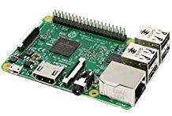

</td>

</tr>

<tr>

<td width="326" valign="top" style="border-style: none solid solid; border-color: -moz-use-text-color windowtext windowtext; border-width: medium 1pt 1pt; padding: 0cm 5.4pt; width: 244.45pt;">

MicroSD card 16GB (minimal to have some buffer for the future) Make sure you have the right card reader to plug the MicroSD card into your computer!

</td>

<td width="326" valign="top" style="border-style: none solid solid none; border-color: -moz-use-text-color windowtext windowtext -moz-use-text-color; border-width: medium 1pt 1pt medium; padding: 0cm 5.4pt; width: 244.45pt;">

 

</td>

</tr>

<tr>

<td width="326" valign="top" style="border-style: none solid solid; border-color: -moz-use-text-color windowtext windowtext; border-width: medium 1pt 1pt; padding: 0cm 5.4pt; width: 244.45pt;">

Designated Raspberry power supply (min. 2,5A 5V, I recommend 3A) _Do not use other USB chargers since insufficient power supply (shown in GUI as lightening symbol in the upper right corner) will result in serious issues like e.g. Bluetooth not working_) A cable switch might be a good thing since you might have to hard-reset your Pi in the early days more often and the Pi itself does not have a power switch

</td>

<td width="326" valign="top" style="border-style: none solid solid none; border-color: -moz-use-text-color windowtext windowtext -moz-use-text-color; border-width: medium 1pt 1pt medium; padding: 0cm 5.4pt; width: 244.45pt;">

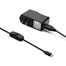

</td>

</tr>

<tr>

<td width="326" valign="top" style="border-style: none solid solid; border-color: -moz-use-text-color windowtext windowtext; border-width: medium 1pt 1pt; padding: 0cm 5.4pt; width: 244.45pt;">

USB Mouse

 

</td>

<td width="326" valign="top" style="border-style: none solid solid none; border-color: -moz-use-text-color windowtext windowtext -moz-use-text-color; border-width: medium 1pt 1pt medium; padding: 0cm 5.4pt; width: 244.45pt;">

</td>

</tr>

<tr>

<td width="326" valign="top" style="border-style: none solid solid; border-color: -moz-use-text-color windowtext windowtext; border-width: medium 1pt 1pt; padding: 0cm 5.4pt; width: 244.45pt;">

USB Keyboard

 

</td>

<td width="326" valign="top" style="border-style: none solid solid none; border-color: -moz-use-text-color windowtext windowtext -moz-use-text-color; border-width: medium 1pt 1pt medium; padding: 0cm 5.4pt; width: 244.45pt;">

</td>

</tr>

<tr>

<td width="326" valign="top" style="border-style: none solid solid; border-color: -moz-use-text-color windowtext windowtext; border-width: medium 1pt 1pt; padding: 0cm 5.4pt; width: 244.45pt;">

HDMI cable (full size to whatever your display needs)

 

</td>

<td width="326" valign="top" style="border-style: none solid solid none; border-color: -moz-use-text-color windowtext windowtext -moz-use-text-color; border-width: medium 1pt 1pt medium; padding: 0cm 5.4pt; width: 244.45pt;">

</td>

</tr>

<tr>

<td width="326" valign="top" style="border-style: none solid solid; border-color: -moz-use-text-color windowtext windowtext; border-width: medium 1pt 1pt; padding: 0cm 5.4pt; width: 244.45pt;">

Ethernet cable (optional, if you not want to use WiFi to connect the Raspberry to your gateway)

 

</td>

<td width="326" valign="top" style="border-style: none solid solid none; border-color: -moz-use-text-color windowtext windowtext -moz-use-text-color; border-width: medium 1pt 1pt medium; padding: 0cm 5.4pt; width: 244.45pt;">

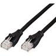

</td>

</tr>

<tr>

<td width="326" valign="top" style="border-style: none solid solid; border-color: -moz-use-text-color windowtext windowtext; border-width: medium 1pt 1pt; padding: 0cm 5.4pt; width: 244.45pt;">

Raspberry case (optional, will **not** be needed if you are going for the 7” Raspberry display setup)

 

</td>

<td width="326" valign="top" style="border-style: none solid solid none; border-color: -moz-use-text-color windowtext windowtext -moz-use-text-color; border-width: medium 1pt 1pt medium; padding: 0cm 5.4pt; width: 244.45pt;">

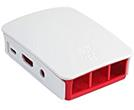

</td>

</tr>

<tr>

<td width="326" valign="top" style="border-style: none solid solid; border-color: -moz-use-text-color windowtext windowtext; border-width: medium 1pt 1pt; padding: 0cm 5.4pt; width: 244.45pt;">

Display with HDMI input ( optional, will **not** be needed if you are going for the 7” Raspberry display setup)

</td>

<td width="326" valign="top" style="border-style: none solid solid none; border-color: -moz-use-text-color windowtext windowtext -moz-use-text-color; border-width: medium 1pt 1pt medium; padding: 0cm 5.4pt; width: 244.45pt;">

</td>

</tr>

</tbody>

</table>

 

### <a name="_Toc485150874">Additional hardware for optional setup of the controller with 7” Raspberry display:</a>

(I found it very useful to have one permanent GUI interface mounted on your controller, you can also use this touchscreen interface directly to interact with your home automation):

<table class="MsoTableGrid" style="border: medium none ; border-collapse: collapse;" border="1" cellspacing="0" cellpadding="0">

<tbody>

<tr>

<td width="326" valign="top" style="border: 1pt solid windowtext; padding: 0cm 5.4pt; width: 244.45pt;">

Raspberry Pi 7" Touch-Display

</td>

<td width="326" valign="top" style="border-style: solid solid solid none; border-color: windowtext windowtext windowtext -moz-use-text-color; border-width: 1pt 1pt 1pt medium; padding: 0cm 5.4pt; width: 244.45pt;">

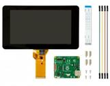

</td>

</tr>

<tr>

<td width="326" valign="top" style="border-style: none solid solid; border-color: -moz-use-text-color windowtext windowtext; border-width: medium 1pt 1pt; padding: 0cm 5.4pt; width: 244.45pt;">

Premium case for Raspberry Pi 7" Touch-Display (closed version) often sold in bundle with Touch-Display, should be available in black, white and transparent

This is a very good case if you want to place the controller on a table or counter since it is protecting the Raspberry from the back.

</td>

<td width="326" valign="top" style="border-style: none solid solid none; border-color: -moz-use-text-color windowtext windowtext -moz-use-text-color; border-width: medium 1pt 1pt medium; padding: 0cm 5.4pt; width: 244.45pt;">

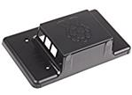 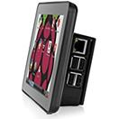

</td>

</tr>

<tr>

<td width="326" valign="top" style="border-style: none solid solid; border-color: -moz-use-text-color windowtext windowtext; border-width: medium 1pt 1pt; padding: 0cm 5.4pt; width: 244.45pt;">

_Alternative:_ Cases for Raspberry Pi 7" Touch-Display. You will find a wide range of other cases. The open versions might give you a better access to the Pi GPIO pins or for changing SD card.

Please consider: since you can rotate the image of the GUI on the display you can also choose to switch from landscape to portrait orientation

</td>

<td width="326" valign="top" style="border-style: none solid solid none; border-color: -moz-use-text-color windowtext windowtext -moz-use-text-color; border-width: medium 1pt 1pt medium; padding: 0cm 5.4pt; width: 244.45pt;">

  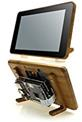 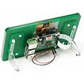

</td>

</tr>

<tr>

<td width="326" valign="top" style="border-style: none solid solid; border-color: -moz-use-text-color windowtext windowtext; border-width: medium 1pt 1pt; padding: 0cm 5.4pt; width: 244.45pt;">

Bluetooth keyboard (optional, since the optional on screen touch keyboard for Raspbian PIXEL was not working without errors, I decided to go for a Bluetooth keyboard which makes the typing much easier)

</td>

<td width="326" valign="top" style="border-style: none solid solid none; border-color: -moz-use-text-color windowtext windowtext -moz-use-text-color; border-width: medium 1pt 1pt medium; padding: 0cm 5.4pt; width: 244.45pt;">

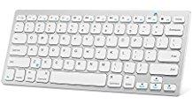

</td>

</tr>

</tbody>

</table>

**  
**

** **

### <a name="_Toc485150875">Z-Wave Controller</a>

If you want to use the Z-Wave technology for your home automation project you have to have one Z-Wave controller connected to your Raspberry

**NOTE**: Be aware that the details serial numbers or item names may vary since you have to always make sure to use the hardware which is allowed in your country!

<table class="MsoTableGrid" style="border: medium none ; border-collapse: collapse;" border="1" cellspacing="0" cellpadding="0">

<tbody>

<tr>

<td width="326" valign="top" style="border: 1pt solid windowtext; padding: 0cm 5.4pt; width: 244.45pt;">

Aeotec by Aeon Labs Z-Stick Gen5

Pros:

- Allows offline inclusion of Z-Wave devices which makes it very easy since you only have to take the stick to the mounted device, not the entire Raspberry

Cons:

- Including battery powered devices into openHAB2 requires a special process (see tutorial)

</td>

<td width="326" valign="top" style="border-style: solid solid solid none; border-color: windowtext windowtext windowtext -moz-use-text-color; border-width: 1pt 1pt 1pt medium; padding: 0cm 5.4pt; width: 244.45pt;">

</td>

</tr>

<tr>

<td width="326" valign="top" style="border-style: none solid solid; border-color: -moz-use-text-color windowtext windowtext; border-width: medium 1pt 1pt; padding: 0cm 5.4pt; width: 244.45pt;">

_Alternative_: UZB Z-Wave PLUS USB stick by Z-Wave.Me

Pros:

- Cheapest controller

Cons:

- For inclusion, the controller has to be plugged into the Raspberry, so for mounted devices like wall switches , you have to take the Raspberry in close proximity of the device or do the inclusion before you mount the switch inside the wall

</td>

<td width="326" valign="top" style="border-style: none solid solid none; border-color: -moz-use-text-color windowtext windowtext -moz-use-text-color; border-width: medium 1pt 1pt medium; padding: 0cm 5.4pt; width: 244.45pt;">

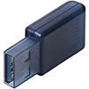

</td>

</tr>

<tr>

<td width="326" valign="top" style="border-style: none solid solid; border-color: -moz-use-text-color windowtext windowtext; border-width: medium 1pt 1pt; padding: 0cm 5.4pt; width: 244.45pt;">

_NOT REALLY an Alternative_: RaZberry2 Z-Wave Plus Daughter Card for Raspberry Pi Home Automation _(not plug and play compatible with optional setup of the controller with 7” Raspberry display!)_

Pros:

- will be mounted directly on the Raspberry so it is not using a USB port

Cons:

- will be mounted directly on the Raspberry which is blocking the GPIO pins for e.g. the Display power supply or additional cooling fans, so you have to manually solder the power wires at the back of the razberry

- is using the i/o port of the Raspberry Pi 3 on board Bluetooth, so a lot of additional configuration is needed to get the razberry and the Bluetooth running in parallel.

- most expensive controller

</td>

<td width="326" valign="top" style="border-style: none solid solid none; border-color: -moz-use-text-color windowtext windowtext -moz-use-text-color; border-width: medium 1pt 1pt medium; padding: 0cm 5.4pt; width: 244.45pt;">

</td>

</tr>

</tbody>

</table>

 

**  
**

** **

### <a name="_Toc485150876">Z-Wave sensors, switches and actuators</a>

 

**NOTE**: Be aware that the details serial numbers or item names may vary since you have to always make sure to use the hardware which is allowed in your country!

Since I am doing a German based home automation project you may find that some Z-Wave devices are not sold in your required country configuration ( e.g. Z-Wave NodOn Smart Plug not available e.g. in the US)

<table class="MsoTableGrid" style="border: medium none ; border-collapse: collapse;" border="1" cellspacing="0" cellpadding="0">

<tbody>

<tr>

<td width="326" valign="top" style="border: 1pt solid windowtext; padding: 0cm 5.4pt; width: 244.45pt;">

Z-Wave Fibaro Double Switch 2, Z-Wave Plus Smart Switch (comes at almost the same costs than the single switch and gives you 2 channels. Only reason to go for single switch is you need the full power range of the single switch since the double switch has slightly lower range)

NOTE: This switch is designed to be installed in the electrical power wiring of your home (inside a distributor case). In some countries this may only be allowed to be done by special trained staff (insurance and/or law).

</td>

<td width="326" valign="top" style="border-style: solid solid solid none; border-color: windowtext windowtext windowtext -moz-use-text-color; border-width: 1pt 1pt 1pt medium; padding: 0cm 5.4pt; width: 244.45pt;">

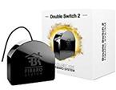

</td>

</tr>

<tr>

<td width="326" valign="top" style="border-style: none solid solid; border-color: -moz-use-text-color windowtext windowtext; border-width: medium 1pt 1pt; padding: 0cm 5.4pt; width: 244.45pt;">

Z-Wave Aeotec by Aeon Labs ZW100 Multisensor

</td>

<td width="326" valign="top" style="border-style: none solid solid none; border-color: -moz-use-text-color windowtext windowtext -moz-use-text-color; border-width: medium 1pt 1pt medium; padding: 0cm 5.4pt; width: 244.45pt;">

</td>

</tr>

<tr>

<td width="326" valign="top" style="border-style: none solid solid; border-color: -moz-use-text-color windowtext windowtext; border-width: medium 1pt 1pt; padding: 0cm 5.4pt; width: 244.45pt;">

Z-Wave Aeon Labs ZW088 Z-Wave Key Fob, Gen5

</td>

<td width="326" valign="top" style="border-style: none solid solid none; border-color: -moz-use-text-color windowtext windowtext -moz-use-text-color; border-width: medium 1pt 1pt medium; padding: 0cm 5.4pt; width: 244.45pt;">

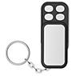

</td>

</tr>

<tr>

<td width="326" valign="top" style="border-style: none solid solid; border-color: -moz-use-text-color windowtext windowtext; border-width: medium 1pt 1pt; padding: 0cm 5.4pt; width: 244.45pt;">

Z-Wave NodOn Smart Plug (not available e.g. in the US)

</td>

<td width="326" valign="top" style="border-style: none solid solid none; border-color: -moz-use-text-color windowtext windowtext -moz-use-text-color; border-width: medium 1pt 1pt medium; padding: 0cm 5.4pt; width: 244.45pt;">

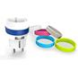

</td>

</tr>

</tbody>

</table>

 

**NOTE:** if you want to by other Z-Wave devices always make your they are listed in the Z-Wave device list of the openHAB2 Z-Wave binding to make sure they are supported correctly in the context of openHAB2:

[http://www.cd-jackson.com/index.php/zwave/zwave-device-database/zwave-device-list](http://www.cd-jackson.com/index.php/zwave/zwave-device-database/zwave-device-list)

  

 

### <a name="_Toc485150877">LAN devices (cable or WiFi)</a>

A lot of things you are using at home are already connected to your LAN and can be integrated into your openHAB2 home automation project if the right binding is available for that device.

You can find an overview on [http://docs.openhab.org/addons/bindings.html](http://docs.openhab.org/addons/bindings.html)

**NOTE**: Be aware that not all the bindings to include devices are already included in the stable version of openHAB2 and may require a manual installation of a so called snapshot version of the binding (how to install snapshot bindings is explained later in this tutorial since we will need it for the WiFi LED controller)

<table class="MsoTableGrid" style="border: medium none ; border-collapse: collapse;" border="1" cellspacing="0" cellpadding="0">

<tbody>

<tr>

<td width="326" valign="top" style="border: 1pt solid windowtext; padding: 0cm 5.4pt; width: 244.45pt;">

WiFi XCSOURCE Magic UFO-WiFi LED-Controller Type LD382 (other brand names might work as well, but you have to make sure it is Type LD382, LD382A or LD686)

REMARK: I was using a WiFi controller on purpose since:

- it is only about half the price of a Z-Wave WiFi controller

- you can control the device as well via smart phone (like light to music feature of the app)

But some things you have to be aware of using WiFi LED instead of Z-Wave LED:

- you have to have a WiFi network to which your Raspberry and your WiFi LED controller is connected

- you have to manually install a beta / snapshot version of openHAB2 or manually install the WiFi LED Binding on top of the package based installation of openHAB2 (see tutorial)

</td>

<td width="326" valign="top" style="border-style: solid solid solid none; border-color: windowtext windowtext windowtext -moz-use-text-color; border-width: 1pt 1pt 1pt medium; padding: 0cm 5.4pt; width: 244.45pt;">

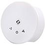

</td>

</tr>

<tr>

<td width="326" valign="top" style="border-style: none solid solid; border-color: -moz-use-text-color windowtext windowtext; border-width: medium 1pt 1pt; padding: 0cm 5.4pt; width: 244.45pt;">

RGB LED stripe incl. power supply 12V DC bundle

While you can buy the stripe and the power supply bundle separately, most of the times the bundle will come at the same price or even cheaper. The included power supply plug should directly fit into the power inlet socket of the WiFi controller.

REMARK: It also allows you to attach the stripe without soldering since you can just cut the cable of the RGB bundle controller and use it to connect the LED stripe to the WiFi controller.

</td>

<td width="326" valign="top" style="border-style: none solid solid none; border-color: -moz-use-text-color windowtext windowtext -moz-use-text-color; border-width: medium 1pt 1pt medium; padding: 0cm 5.4pt; width: 244.45pt;">

</td>

</tr>

<tr>

<td width="326" valign="top" style="border-style: none solid solid; border-color: -moz-use-text-color windowtext windowtext; border-width: medium 1pt 1pt; padding: 0cm 5.4pt; width: 244.45pt;">

Optional: White LED stripe

Since the WiFi LED-Controller is allowing you to at additionally control plain colour LED stripe (or in case of controller type LD686  even two) you might want to get an additional strip in e.g. plain white to create ab clear white illumination.

NOTE: You might be fine with just the stripe if you already got the power supply with the RGB stripe

</td>

<td width="326" valign="top" style="border-style: none solid solid none; border-color: -moz-use-text-color windowtext windowtext -moz-use-text-color; border-width: medium 1pt 1pt medium; padding: 0cm 5.4pt; width: 244.45pt;">

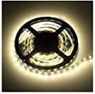

</td>

</tr>

<tr>

<td width="326" valign="top" style="border-style: none solid solid; border-color: -moz-use-text-color windowtext windowtext; border-width: medium 1pt 1pt; padding: 0cm 5.4pt; width: 244.45pt;">

Optional (in my case it was already there and I just included it into my project):

Yamaha Receiver RX-V581

</td>

<td width="326" valign="top" style="border-style: none solid solid none; border-color: -moz-use-text-color windowtext windowtext -moz-use-text-color; border-width: medium 1pt 1pt medium; padding: 0cm 5.4pt; width: 244.45pt;">

</td>

</tr>

<tr>

<td width="326" valign="top" style="border-style: none solid solid; border-color: -moz-use-text-color windowtext windowtext; border-width: medium 1pt 1pt; padding: 0cm 5.4pt; width: 244.45pt;">

Optional (in my case it was already there and I just included it into my project):

Samsung TV Details MISSING

**NOTE: **Even when the binding is not officially supporting your TV you might be lucky

</td>

<td width="326" valign="top" style="border-style: none solid solid none; border-color: -moz-use-text-color windowtext windowtext -moz-use-text-color; border-width: medium 1pt 1pt medium; padding: 0cm 5.4pt; width: 244.45pt;">

</td>

</tr>

</tbody>

</table>

  

** **

## <a name="_Toc485150878">Software list:</a>

 

My tutorial is using a MS-Windows windows machine for the PC part (You should be able to get it done with Mac or Linux PCs as well, but you have to go online to look up the differences and do some adaptions on the tutorial e.g. mounting the Raspberry file system to PC)

### <a name="_Toc485150879">Windows Download list:</a>

<table class="MsoTableGrid" style="border: medium none ; border-collapse: collapse;" border="1" cellspacing="0" cellpadding="0">

<tbody>

<tr>

<td width="326" valign="top" style="border: 1pt solid windowtext; padding: 0cm 5.4pt; width: 244.45pt;">

The latest **Raspbian** (Raspberry OS) image

You have to download the “Raspbian Jessie with PIXEL - Image with PIXEL desktop based on Debian Jessie” since this tutorial is using PIXEL

</td>

<td width="326" valign="top" style="border-style: solid solid solid none; border-color: windowtext windowtext windowtext -moz-use-text-color; border-width: 1pt 1pt 1pt medium; padding: 0cm 5.4pt; width: 244.45pt;">

[https://www.Raspberrypi.org/downloads/Raspbian/](https://www.raspberrypi.org/downloads/raspbian/)

 

</td>

</tr>

<tr>

<td width="326" valign="top" style="border-style: none solid solid; border-color: -moz-use-text-color windowtext windowtext; border-width: medium 1pt 1pt; padding: 0cm 5.4pt; width: 244.45pt;">

**Etcher** (to write the Raspbian image to the SD-Card)

</td>

<td width="326" valign="top" style="border-style: none solid solid none; border-color: -moz-use-text-color windowtext windowtext -moz-use-text-color; border-width: medium 1pt 1pt medium; padding: 0cm 5.4pt; width: 244.45pt;">

[https://etcher.io/](https://etcher.io/)

</td>

</tr>

<tr>

<td width="326" valign="top" style="border-style: none solid solid; border-color: -moz-use-text-color windowtext windowtext; border-width: medium 1pt 1pt; padding: 0cm 5.4pt; width: 244.45pt;">

**Eclipse Smart HomeDesigner** (optional but strongly recommended for easy editing of OpenHAB2 configuration files; incl. syntax highlighting)

You have to choose the right version for your PC

</td>

<td width="326" valign="top" style="border-style: none solid solid none; border-color: -moz-use-text-color windowtext windowtext -moz-use-text-color; border-width: medium 1pt 1pt medium; padding: 0cm 5.4pt; width: 244.45pt;">

[https://www.openhab.org/downloads.html](https://www.openhab.org/downloads.html)

 

</td>

</tr>

<tr>

<td width="326" valign="top" style="border-style: none solid solid; border-color: -moz-use-text-color windowtext windowtext; border-width: medium 1pt 1pt; padding: 0cm 5.4pt; width: 244.45pt;">

To use Eclipse Smart HomeDesigner you need **Java Runtime Environment JRE** (if not already installed on your PC)

</td>

<td width="326" valign="top" style="border-style: none solid solid none; border-color: -moz-use-text-color windowtext windowtext -moz-use-text-color; border-width: medium 1pt 1pt medium; padding: 0cm 5.4pt; width: 244.45pt;">

[https://java.com/](https://java.com/)

</td>

</tr>

<tr>

<td width="326" valign="top" style="border-style: none solid solid; border-color: -moz-use-text-color windowtext windowtext; border-width: medium 1pt 1pt; padding: 0cm 5.4pt; width: 244.45pt;">

**PuTTY**

or **KiTTY** portable

to access the Raspberry console from your PC

</td>

<td width="326" valign="top" style="border-style: none solid solid none; border-color: -moz-use-text-color windowtext windowtext -moz-use-text-color; border-width: medium 1pt 1pt medium; padding: 0cm 5.4pt; width: 244.45pt;">

[http://www.putty.org/](http://www.putty.org/)

[https://portableapps.com/apps/internet/kitty-portable](https://portableapps.com/apps/internet/kitty-portable)

 

</td>

</tr>

<tr>

<td width="326" valign="top" style="border-style: none solid solid; border-color: -moz-use-text-color windowtext windowtext; border-width: medium 1pt 1pt; padding: 0cm 5.4pt; width: 244.45pt;">

**WinSCP** portable to access Raspberry file System directly from your PC (might become obsolete if you use a SAMBA server on your Raspberry, see tutorial)

 

</td>

<td width="326" valign="top" style="border-style: none solid solid none; border-color: -moz-use-text-color windowtext windowtext -moz-use-text-color; border-width: medium 1pt 1pt medium; padding: 0cm 5.4pt; width: 244.45pt;">

[https://winscp.net/eng/download.php](https://winscp.net/eng/download.php)

</td>

</tr>

</tbody>

</table>

 

### <a name="_Toc485150880">Raspberry downloads:</a>

How to download software will be explained in the tutorial, but as a reference you will use

**openHAB2** Package repository based installation or manual installation (be aware that the file locations on the Raspberry will be different based on which kind of installation you choose)

**Samba** server(for access of Raspberry files from Windows machine; needed for Eclipse Smart HomeDesigner)

**xscreensaver** (optional if you are using the display setup, to easy control screen blackening or screen savers)

 

  

 

# <a name="_Toc485150881">Chapter 3: Raspberry hardware and Raspbian OS installation</a>

## <a name="_Toc485150882">General information about Raspberry interfaces and GPIO pins:</a>

### <a name="_Toc485150883">Raspberry input Overview:</a>

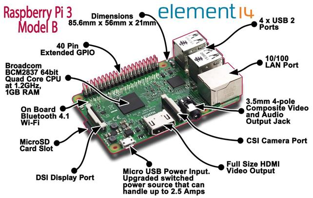

### <a name="_Toc485150884">Raspberry GPIO pin Overview:</a>

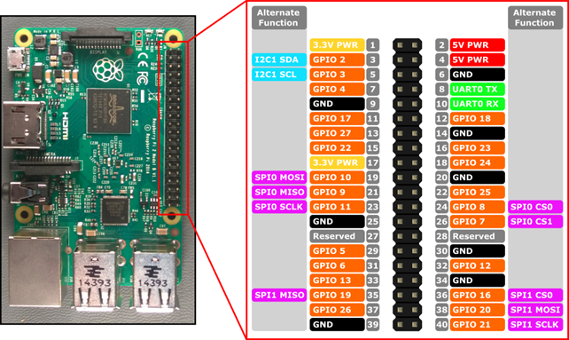

  

 

## <a name="_Toc485150885">Preparing MicroSD card - writing Raspbian image to MicroSD card (PC required):</a>

 

<table class="MsoTableGrid" style="border: medium none ; border-collapse: collapse;" border="1" cellspacing="0" cellpadding="0">

<tbody>

<tr>

<td width="316" valign="top" style="border: 1pt solid windowtext; padding: 0cm 5.4pt; width: 236.65pt;">

Download latest Raspbian Release (*.zip file) to a Windows folder

</td>

<td width="341" valign="top" style="border-style: solid solid solid none; border-color: windowtext windowtext windowtext -moz-use-text-color; border-width: 1pt 1pt 1pt medium; padding: 0cm 5.4pt; width: 256.05pt;">

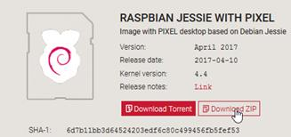

</td>

</tr>

<tr>

<td width="316" valign="top" style="border-style: none solid solid; border-color: -moz-use-text-color windowtext windowtext; border-width: medium 1pt 1pt; padding: 0cm 5.4pt; width: 236.65pt;">

Extract *.zip file to receive *.img file

</td>

<td width="341" valign="top" style="border-style: none solid solid none; border-color: -moz-use-text-color windowtext windowtext -moz-use-text-color; border-width: medium 1pt 1pt medium; padding: 0cm 5.4pt; width: 256.05pt;">

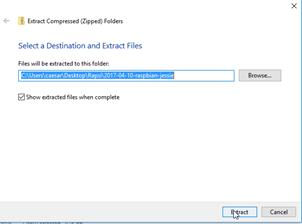

</td>

</tr>

<tr>

<td width="316" valign="top" style="border-style: none solid solid; border-color: -moz-use-text-color windowtext windowtext; border-width: medium 1pt 1pt; padding: 0cm 5.4pt; width: 236.65pt;">

Use Etcher to write image to a MicroSD card

1.  select image
2.  select drive with MicroSD card plugged in to
3.  start flashing

</td>

<td width="341" valign="top" style="border-style: none solid solid none; border-color: -moz-use-text-color windowtext windowtext -moz-use-text-color; border-width: medium 1pt 1pt medium; padding: 0cm 5.4pt; width: 256.05pt;">

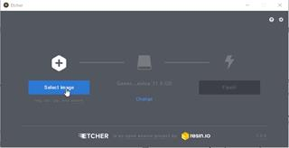

</td>

</tr>

</tbody>

</table>

 

  

** **

## <a name="_Toc485150886">Connecting the hardware to the Raspberry</a>

### <a name="_Toc485150887">Basic hardware setup:</a>

<table class="MsoTableGrid" style="border: medium none ; border-collapse: collapse;" border="1" cellspacing="0" cellpadding="0">

<tbody>

<tr>

<td width="326" valign="top" style="border: 1pt solid windowtext; padding: 0cm 5.4pt; width: 244.45pt;">

 

</td>

<td width="326" valign="top" style="border-style: solid solid solid none; border-color: windowtext windowtext windowtext -moz-use-text-color; border-width: 1pt 1pt 1pt medium; padding: 0cm 5.4pt; width: 244.45pt;">

 

</td>

</tr>

<tr>

<td width="326" valign="top" style="border-style: none solid solid; border-color: -moz-use-text-color windowtext windowtext; border-width: medium 1pt 1pt; padding: 0cm 5.4pt; width: 244.45pt;">

Connect keyboard and mouse to the USB ports

 

</td>

<td width="326" valign="top" style="border-style: none solid solid none; border-color: -moz-use-text-color windowtext windowtext -moz-use-text-color; border-width: medium 1pt 1pt medium; padding: 0cm 5.4pt; width: 244.45pt;">

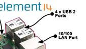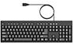

</td>

</tr>

<tr>

<td width="326" valign="top" style="border-style: none solid solid; border-color: -moz-use-text-color windowtext windowtext; border-width: medium 1pt 1pt; padding: 0cm 5.4pt; width: 244.45pt;">

Insert the MicroSD card (pins facing the circuit board)

</td>

<td width="326" valign="top" style="border-style: none solid solid none; border-color: -moz-use-text-color windowtext windowtext -moz-use-text-color; border-width: medium 1pt 1pt medium; padding: 0cm 5.4pt; width: 244.45pt;">

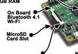

</td>

</tr>

<tr>

<td width="326" valign="top" style="border-style: none solid solid; border-color: -moz-use-text-color windowtext windowtext; border-width: medium 1pt 1pt; padding: 0cm 5.4pt; width: 244.45pt;">

Connect Raspberry with display using HDMI ( optional, will **not** be needed if you are going for the 7” Raspberry display setup)

</td>

<td width="326" valign="top" style="border-style: none solid solid none; border-color: -moz-use-text-color windowtext windowtext -moz-use-text-color; border-width: medium 1pt 1pt medium; padding: 0cm 5.4pt; width: 244.45pt;">

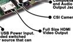

</td>

</tr>

<tr>

<td width="326" valign="top" style="border-style: none solid solid; border-color: -moz-use-text-color windowtext windowtext; border-width: medium 1pt 1pt; padding: 0cm 5.4pt; width: 244.45pt;">

Connect the Raspberry with Ethernet cable to your gateway (optional)

</td>

<td width="326" valign="top" style="border-style: none solid solid none; border-color: -moz-use-text-color windowtext windowtext -moz-use-text-color; border-width: medium 1pt 1pt medium; padding: 0cm 5.4pt; width: 244.45pt;">

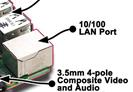

</td>

</tr>

<tr>

<td width="326" valign="top" style="border-style: none solid solid; border-color: -moz-use-text-color windowtext windowtext; border-width: medium 1pt 1pt; padding: 0cm 5.4pt; width: 244.45pt;">

Connect the power supply to the micro USB power input

**Make sure that you have everything plugged in and the Raspberry is clear of any metal items since this step is already powering up your Raspberry.**

</td>

<td width="326" valign="top" style="border-style: none solid solid none; border-color: -moz-use-text-color windowtext windowtext -moz-use-text-color; border-width: medium 1pt 1pt medium; padding: 0cm 5.4pt; width: 244.45pt;">

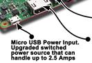

</td>

</tr>

</tbody>

</table>

 

  

** **

## <a name="_Toc485150888">Optional: Installation of 7” Raspberry display and display case:</a>

The full tutorial will be found on:

[https://www.element14.com/community/docs/DOC-78156/l/Raspberry-pi-7-touchscreen-display](https://www.element14.com/community/docs/DOC-78156/l/raspberry-pi-7-touchscreen-display)

and a clip on YouTube:

[https://www.youtube.com/watch?v=tK-w-wDvRTg](https://www.youtube.com/watch?v=tK-w-wDvRTg)

**Remark**: I had an issue with plugging in the power supply to the micro USB power input on the circuit board of the display (like shown in the video). The Raspberry was still showing me the low power symbol (lightening symbol on the upper right corner) SOLUTION:  I had to plug in the power supply to the micro USB power input on the Raspberry itself. The display is now powered via the jumper cables. The standard display case is also allowing for both micro USB power inputs to be used.

**NOTE**: If the image on the display is having the wrong orientation, you can rotate the image by changing the configuration of Raspbian (see tutorial section Initial configuration of Raspbian)

### <a name="_Toc485150889">Display installation pictures:</a>

<table class="MsoTableGrid" style="border: medium none ; border-collapse: collapse;" border="1" cellspacing="0" cellpadding="0">

<tbody>

<tr>

<td width="326" valign="top" style="border: 1pt solid windowtext; padding: 0cm 5.4pt; width: 244.45pt;">

Step 1

</td>

<td width="326" valign="top" style="border-style: solid solid solid none; border-color: windowtext windowtext windowtext -moz-use-text-color; border-width: 1pt 1pt 1pt medium; padding: 0cm 5.4pt; width: 244.45pt;">

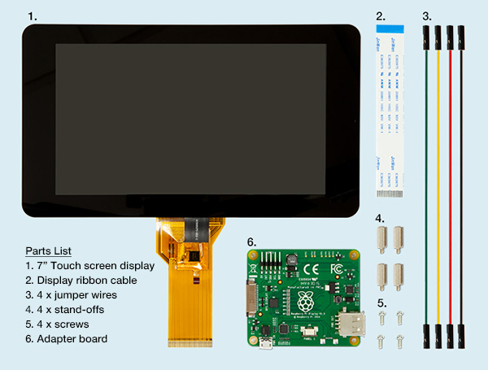

</td>

</tr>

<tr>

<td width="326" valign="top" style="border-style: none solid solid; border-color: -moz-use-text-color windowtext windowtext; border-width: medium 1pt 1pt; padding: 0cm 5.4pt; width: 244.45pt;">

Step 2

</td>

<td width="326" valign="top" style="border-style: none solid solid none; border-color: -moz-use-text-color windowtext windowtext -moz-use-text-color; border-width: medium 1pt 1pt medium; padding: 0cm 5.4pt; width: 244.45pt;">

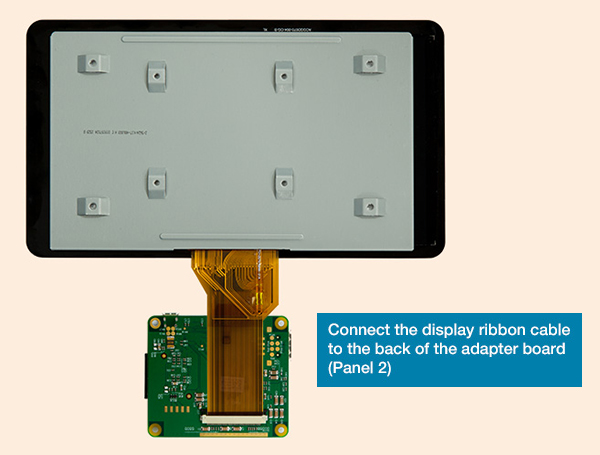

</td>

</tr>

<tr>

<td width="326" valign="top" style="border-style: none solid solid; border-color: -moz-use-text-color windowtext windowtext; border-width: medium 1pt 1pt; padding: 0cm 5.4pt; width: 244.45pt;">

Step 3

</td>

<td width="326" valign="top" style="border-style: none solid solid none; border-color: -moz-use-text-color windowtext windowtext -moz-use-text-color; border-width: medium 1pt 1pt medium; padding: 0cm 5.4pt; width: 244.45pt;">

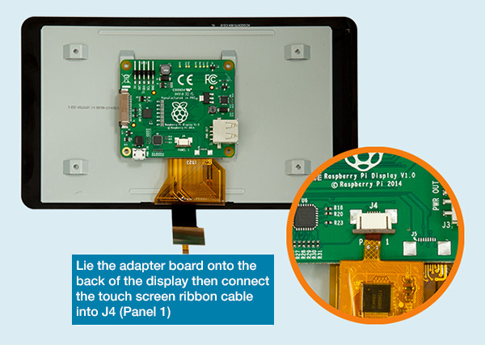

</td>

</tr>

<tr>

<td width="326" valign="top" style="border-style: none solid solid; border-color: -moz-use-text-color windowtext windowtext; border-width: medium 1pt 1pt; padding: 0cm 5.4pt; width: 244.45pt;">

Step 4

</td>

<td width="326" valign="top" style="border-style: none solid solid none; border-color: -moz-use-text-color windowtext windowtext -moz-use-text-color; border-width: medium 1pt 1pt medium; padding: 0cm 5.4pt; width: 244.45pt;">

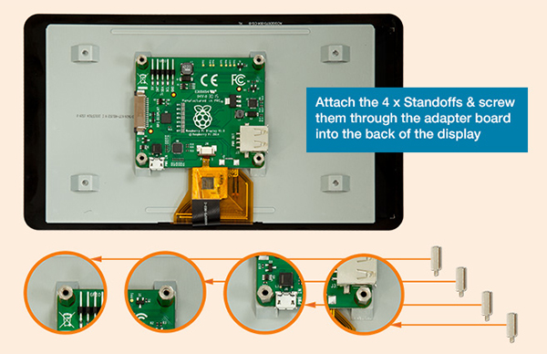

</td>

</tr>

<tr>

<td width="326" valign="top" style="border-style: none solid solid; border-color: -moz-use-text-color windowtext windowtext; border-width: medium 1pt 1pt; padding: 0cm 5.4pt; width: 244.45pt;">

Step 5

</td>

<td width="326" valign="top" style="border-style: none solid solid none; border-color: -moz-use-text-color windowtext windowtext -moz-use-text-color; border-width: medium 1pt 1pt medium; padding: 0cm 5.4pt; width: 244.45pt;">

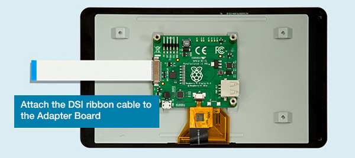

</td>

</tr>

<tr>

<td width="326" valign="top" style="border-style: none solid solid; border-color: -moz-use-text-color windowtext windowtext; border-width: medium 1pt 1pt; padding: 0cm 5.4pt; width: 244.45pt;">

Step 6

</td>

<td width="326" valign="top" style="border-style: none solid solid none; border-color: -moz-use-text-color windowtext windowtext -moz-use-text-color; border-width: medium 1pt 1pt medium; padding: 0cm 5.4pt; width: 244.45pt;">

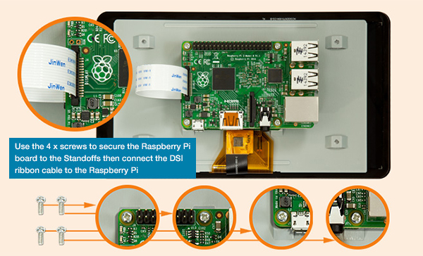

</td>

</tr>

<tr>

<td width="326" valign="top" style="border-style: none solid solid; border-color: -moz-use-text-color windowtext windowtext; border-width: medium 1pt 1pt; padding: 0cm 5.4pt; width: 244.45pt;">

Step 7

</td>

<td width="326" valign="top" style="border-style: none solid solid none; border-color: -moz-use-text-color windowtext windowtext -moz-use-text-color; border-width: medium 1pt 1pt medium; padding: 0cm 5.4pt; width: 244.45pt;">

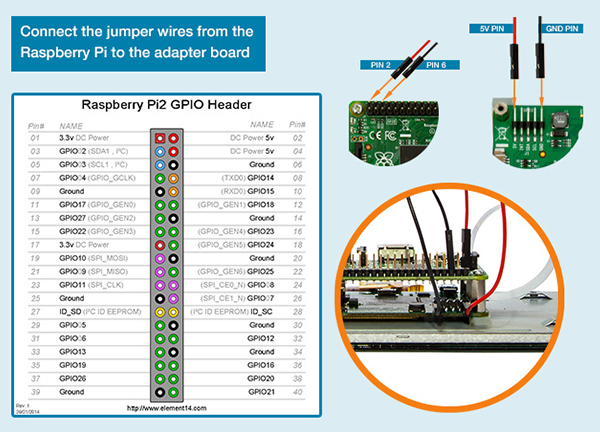

The two other path cables (green and yellow can be ignored)

</td>

</tr>

<tr>

<td width="326" valign="top" style="border-style: none solid solid; border-color: -moz-use-text-color windowtext windowtext; border-width: medium 1pt 1pt; padding: 0cm 5.4pt; width: 244.45pt;">

Step 8

</td>

<td width="326" valign="top" style="border-style: none solid solid none; border-color: -moz-use-text-color windowtext windowtext -moz-use-text-color; border-width: medium 1pt 1pt medium; padding: 0cm 5.4pt; width: 244.45pt;">

Assembly of the standard display. (Make sure you have inserted the MicroSD card since you won’t have access to the slot as soon as you mounted the case!)

Just pull the back plate off the case, insert the display including the mounted Raspberry (make sure that the path cables and the display cables are not crushed between case and board), tighten it with the 4 screws and put the back plate into place

Here is a good clip on YouTube: [https://www.youtube.com/watch?v=wpSxibZOmoo](https://www.youtube.com/watch?v=wpSxibZOmoo)

 

</td>

</tr>

</tbody>

</table>

  

 

# <a name="_Toc485150890">Chapter 4: Raspbian basic configuration</a>

## <a name="_Toc485150891">Starting up Raspberry or the first time – Raspbian PIXEL desktop</a>

Since this tutorial is focussing on using the PIXEL GUI here are a few basic tips

Raspberry start-up screen

PIXEL basic desktop (including the programs used in this tutorial) not unlike other PC OS desktops:

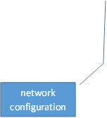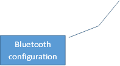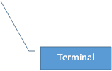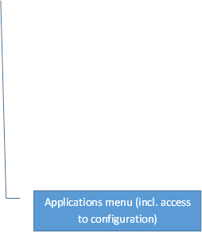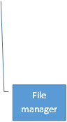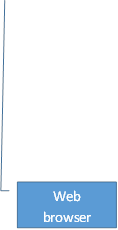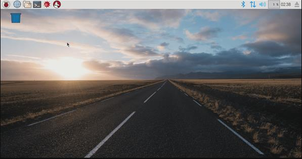

** **

**NOTE: **If you are working with the 7” Raspberry display setup you might need to flip/rotate the display orientation. Just check the section” Optional: Change display orientation” later in this chapter

**  
**

** **

### <a name="_Toc485150892">Working with the Terminal:</a>

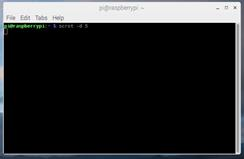

**NOTE:** As soon as you have connected the Raspberry to the network you might find it easier to open the Terminal remotely using PuTTY. This also allows you to directly paste command lines from this tutorial into the Terminal. (Right click in PuTTY terminal is pasting the content of the clipboard into the terminal)

### <a name="_Toc485150893">Basic terminal commands and functions:</a>

The full list can be found on:

[https://www.Raspberrypi.org/documentation/linux/usage/commands.md](https://www.raspberrypi.org/documentation/linux/usage/commands.md)

<table class="MsoTableGrid" style="border: medium none ; border-collapse: collapse;" border="1" cellspacing="0" cellpadding="0">

<tbody>

<tr>

<td width="206" valign="top" style="border: 1pt solid windowtext; padding: 0cm 5.4pt; width: 154.25pt;">

help

</td>

<td width="451" valign="top" style="border-style: solid solid solid none; border-color: windowtext windowtext windowtext -moz-use-text-color; border-width: 1pt 1pt 1pt medium; padding: 0cm 5.4pt; width: 338.45pt;">

Is showing you basic commands

</td>

</tr>

<tr>

<td width="206" valign="top" style="border-style: none solid solid; border-color: -moz-use-text-color windowtext windowtext; border-width: medium 1pt 1pt; padding: 0cm 5.4pt; width: 154.25pt;">

sudo _othercommand_

</td>

<td width="451" valign="top" style="border-style: none solid solid none; border-color: -moz-use-text-color windowtext windowtext -moz-use-text-color; border-width: medium 1pt 1pt medium; padding: 0cm 5.4pt; width: 338.45pt;">

is allowing you to run other commands as super user aka root user

</td>

</tr>

<tr>

<td width="206" valign="top" style="border-style: none solid solid; border-color: -moz-use-text-color windowtext windowtext; border-width: medium 1pt 1pt; padding: 0cm 5.4pt; width: 154.25pt;">

ls -la

</td>

<td width="451" valign="top" style="border-style: none solid solid none; border-color: -moz-use-text-color windowtext windowtext -moz-use-text-color; border-width: medium 1pt 1pt medium; padding: 0cm 5.4pt; width: 338.45pt;">

Shows the files in a directory incl. additional information

</td>

</tr>

<tr>

<td width="206" valign="top" style="border-style: none solid solid; border-color: -moz-use-text-color windowtext windowtext; border-width: medium 1pt 1pt; padding: 0cm 5.4pt; width: 154.25pt;">

cd

 

cd

cd ..

cd _directory_

_ _

_cd /directory/directory_

</td>

<td width="451" valign="top" style="border-style: none solid solid none; border-color: -moz-use-text-color windowtext windowtext -moz-use-text-color; border-width: medium 1pt 1pt medium; padding: 0cm 5.4pt; width: 338.45pt;">

Is changing the shell working directory.

It can be used with attributes:

No attribute => working directory is changed to user root directory.

working directory is changed to directory one level above

working directory is changed to the named _directory_ inside the current directory

working directory is changed to the directory defined by the full path _/directory/directory_

.

</td>

</tr>

<tr>

<td width="206" valign="top" style="border-style: none solid solid; border-color: -moz-use-text-color windowtext windowtext; border-width: medium 1pt 1pt; padding: 0cm 5.4pt; width: 154.25pt;">

nano _filename_

(sudo nano _filename)_

</td>

<td width="451" valign="top" style="border-style: none solid solid none; border-color: -moz-use-text-color windowtext windowtext -moz-use-text-color; border-width: medium 1pt 1pt medium; padding: 0cm 5.4pt; width: 338.45pt;">

Is stating a basic editor in the terminal to open or create a simple text or configuration file, mostly you have to add a sudo if you want to be able to write the files with root user rights. Closing the editor is done by ctrl+x and then choosing whether you want to save your changes or not

</td>

</tr>

<tr>

<td width="206" valign="top" style="border-style: none solid solid; border-color: -moz-use-text-color windowtext windowtext; border-width: medium 1pt 1pt; padding: 0cm 5.4pt; width: 154.25pt;">

 

</td>

<td width="451" valign="top" style="border-style: none solid solid none; border-color: -moz-use-text-color windowtext windowtext -moz-use-text-color; border-width: medium 1pt 1pt medium; padding: 0cm 5.4pt; width: 338.45pt;">

 

</td>

</tr>

<tr>

<td width="206" valign="top" style="border-style: none solid solid; border-color: -moz-use-text-color windowtext windowtext; border-width: medium 1pt 1pt; padding: 0cm 5.4pt; width: 154.25pt;">

 

</td>

<td width="451" valign="top" style="border-style: none solid solid none; border-color: -moz-use-text-color windowtext windowtext -moz-use-text-color; border-width: medium 1pt 1pt medium; padding: 0cm 5.4pt; width: 338.45pt;">

 

</td>

</tr>

<tr>

<td width="206" valign="top" style="border-style: none solid solid; border-color: -moz-use-text-color windowtext windowtext; border-width: medium 1pt 1pt; padding: 0cm 5.4pt; width: 154.25pt;">

 

</td>

<td width="451" valign="top" style="border-style: none solid solid none; border-color: -moz-use-text-color windowtext windowtext -moz-use-text-color; border-width: medium 1pt 1pt medium; padding: 0cm 5.4pt; width: 338.45pt;">

 

</td>

</tr>

<tr>

<td width="206" valign="top" style="border-style: none solid solid; border-color: -moz-use-text-color windowtext windowtext; border-width: medium 1pt 1pt; padding: 0cm 5.4pt; width: 154.25pt;">

 

</td>

<td width="451" valign="top" style="border-style: none solid solid none; border-color: -moz-use-text-color windowtext windowtext -moz-use-text-color; border-width: medium 1pt 1pt medium; padding: 0cm 5.4pt; width: 338.45pt;">

 

</td>

</tr>

<tr>

<td width="206" valign="top" style="border-style: none solid solid; border-color: -moz-use-text-color windowtext windowtext; border-width: medium 1pt 1pt; padding: 0cm 5.4pt; width: 154.25pt;">

 

</td>

<td width="451" valign="top" style="border-style: none solid solid none; border-color: -moz-use-text-color windowtext windowtext -moz-use-text-color; border-width: medium 1pt 1pt medium; padding: 0cm 5.4pt; width: 338.45pt;">

 

</td>

</tr>

</tbody>

</table>

 

  

 

## <a name="_Toc485150894">Initial configuration of Raspbian</a>

The following steps make sure, that basic Raspbian configuration is done.

**NOTE:** There may be many tutorials in how to set-up and configure Raspbian and going into more details about user rights and other Raspbian features. This tutorial is showing the way which worked for my project aiming to run openHAB2 on the Raspberry.

Since this tutorial is using the PIXEL GUI I always refer to the PIXEL way of configuring and only go back to the terminal way (text only) if it is required.

 

### <a name="_Toc485150895">Localisation:</a>

The 1.st thing you want to do is changing the localisation settings to make sure your keyboard layout and WiFi settings are matching.

**NOTE:** Do not change the password before you have changed the keyboard layout since you might put in a different password than you expect (e.g. US qwerty vs. German qwertz results in “Raspberrz” instead of “Raspberry”)

<table class="MsoTableGrid" style="border: medium none ; border-collapse: collapse;" border="1" cellspacing="0" cellpadding="0">

<tbody>

<tr>

<td width="326" valign="top" style="border: 1pt solid windowtext; padding: 0cm 5.4pt; width: 244.45pt;">

Open Raspberry Pi Configuration

Application menu

-Preferences

--Raspberry Pi configuration

</td>

<td width="326" valign="top" style="border-style: solid solid solid none; border-color: windowtext windowtext windowtext -moz-use-text-color; border-width: 1pt 1pt 1pt medium; padding: 0cm 5.4pt; width: 244.45pt;">

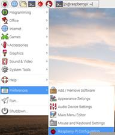

</td>

</tr>

<tr style="height: 3.85pt;">

<td width="326" valign="top" style="border-style: none solid solid; border-color: -moz-use-text-color windowtext windowtext; border-width: medium 1pt 1pt; padding: 0cm 5.4pt; width: 244.45pt; height: 3.85pt;">

Go to tab Localisation

</td>

<td width="326" valign="top" style="border-style: none solid solid none; border-color: -moz-use-text-color windowtext windowtext -moz-use-text-color; border-width: medium 1pt 1pt medium; padding: 0cm 5.4pt; width: 244.45pt; height: 3.85pt;">

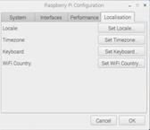

</td>

</tr>

<tr>

<td width="326" valign="top" style="border-style: none solid solid; border-color: -moz-use-text-color windowtext windowtext; border-width: medium 1pt 1pt; padding: 0cm 5.4pt; width: 244.45pt;">

Select Locale, Timezone, Keyboard and WiFi Country

Locale: choose your language and country

 

 

 

 

 

Timezone: choose timezone

 

 

 

 

Keyboard: choose keyboard language and specific keyboard layout

 

 

 

 

 

 

 

 

 

WiFi Country: choose country specific WiFi settings

</td>

<td width="326" valign="top" style="border-style: none solid solid none; border-color: -moz-use-text-color windowtext windowtext -moz-use-text-color; border-width: medium 1pt 1pt medium; padding: 0cm 5.4pt; width: 244.45pt;">

 

 

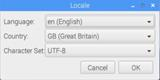

 

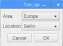

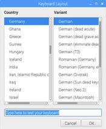

 

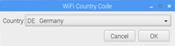

</td>

</tr>

<tr>

<td width="326" valign="top" style="border-style: none solid solid; border-color: -moz-use-text-color windowtext windowtext; border-width: medium 1pt 1pt; padding: 0cm 5.4pt; width: 244.45pt;">

Accept the reboot

</td>

<td width="326" valign="top" style="border-style: none solid solid none; border-color: -moz-use-text-color windowtext windowtext -moz-use-text-color; border-width: medium 1pt 1pt medium; padding: 0cm 5.4pt; width: 244.45pt;">

 

</td>

</tr>

</tbody>

</table>

** **

** **

### <a name="_Toc485150896">Optional: Change display orientation</a>

If you are working with the 7” Raspberry display setup you might need to flip/rotate the display orientation for specific cases

<table class="MsoTableGrid" style="border: medium none ; border-collapse: collapse;" border="1" cellspacing="0" cellpadding="0">

<tbody>

<tr>

<td width="326" valign="top" style="border: 1pt solid windowtext; padding: 0cm 5.4pt; width: 244.45pt;">

Open Terminal

</td>

<td width="326" valign="top" style="border-style: solid solid solid none; border-color: windowtext windowtext windowtext -moz-use-text-color; border-width: 1pt 1pt 1pt medium; padding: 0cm 5.4pt; width: 244.45pt;">

</td>

</tr>

<tr>

<td width="326" valign="top" style="border-style: none solid solid; border-color: -moz-use-text-color windowtext windowtext; border-width: medium 1pt 1pt; padding: 0cm 5.4pt; width: 244.45pt;">

Open boot config.txt file in nano editor

</td>

<td width="326" valign="top" style="border-style: none solid solid none; border-color: -moz-use-text-color windowtext windowtext -moz-use-text-color; border-width: medium 1pt 1pt medium; padding: 0cm 5.4pt; width: 244.45pt;">

sudo nano /boot/config.txt

</td>

</tr>

<tr>

<td width="326" valign="top" style="border-style: none solid solid; border-color: -moz-use-text-color windowtext windowtext; border-width: medium 1pt 1pt; padding: 0cm 5.4pt; width: 244.45pt;">

Add the line at the bottom of the file:

(This will flip the display orientation)

</td>

<td width="326" valign="top" style="border-style: none solid solid none; border-color: -moz-use-text-color windowtext windowtext -moz-use-text-color; border-width: medium 1pt 1pt medium; padding: 0cm 5.4pt; width: 244.45pt;">

lcd_rotate=2

</td>

</tr>

<tr>

<td width="326" valign="top" style="border-style: none solid solid; border-color: -moz-use-text-color windowtext windowtext; border-width: medium 1pt 1pt; padding: 0cm 5.4pt; width: 244.45pt;">

Optional: You can choose from different angles

    0 degrees rotation

or

  90 degrees rotation

or

180 degrees rotation

or

270 degrees rotation

or

horizontal flip

or

vertical flip

</td>

<td width="326" valign="top" style="border-style: none solid solid none; border-color: -moz-use-text-color windowtext windowtext -moz-use-text-color; border-width: medium 1pt 1pt medium; padding: 0cm 5.4pt; width: 244.45pt;">

 

display_rotate=0

or

display_rotate=1

or

display_rotate=2

or

display_rotate=3

or

display_rotate=0x10000

or

display_rotate=0x20000

</td>

</tr>

<tr>

<td width="326" valign="top" style="border-style: none solid solid; border-color: -moz-use-text-color windowtext windowtext; border-width: medium 1pt 1pt; padding: 0cm 5.4pt; width: 244.45pt;">

Exit and save the file

</td>

<td width="326" valign="top" style="border-style: none solid solid none; border-color: -moz-use-text-color windowtext windowtext -moz-use-text-color; border-width: medium 1pt 1pt medium; padding: 0cm 5.4pt; width: 244.45pt;">

<ctrl+x>

<y>

<Enter>

</td>

</tr>

<tr>

<td width="326" valign="top" style="border-style: none solid solid; border-color: -moz-use-text-color windowtext windowtext; border-width: medium 1pt 1pt; padding: 0cm 5.4pt; width: 244.45pt;">

Reboot the Raspberry for the changes to take effect

</td>

<td width="326" valign="top" style="border-style: none solid solid none; border-color: -moz-use-text-color windowtext windowtext -moz-use-text-color; border-width: medium 1pt 1pt medium; padding: 0cm 5.4pt; width: 244.45pt;">

sudo reboot

</td>

</tr>

</tbody>

</table>

  

 

### <a name="_Toc485150897">Changing Password:</a>

This is important to secure your standard Raspberry user “pi” before you connect the Raspberry to the network.

**NOTE:** Make sure you have changed the keyboard layout to your requirements before change the password.

<table class="MsoTableGrid" style="border: medium none ; border-collapse: collapse;" border="1" cellspacing="0" cellpadding="0">

<tbody>

<tr>

<td width="326" valign="top" style="border: 1pt solid windowtext; padding: 0cm 5.4pt; width: 244.45pt;">

Open Raspberry Pi Configuration

Application menu

-Preferences

--Raspberry Pi configuration

</td>

<td width="326" valign="top" style="border-style: solid solid solid none; border-color: windowtext windowtext windowtext -moz-use-text-color; border-width: 1pt 1pt 1pt medium; padding: 0cm 5.4pt; width: 244.45pt;">

</td>

</tr>

<tr>

<td width="326" valign="top" style="border-style: none solid solid; border-color: -moz-use-text-color windowtext windowtext; border-width: medium 1pt 1pt; padding: 0cm 5.4pt; width: 244.45pt;">

Go to tab System and select Change Password (Remark: you might not have the option Expand Filesystem as shown in the picture)

</td>

<td width="326" valign="top" style="border-style: none solid solid none; border-color: -moz-use-text-color windowtext windowtext -moz-use-text-color; border-width: medium 1pt 1pt medium; padding: 0cm 5.4pt; width: 244.45pt;">

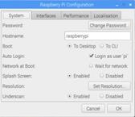

</td>

</tr>

<tr>

<td width="326" valign="top" style="border-style: none solid solid; border-color: -moz-use-text-color windowtext windowtext; border-width: medium 1pt 1pt; padding: 0cm 5.4pt; width: 244.45pt;">

Enter initial (for standard user “pi” it is “Raspberry” and your new password

</td>

<td width="326" valign="top" style="border-style: none solid solid none; border-color: -moz-use-text-color windowtext windowtext -moz-use-text-color; border-width: medium 1pt 1pt medium; padding: 0cm 5.4pt; width: 244.45pt;">

Raspberry

_yourpassword_

_yourpassword_

</td>

</tr>

</tbody>

</table>

 

  

** **

### <a name="_Toc485150898">Enabling interfaces:</a>

This is required for the communication to the PC (SSH) and to the Z-Wave stick (Serial)

<table class="MsoTableGrid" style="border: medium none ; border-collapse: collapse;" border="1" cellspacing="0" cellpadding="0">

<tbody>

<tr>

<td width="326" valign="top" style="border: 1pt solid windowtext; padding: 0cm 5.4pt; width: 244.45pt;">

Open Raspberry Pi Configuration

Application menu

-Preferences

--Raspberry Pi configuration

</td>

<td width="326" valign="top" style="border-style: solid solid solid none; border-color: windowtext windowtext windowtext -moz-use-text-color; border-width: 1pt 1pt 1pt medium; padding: 0cm 5.4pt; width: 244.45pt;">

</td>

</tr>

<tr>

<td width="326" valign="top" style="border-style: none solid solid; border-color: -moz-use-text-color windowtext windowtext; border-width: medium 1pt 1pt; padding: 0cm 5.4pt; width: 244.45pt;">

Go to tab Interfaces

</td>

<td width="326" valign="top" style="border-style: none solid solid none; border-color: -moz-use-text-color windowtext windowtext -moz-use-text-color; border-width: medium 1pt 1pt medium; padding: 0cm 5.4pt; width: 244.45pt;">

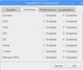

</td>

</tr>

<tr>

<td width="326" valign="top" style="border-style: none solid solid; border-color: -moz-use-text-color windowtext windowtext; border-width: medium 1pt 1pt; padding: 0cm 5.4pt; width: 244.45pt;">

Enable SSH (to access the Raspberry via Network)

Enable Serial (to enable Serial Port for Z-Wave controllers)

</td>

<td width="326" valign="top" style="border-style: none solid solid none; border-color: -moz-use-text-color windowtext windowtext -moz-use-text-color; border-width: medium 1pt 1pt medium; padding: 0cm 5.4pt; width: 244.45pt;">

SSH:    Enable

Serial: Enable

</td>

</tr>

</tbody>

</table>

 

**  
**

** **

### <a name="_Toc485150899">Connect Raspberry to network:</a>

Either by plugging in a Ethernet cable or by connecting to a WiFi network:

<table class="MsoTableGrid" style="border: medium none ; border-collapse: collapse;" border="1" cellspacing="0" cellpadding="0">

<tbody>

<tr>

<td width="326" valign="top" style="border: 1pt solid windowtext; padding: 0cm 5.4pt; width: 244.45pt;">

Click on the network symbol

</td>

<td width="326" valign="top" style="border-style: solid solid solid none; border-color: windowtext windowtext windowtext -moz-use-text-color; border-width: 1pt 1pt 1pt medium; padding: 0cm 5.4pt; width: 244.45pt;">

3 lines and 2 red crosses if no connection is available

</td>

</tr>

<tr>

<td width="326" valign="top" style="border-style: none solid solid; border-color: -moz-use-text-color windowtext windowtext; border-width: medium 1pt 1pt; padding: 0cm 5.4pt; width: 244.45pt;">

Select WiFi network:

</td>

<td width="326" valign="top" style="border-style: none solid solid none; border-color: -moz-use-text-color windowtext windowtext -moz-use-text-color; border-width: medium 1pt 1pt medium; padding: 0cm 5.4pt; width: 244.45pt;">

_yourwifi_

</td>

</tr>

<tr>

<td width="326" valign="top" style="border-style: none solid solid; border-color: -moz-use-text-color windowtext windowtext; border-width: medium 1pt 1pt; padding: 0cm 5.4pt; width: 244.45pt;">

Enter WiFi password

</td>

<td width="326" valign="top" style="border-style: none solid solid none; border-color: -moz-use-text-color windowtext windowtext -moz-use-text-color; border-width: medium 1pt 1pt medium; padding: 0cm 5.4pt; width: 244.45pt;">

_yourwifipassword_

</td>

</tr>

</tbody>

</table>

 

### <a name="_Toc485150900">Check the IP address of the Raspberry:</a>

To do so you have to check the IP address of the Raspberry in the terminal

<table class="MsoTableGrid" style="border: medium none ; border-collapse: collapse;" border="1" cellspacing="0" cellpadding="0">

<tbody>

<tr>

<td width="262" valign="top" style="border: 1pt solid windowtext; padding: 0cm 5.4pt; width: 196.8pt;">

Start terminal by clicking on the icon

</td>

<td width="389" valign="top" style="border-style: solid solid solid none; border-color: windowtext windowtext windowtext -moz-use-text-color; border-width: 1pt 1pt 1pt medium; padding: 0cm 5.4pt; width: 292.1pt;">

</td>

</tr>

<tr>

<td width="262" valign="top" style="border-style: none solid solid; border-color: -moz-use-text-color windowtext windowtext; border-width: medium 1pt 1pt; padding: 0cm 5.4pt; width: 196.8pt;">

use the command

</td>

<td width="389" valign="top" style="border-style: none solid solid none; border-color: -moz-use-text-color windowtext windowtext -moz-use-text-color; border-width: medium 1pt 1pt medium; padding: 0cm 5.4pt; width: 292.1pt;">

ifconfig

</td>

</tr>

<tr>

<td width="262" valign="top" style="border-style: none solid solid; border-color: -moz-use-text-color windowtext windowtext; border-width: medium 1pt 1pt; padding: 0cm 5.4pt; width: 196.8pt;">

Result: the terminal shows you the ip configuration and the IP addresses for the different connections

</td>

<td width="389" valign="top" style="border-style: none solid solid none; border-color: -moz-use-text-color windowtext windowtext -moz-use-text-color; border-width: medium 1pt 1pt medium; padding: 0cm 5.4pt; width: 292.1pt;">

Ethernet cable: eth0 _xxx.xxx.xxx.xxx_

or

WiFi: wlan0 _xxx.xxx.xxx.xxx_

</td>

</tr>

</tbody>

</table>

**NOTE:** You might want to set your IP address of the Raspberry to static, if you get problems with the lease time setting of your gateway (IP address is changing whenever you reconnect to the network)

 

### <a name="_Toc485150901">Update / Upgrade Raspbian:</a>

Raspbian is proving online updates so make sure that you have the latest installed before you go further in the configuration.

<table class="MsoTableGrid" style="border: medium none ; border-collapse: collapse;" border="1" cellspacing="0" cellpadding="0">

<tbody>

<tr>

<td width="262" valign="top" style="border: 1pt solid windowtext; padding: 0cm 5.4pt; width: 196.8pt;">

Start terminal by clicking on the icon

</td>

<td width="389" valign="top" style="border-style: solid solid solid none; border-color: windowtext windowtext windowtext -moz-use-text-color; border-width: 1pt 1pt 1pt medium; padding: 0cm 5.4pt; width: 292.1pt;">

</td>

</tr>

<tr style="height: 56.6pt;">

<td width="262" valign="top" style="border-style: none solid solid; border-color: -moz-use-text-color windowtext windowtext; border-width: medium 1pt 1pt; padding: 0cm 5.4pt; width: 196.8pt; height: 56.6pt;">

use the command

(be aware that the upgrade function will take several minutes to complete if you run it for the first time)

</td>

<td width="389" valign="top" style="border-style: none solid solid none; border-color: -moz-use-text-color windowtext windowtext -moz-use-text-color; border-width: medium 1pt 1pt medium; padding: 0cm 5.4pt; width: 292.1pt; height: 56.6pt;">

sudo apt-get update

sudo apt-get upgrade

</td>

</tr>

</tbody>

</table>

 

 

**  
**

## <a name="_Toc485150902">Optional Raspberry settings and configuration:</a>

The following settings and configuration is just for additional information and might not be needed to setup openHAB2\. Some of the settings and configuration might still be useful.

 

### <a name="_Toc485150903">Check partition size on MicroSD card:</a>

Make sure Raspbian is using the full capacity of the MicroSD card (normally while starting up Raspbian for the first time, it is done automatically and the Raspberry will restart automatically):

<table class="MsoTableGrid" style="border: medium none ; border-collapse: collapse;" border="1" cellspacing="0" cellpadding="0">

<tbody>

<tr>

<td width="262" valign="top" style="border: 1pt solid windowtext; padding: 0cm 5.4pt; width: 196.8pt;">

Open Terminal

</td>

<td width="389" valign="top" style="border-style: solid solid solid none; border-color: windowtext windowtext windowtext -moz-use-text-color; border-width: 1pt 1pt 1pt medium; padding: 0cm 5.4pt; width: 292.1pt;">

</td>

</tr>

<tr>

<td width="262" valign="top" style="border-style: none solid solid; border-color: -moz-use-text-color windowtext windowtext; border-width: medium 1pt 1pt; padding: 0cm 5.4pt; width: 196.8pt;">

use the command

</td>

<td width="389" valign="top" style="border-style: none solid solid none; border-color: -moz-use-text-color windowtext windowtext -moz-use-text-color; border-width: medium 1pt 1pt medium; padding: 0cm 5.4pt; width: 292.1pt;">

sudo fdisk -l

</td>

</tr>

<tr>

<td width="262" valign="top" style="border-style: none solid solid; border-color: -moz-use-text-color windowtext windowtext; border-width: medium 1pt 1pt; padding: 0cm 5.4pt; width: 196.8pt;">

Result: the terminal shows you the partition size of the two partitions on the MicroSD card summing up to the total capacity

</td>

<td width="389" valign="top" style="border-style: none solid solid none; border-color: -moz-use-text-color windowtext windowtext -moz-use-text-color; border-width: medium 1pt 1pt medium; padding: 0cm 5.4pt; width: 292.1pt;">

Example for 16 GB:

 

</td>

</tr>

<tr>

<td width="262" valign="top" style="border-style: none solid solid; border-color: -moz-use-text-color windowtext windowtext; border-width: medium 1pt 1pt; padding: 0cm 5.4pt; width: 196.8pt;">

If the capacity is not completely used (e.g. you were using not a plain Raspbian image) you have to expand the partitions manually in the terminal configuration

</td>

<td width="389" valign="top" style="border-style: none solid solid none; border-color: -moz-use-text-color windowtext windowtext -moz-use-text-color; border-width: medium 1pt 1pt medium; padding: 0cm 5.4pt; width: 292.1pt;">

 

</td>

</tr>

<tr>

<td width="262" valign="top" style="border-style: none solid solid; border-color: -moz-use-text-color windowtext windowtext; border-width: medium 1pt 1pt; padding: 0cm 5.4pt; width: 196.8pt;">

Start terminal configuration with command

</td>

<td width="389" valign="top" style="border-style: none solid solid none; border-color: -moz-use-text-color windowtext windowtext -moz-use-text-color; border-width: medium 1pt 1pt medium; padding: 0cm 5.4pt; width: 292.1pt;">

sudo raspi-config

</td>

</tr>

<tr>

<td width="262" valign="top" style="border-style: none solid solid; border-color: -moz-use-text-color windowtext windowtext; border-width: medium 1pt 1pt; padding: 0cm 5.4pt; width: 196.8pt;">

Select Option (Be aware that the option numbers might change in newer Raspbian releases)

</td>

<td width="389" valign="top" style="border-style: none solid solid none; border-color: -moz-use-text-color windowtext windowtext -moz-use-text-color; border-width: medium 1pt 1pt medium; padding: 0cm 5.4pt; width: 292.1pt;">

7 Advanced Options

</td>

</tr>

<tr>

<td width="262" valign="top" style="border-style: none solid solid; border-color: -moz-use-text-color windowtext windowtext; border-width: medium 1pt 1pt; padding: 0cm 5.4pt; width: 196.8pt;">

Select Option

</td>

<td width="389" valign="top" style="border-style: none solid solid none; border-color: -moz-use-text-color windowtext windowtext -moz-use-text-color; border-width: medium 1pt 1pt medium; padding: 0cm 5.4pt; width: 292.1pt;">

A1 Expand Filesystem

Prompt will tell you that the file system has been increased

</td>

</tr>

<tr>

<td width="262" valign="top" style="border-style: none solid solid; border-color: -moz-use-text-color windowtext windowtext; border-width: medium 1pt 1pt; padding: 0cm 5.4pt; width: 196.8pt;">

Now select to exit the configuration

</td>

<td width="389" valign="top" style="border-style: none solid solid none; border-color: -moz-use-text-color windowtext windowtext -moz-use-text-color; border-width: medium 1pt 1pt medium; padding: 0cm 5.4pt; width: 292.1pt;">

<Finish>

</td>

</tr>

<tr>

<td width="262" valign="top" style="border-style: none solid solid; border-color: -moz-use-text-color windowtext windowtext; border-width: medium 1pt 1pt; padding: 0cm 5.4pt; width: 196.8pt;">

Allow reboot

</td>

<td width="389" valign="top" style="border-style: none solid solid none; border-color: -moz-use-text-color windowtext windowtext -moz-use-text-color; border-width: medium 1pt 1pt medium; padding: 0cm 5.4pt; width: 292.1pt;">

<Yes>

</td>

</tr>

</tbody>

</table>

 

### <a name="_Toc485150904">Create a Desktop icon and link it to a application</a>

To be able to create a Icon you have to first create a *.desktop file

**NOTE:** This example is creating the desktop icon for the user “pi”

<table class="MsoTableGrid" style="border: medium none ; border-collapse: collapse;" border="1" cellspacing="0" cellpadding="0">

<tbody>

<tr>

<td width="326" valign="top" style="border: 1pt solid windowtext; padding: 0cm 5.4pt; width: 244.45pt;">

Open Terminal

</td>

<td width="326" valign="top" style="border-style: solid solid solid none; border-color: windowtext windowtext windowtext -moz-use-text-color; border-width: 1pt 1pt 1pt medium; padding: 0cm 5.4pt; width: 244.45pt;">

</td>

</tr>

<tr>

<td width="326" valign="top" style="border-style: none solid solid; border-color: -moz-use-text-color windowtext windowtext; border-width: medium 1pt 1pt; padding: 0cm 5.4pt; width: 244.45pt;">

Go to the directory desktop for your “pi” user

</td>

<td width="326" valign="top" style="border-style: none solid solid none; border-color: -moz-use-text-color windowtext windowtext -moz-use-text-color; border-width: medium 1pt 1pt medium; padding: 0cm 5.4pt; width: 244.45pt;">

cd /home/pi/Desktop

</td>

</tr>

<tr>

<td width="326" valign="top" style="border-style: none solid solid; border-color: -moz-use-text-color windowtext windowtext; border-width: medium 1pt 1pt; padding: 0cm 5.4pt; width: 244.45pt;">

Create a specific desktop file using nano editor

</td>

<td width="326" valign="top" style="border-style: none solid solid none; border-color: -moz-use-text-color windowtext windowtext -moz-use-text-color; border-width: medium 1pt 1pt medium; padding: 0cm 5.4pt; width: 244.45pt;">

sudo nano _yourdesktopfile_.desktop

</td>

</tr>

<tr>

<td width="326" valign="top" style="border-style: none solid solid; border-color: -moz-use-text-color windowtext windowtext; border-width: medium 1pt 1pt; padding: 0cm 5.4pt; width: 244.45pt;">

Enter parameters into the file accordingly

Name: _YourShortcutName_

Comment: _Your Shortcut Comment_

Icon: _YourIcon_.png

Application for shortcut: YourShortcutApp

 

</td>

<td width="326" valign="top" style="border-style: none solid solid none; border-color: -moz-use-text-color windowtext windowtext -moz-use-text-color; border-width: medium 1pt 1pt medium; padding: 0cm 5.4pt; width: 244.45pt;">

Desktop Entry]

Name=_YourShortcutName_

Comment=_Your Shortcut Comment_

Icon=/usr/share/pixmaps/_YourIcon_.png

Exec=/usr/bin/_YourShortcutApp_

Type=Application

Encoding=UTF-8

Terminal=false

</td>

</tr>

<tr>

<td width="326" valign="top" style="border-style: none solid solid; border-color: -moz-use-text-color windowtext windowtext; border-width: medium 1pt 1pt; padding: 0cm 5.4pt; width: 244.45pt;">

Exit and save the file

</td>

<td width="326" valign="top" style="border-style: none solid solid none; border-color: -moz-use-text-color windowtext windowtext -moz-use-text-color; border-width: medium 1pt 1pt medium; padding: 0cm 5.4pt; width: 244.45pt;">

<ctrl+x>

<y>

<Enter>

</td>

</tr>

</tbody>

</table>

  

** **

### <a name="_Toc485150905">Enabling root user:</a>

Since by default the “root” disabled it can’t be used. You might want to enable it for certain purposes like e.g. enabling the root user for samba file server to get full access to the directories from a PC (see chapter setup samba server)

**NOTE:** There is a reason for the “root” being disabled! Enabling the user is allowing full access to the Raspbian and therefore creating a security risk. Please always consider whether you really want to enable this user!

<table class="MsoTableGrid" style="border: medium none ; border-collapse: collapse;" border="1" cellspacing="0" cellpadding="0">

<tbody>

<tr>

<td width="326" valign="top" style="border: 1pt solid windowtext; padding: 0cm 5.4pt; width: 244.45pt;">

Open Terminal

</td>

<td width="326" valign="top" style="border-style: solid solid solid none; border-color: windowtext windowtext windowtext -moz-use-text-color; border-width: 1pt 1pt 1pt medium; padding: 0cm 5.4pt; width: 244.45pt;">

</td>

</tr>

<tr>

<td width="326" valign="top" style="border-style: none solid solid; border-color: -moz-use-text-color windowtext windowtext; border-width: medium 1pt 1pt; padding: 0cm 5.4pt; width: 244.45pt;">

Since the user already exists you just have to set the password

NOTE: you can also use the command to change the password later on

</td>

<td width="326" valign="top" style="border-style: none solid solid none; border-color: -moz-use-text-color windowtext windowtext -moz-use-text-color; border-width: medium 1pt 1pt medium; padding: 0cm 5.4pt; width: 244.45pt;">

sudo passwd root

</td>

</tr>

<tr>

<td width="326" valign="top" style="border-style: none solid solid; border-color: -moz-use-text-color windowtext windowtext; border-width: medium 1pt 1pt; padding: 0cm 5.4pt; width: 244.45pt;">

Just enter twice the new password for the “root” user

</td>

<td width="326" valign="top" style="border-style: none solid solid none; border-color: -moz-use-text-color windowtext windowtext -moz-use-text-color; border-width: medium 1pt 1pt medium; padding: 0cm 5.4pt; width: 244.45pt;">

_rootpassword_

_rootpassword_

</td>

</tr>

</tbody>

</table>

 

### <a name="_Toc485150906">Enabling remote SSH access for root user:</a>

**NOTE:** There is a reason for the “root” not being enabled for SSH! Enabling the user for SSH is allowing full remote access to the Raspbian and therefore creating a significant security risk. Please always consider whether you really want to enable this user for SSH!

<table class="MsoTableGrid" style="border: medium none ; border-collapse: collapse;" border="1" cellspacing="0" cellpadding="0">

<tbody>

<tr>

<td width="326" valign="top" style="border: 1pt solid windowtext; padding: 0cm 5.4pt; width: 244.45pt;">

Open Terminal

</td>

<td width="326" valign="top" style="border-style: solid solid solid none; border-color: windowtext windowtext windowtext -moz-use-text-color; border-width: 1pt 1pt 1pt medium; padding: 0cm 5.4pt; width: 244.45pt;">

</td>

</tr>

<tr>

<td width="326" valign="top" style="border-style: none solid solid; border-color: -moz-use-text-color windowtext windowtext; border-width: medium 1pt 1pt; padding: 0cm 5.4pt; width: 244.45pt;">

Open sshd.config file in nano editor

</td>

<td width="326" valign="top" style="border-style: none solid solid none; border-color: -moz-use-text-color windowtext windowtext -moz-use-text-color; border-width: medium 1pt 1pt medium; padding: 0cm 5.4pt; width: 244.45pt;">

sudo nano /etc/ssh/sshd_config

</td>

</tr>

<tr>

<td width="326" valign="top" style="border-style: none solid solid; border-color: -moz-use-text-color windowtext windowtext; border-width: medium 1pt 1pt; padding: 0cm 5.4pt; width: 244.45pt;">

Find the section # Authentication in the file

</td>

<td width="326" valign="top" style="border-style: none solid solid none; border-color: -moz-use-text-color windowtext windowtext -moz-use-text-color; border-width: medium 1pt 1pt medium; padding: 0cm 5.4pt; width: 244.45pt;">

# Authentication:

LoginGraceTime 120

PermitRootLogin without-password

StrictModes yes

</td>

</tr>

<tr>

<td width="326" valign="top" style="border-style: none solid solid; border-color: -moz-use-text-color windowtext windowtext; border-width: medium 1pt 1pt; padding: 0cm 5.4pt; width: 244.45pt;">

And change the PermitRootLoing line to

</td>

<td width="326" valign="top" style="border-style: none solid solid none; border-color: -moz-use-text-color windowtext windowtext -moz-use-text-color; border-width: medium 1pt 1pt medium; padding: 0cm 5.4pt; width: 244.45pt;">

PermitRootLogin yes

</td>

</tr>

<tr>

<td width="326" valign="top" style="border-style: none solid solid; border-color: -moz-use-text-color windowtext windowtext; border-width: medium 1pt 1pt; padding: 0cm 5.4pt; width: 244.45pt;">

Exit and save the file

</td>

<td width="326" valign="top" style="border-style: none solid solid none; border-color: -moz-use-text-color windowtext windowtext -moz-use-text-color; border-width: medium 1pt 1pt medium; padding: 0cm 5.4pt; width: 244.45pt;">

<ctrl+x>

<y>

<Enter>

</td>

</tr>

<tr>

<td width="326" valign="top" style="border-style: none solid solid; border-color: -moz-use-text-color windowtext windowtext; border-width: medium 1pt 1pt; padding: 0cm 5.4pt; width: 244.45pt;">

Reboot the Raspberry for the changes to take effect

</td>

<td width="326" valign="top" style="border-style: none solid solid none; border-color: -moz-use-text-color windowtext windowtext -moz-use-text-color; border-width: medium 1pt 1pt medium; padding: 0cm 5.4pt; width: 244.45pt;">

sudo reboot

</td>

</tr>

</tbody>

</table>

 

  

** **

## <a name="_Toc485150907">Optional: Raspbian PIXEL screensaver (xscreensaver)</a>

If you are working with the 7” Raspberry display setup you might want to use a screensaver as well.

### <a name="_Toc485150908">Installation of xscreensaver:</a>

<table class="MsoTableGrid" style="border: medium none ; border-collapse: collapse;" border="1" cellspacing="0" cellpadding="0">

<tbody>

<tr>

<td width="326" valign="top" style="border: 1pt solid windowtext; padding: 0cm 5.4pt; width: 244.45pt;">

Open Terminal

</td>

<td width="326" valign="top" style="border-style: solid solid solid none; border-color: windowtext windowtext windowtext -moz-use-text-color; border-width: 1pt 1pt 1pt medium; padding: 0cm 5.4pt; width: 244.45pt;">

</td>

</tr>

<tr>

<td width="326" valign="top" style="border-style: none solid solid; border-color: -moz-use-text-color windowtext windowtext; border-width: medium 1pt 1pt; padding: 0cm 5.4pt; width: 244.45pt;">

Install xscreensaver and some additional screen saver themes

</td>

<td width="326" valign="top" style="border-style: none solid solid none; border-color: -moz-use-text-color windowtext windowtext -moz-use-text-color; border-width: medium 1pt 1pt medium; padding: 0cm 5.4pt; width: 244.45pt;">

sudo apt-get install xscreensaver xscreensaver-data-extra xscreensaver-gl-extra

<y>

</td>

</tr>

</tbody>

</table>

 

### <a name="_Toc485150909">Configuration of xscreensaver:</a>

I am showing an example configuration which is first switching on a screensaver and then turning off the display completely.

<table class="MsoTableGrid" style="border: medium none ; border-collapse: collapse;" border="1" cellspacing="0" cellpadding="0">

<tbody>

<tr>

<td width="326" valign="top" style="border: 1pt solid windowtext; padding: 0cm 5.4pt; width: 244.45pt;">

Open Screensaver Preferences

Application menu

-Preferences

--Screensaver

 

</td>

<td width="326" valign="top" style="border-style: solid solid solid none; border-color: windowtext windowtext windowtext -moz-use-text-color; border-width: 1pt 1pt 1pt medium; padding: 0cm 5.4pt; width: 244.45pt;">

</td>

</tr>

<tr>

<td width="326" valign="top" style="border-style: none solid solid; border-color: -moz-use-text-color windowtext windowtext; border-width: medium 1pt 1pt; padding: 0cm 5.4pt; width: 244.45pt;">

Configure Display Modes

Mode: <Only One Screen Saver>

Screensaver: <Barcode>

Blank After: <5> minutes

Cycle After: <0> minutes

NOTE: This is just a sample configuration selecting one screensaver after 5 minutes

</td>

<td width="326" valign="top" style="border-style: none solid solid none; border-color: -moz-use-text-color windowtext windowtext -moz-use-text-color; border-width: medium 1pt 1pt medium; padding: 0cm 5.4pt; width: 244.45pt;">

</td>

</tr>

<tr>

<td width="326" valign="top" style="border-style: none solid solid; border-color: -moz-use-text-color windowtext windowtext; border-width: medium 1pt 1pt; padding: 0cm 5.4pt; width: 244.45pt;">

Configure Advanced

Display Power Management

<check> Power Management Enabled

Standby After <10> minutes

Suspend After <10> minutes

Off After <10> minutes

<check> Quick Power-off in Blank Only Mode

 (Display Power Management)

NOTE: This is just a sample switching off the screen after 10 minutes

</td>

<td width="326" valign="top" style="border-style: none solid solid none; border-color: -moz-use-text-color windowtext windowtext -moz-use-text-color; border-width: medium 1pt 1pt medium; padding: 0cm 5.4pt; width: 244.45pt;">

</td>

</tr>

<tr>

<td width="326" valign="top" style="border-style: none solid solid; border-color: -moz-use-text-color windowtext windowtext; border-width: medium 1pt 1pt; padding: 0cm 5.4pt; width: 244.45pt;">

Close the Screensaver Preferences

</td>

<td width="326" valign="top" style="border-style: none solid solid none; border-color: -moz-use-text-color windowtext windowtext -moz-use-text-color; border-width: medium 1pt 1pt medium; padding: 0cm 5.4pt; width: 244.45pt;">

 

</td>

</tr>

</tbody>

</table>

  

 

## <a name="_Toc485150910">Optional: Start Chromium Web server on Raspbian boot</a>

 

### <a name="_Toc485150911">Configure the autostart file:</a>

<table class="MsoTableGrid" style="border: medium none ; border-collapse: collapse;" border="1" cellspacing="0" cellpadding="0">

<tbody>

<tr>

<td width="326" valign="top" style="border: 1pt solid windowtext; padding: 0cm 5.4pt; width: 244.45pt;">

Open Terminal

</td>

<td width="326" valign="top" style="border-style: solid solid solid none; border-color: windowtext windowtext windowtext -moz-use-text-color; border-width: 1pt 1pt 1pt medium; padding: 0cm 5.4pt; width: 244.45pt;">

</td>

</tr>

<tr>

<td width="326" valign="top" style="border-style: none solid solid; border-color: -moz-use-text-color windowtext windowtext; border-width: medium 1pt 1pt; padding: 0cm 5.4pt; width: 244.45pt;">

Open the autostart configuration file with nano editor

</td>

<td width="326" valign="top" style="border-style: none solid solid none; border-color: -moz-use-text-color windowtext windowtext -moz-use-text-color; border-width: medium 1pt 1pt medium; padding: 0cm 5.4pt; width: 244.45pt;">

sudo nano /home/pi/.config/lxsession/LXDE-pi/autostart

</td>

</tr>

<tr>

<td width="326" valign="top" style="border-style: none solid solid; border-color: -moz-use-text-color windowtext windowtext; border-width: medium 1pt 1pt; padding: 0cm 5.4pt; width: 244.45pt;">

Add the lines at the end of the file (ignoring error dialogs)

</td>

<td width="326" valign="top" style="border-style: none solid solid none; border-color: -moz-use-text-color windowtext windowtext -moz-use-text-color; border-width: medium 1pt 1pt medium; padding: 0cm 5.4pt; width: 244.45pt;">

@unclutter

@chromium-browser --noerrdialogs

</td>

</tr>

<tr>

<td width="326" valign="top" style="border-style: none solid solid; border-color: -moz-use-text-color windowtext windowtext; border-width: medium 1pt 1pt; padding: 0cm 5.4pt; width: 244.45pt;">

Optional parameters:

--kiosk (for full screen mode. NOTE: to exit full screen mode you have to press “Alt+F4” on the keyboard of the Raspberry, so you have to have a keyboard installed to exit this mode!)

--incognito (for incognito mode of the browser)

http://yoururl.com (for selecting the URL directly in the configuration file. NOTE: selecting the URL via Chromium settings might be easier)

</td>

<td width="326" valign="top" style="border-style: none solid solid none; border-color: -moz-use-text-color windowtext windowtext -moz-use-text-color; border-width: medium 1pt 1pt medium; padding: 0cm 5.4pt; width: 244.45pt;">

@chromium-browser --noerrdialogs --kiosk --incognito http://_yoururl.com_

</td>

</tr>

<tr>

<td width="326" valign="top" style="border-style: none solid solid; border-color: -moz-use-text-color windowtext windowtext; border-width: medium 1pt 1pt; padding: 0cm 5.4pt; width: 244.45pt;">

Exit and save the file

</td>

<td width="326" valign="top" style="border-style: none solid solid none; border-color: -moz-use-text-color windowtext windowtext -moz-use-text-color; border-width: medium 1pt 1pt medium; padding: 0cm 5.4pt; width: 244.45pt;">

<ctrl+x>

<y>

<Enter>

</td>

</tr>

<tr>

<td width="326" valign="top" style="border-style: none solid solid; border-color: -moz-use-text-color windowtext windowtext; border-width: medium 1pt 1pt; padding: 0cm 5.4pt; width: 244.45pt;">

Check if the browser is coming up after reboot

</td>

<td width="326" valign="top" style="border-style: none solid solid none; border-color: -moz-use-text-color windowtext windowtext -moz-use-text-color; border-width: medium 1pt 1pt medium; padding: 0cm 5.4pt; width: 244.45pt;">

sudo reboot

</td>

</tr>

</tbody>

</table>

 

### <a name="_Toc485150912">Select the start URL for Chromium web browser:</a>

NOTE: You can also select the URL in the autostart file, but using the browser functionality is giving you a simpler access (no terminal) and you can check the result without rebooting

<table class="MsoTableGrid" style="border: medium none ; border-collapse: collapse;" border="1" cellspacing="0" cellpadding="0">

<tbody>

<tr>

<td width="324" valign="top" style="border: 1pt solid windowtext; padding: 0cm 5.4pt; width: 243.3pt;">

Open Chromium and go to the Settings

(3 bullets icon)

</td>

<td width="333" valign="top" style="border-style: solid solid solid none; border-color: windowtext windowtext windowtext -moz-use-text-color; border-width: 1pt 1pt 1pt medium; padding: 0cm 5.4pt; width: 249.4pt;">

</td>

</tr>

<tr>

<td width="324" valign="top" style="border-style: none solid solid; border-color: -moz-use-text-color windowtext windowtext; border-width: medium 1pt 1pt; padding: 0cm 5.4pt; width: 243.3pt;">

Select in the On start-up chapter the option

<check> Open a specific page or set of pages

And click on the link <Set pages> to enter the requested start URL

</td>

<td width="333" valign="top" style="border-style: none solid solid none; border-color: -moz-use-text-color windowtext windowtext -moz-use-text-color; border-width: medium 1pt 1pt medium; padding: 0cm 5.4pt; width: 249.4pt;">

</td>

</tr>

<tr>

<td width="324" valign="top" style="border-style: none solid solid; border-color: -moz-use-text-color windowtext windowtext; border-width: medium 1pt 1pt; padding: 0cm 5.4pt; width: 243.3pt;">

Enter the requested start URL _http://yoururl.com_

<OK> your URL

Now Chromium is allowing you to enter an additional URL which you can ignore

 

</td>

<td width="333" valign="top" style="border-style: none solid solid none; border-color: -moz-use-text-color windowtext windowtext -moz-use-text-color; border-width: medium 1pt 1pt medium; padding: 0cm 5.4pt; width: 249.4pt;">

</td>

</tr>

<tr>

<td width="324" valign="top" style="border-style: none solid solid; border-color: -moz-use-text-color windowtext windowtext; border-width: medium 1pt 1pt; padding: 0cm 5.4pt; width: 243.3pt;">

To check if it is working

Close Chromium browser

Open Chromium browser

Result: _http://yoururl.com _should be loaded on startup (in my example I selected the openHAB2 GUI start page )

Optional: If you have completed your openHAB2 configuration and want to use HABPANEL as GUI you can just use the URL http://xxx.xxx.xxx.xxx:8080/HABPANEL/index.html#/

or even start specific pages in the HABPANEL GUI (just use the URL shown in the browser when you access the HABPANEL page)

</td>

<td width="333" valign="top" style="border-style: none solid solid none; border-color: -moz-use-text-color windowtext windowtext -moz-use-text-color; border-width: medium 1pt 1pt medium; padding: 0cm 5.4pt; width: 249.4pt;">

http://_xxx.xxx.xxx.xxx_:8080/start/index

</td>

</tr>

</tbody>

</table>

 

  

 

# <a name="_Toc485150913">Chapter 5: Setting up Raspbian for access via PC</a>

## <a name="_Toc485150914">Connect to the Raspberry terminal your windows system using, KiTTY or PuTTY:</a>

<table class="MsoTableGrid" style="border: medium none ; border-collapse: collapse;" border="1" cellspacing="0" cellpadding="0">

<tbody>

<tr>

<td width="320" valign="top" style="border: 1pt solid windowtext; padding: 0cm 5.4pt; width: 239.95pt;">

Open KiTTY or PuTTY on your PC

</td>

<td width="337" valign="top" style="border-style: solid solid solid none; border-color: windowtext windowtext windowtext -moz-use-text-color; border-width: 1pt 1pt 1pt medium; padding: 0cm 5.4pt; width: 252.75pt;">

</td>

</tr>

<tr>

<td width="320" valign="top" style="border-style: none solid solid; border-color: -moz-use-text-color windowtext windowtext; border-width: medium 1pt 1pt; padding: 0cm 5.4pt; width: 239.95pt;">

Enter Hostname (pi@ in front of the IP is giving the user you want to use for connecting, in this case the standard user “pi”), Port and Connection type

Select Open to launch the terminal

</td>

<td width="337" valign="top" style="border-style: none solid solid none; border-color: -moz-use-text-color windowtext windowtext -moz-use-text-color; border-width: medium 1pt 1pt medium; padding: 0cm 5.4pt; width: 252.75pt;">

Hostname: pi@_xxx.xxx.xxx.xxx_

Port:22

Connection type: SSH

<Open>

</td>

</tr>

<tr>

<td width="320" valign="top" style="border-style: none solid solid; border-color: -moz-use-text-color windowtext windowtext; border-width: medium 1pt 1pt; padding: 0cm 5.4pt; width: 239.95pt;">

Optional save the session

</td>

<td width="337" valign="top" style="border-style: none solid solid none; border-color: -moz-use-text-color windowtext windowtext -moz-use-text-color; border-width: medium 1pt 1pt medium; padding: 0cm 5.4pt; width: 252.75pt;">

Saved session _yoursessionname_

<Save>

</td>

</tr>

<tr>

<td width="320" valign="top" style="border-style: none solid solid; border-color: -moz-use-text-color windowtext windowtext; border-width: medium 1pt 1pt; padding: 0cm 5.4pt; width: 239.95pt;">

On first connection an security alert is coming which you have to accept

</td>

<td width="337" valign="top" style="border-style: none solid solid none; border-color: -moz-use-text-color windowtext windowtext -moz-use-text-color; border-width: medium 1pt 1pt medium; padding: 0cm 5.4pt; width: 252.75pt;">

Yes

</td>

</tr>

<tr>

<td width="320" valign="top" style="border-style: none solid solid; border-color: -moz-use-text-color windowtext windowtext; border-width: medium 1pt 1pt; padding: 0cm 5.4pt; width: 239.95pt;">

Now a terminal window is opening on our PC asking you to enter the “pi” user password

</td>

<td width="337" valign="top" style="border-style: none solid solid none; border-color: -moz-use-text-color windowtext windowtext -moz-use-text-color; border-width: medium 1pt 1pt medium; padding: 0cm 5.4pt; width: 252.75pt;">

_yourpassword_

</td>

</tr>

<tr>

<td width="320" valign="top" style="border-style: none solid solid; border-color: -moz-use-text-color windowtext windowtext; border-width: medium 1pt 1pt; padding: 0cm 5.4pt; width: 239.95pt;">

The terminal window is now starting up in the user home directory

</td>

<td width="337" valign="top" style="border-style: none solid solid none; border-color: -moz-use-text-color windowtext windowtext -moz-use-text-color; border-width: medium 1pt 1pt medium; padding: 0cm 5.4pt; width: 252.75pt;">

</td>

</tr>

<tr>

<td width="320" valign="top" style="border-style: none solid solid; border-color: -moz-use-text-color windowtext windowtext; border-width: medium 1pt 1pt; padding: 0cm 5.4pt; width: 239.95pt;">

You can now use the PC terminal window the same way you us the terminal on the Raspberry itself

</td>

<td width="337" valign="top" style="border-style: none solid solid none; border-color: -moz-use-text-color windowtext windowtext -moz-use-text-color; border-width: medium 1pt 1pt medium; padding: 0cm 5.4pt; width: 252.75pt;">

 

</td>

</tr>

</tbody>

</table>

 

**  
**

** **

## <a name="_Toc485150915">Optional: Connect to the Raspberry file system from your windows system using WinSCP:</a>

**NOTE: **The connection can only access the rights of the Raspberry user. So the standard user “pi” will not have the writing rights for multiple directories. For full access you have to use the user “root” (user needs to be enabled since it is disabled in standard setup, procedure shown later in the tutorial), but enabling this user for SSH access is opening up a significant security risk, so it is recommended to use as Raspberry based Samba server for full access to specific directories (shown later in the tutorial).

 

<table class="MsoTableGrid" style="border: medium none ; border-collapse: collapse;" border="1" cellspacing="0" cellpadding="0">

<tbody>

<tr>

<td width="326" valign="top" style="border: 1pt solid windowtext; padding: 0cm 5.4pt; width: 244.45pt;">

Open WinSCP on your computer

</td>

<td width="326" valign="top" style="border-style: solid solid solid none; border-color: windowtext windowtext windowtext -moz-use-text-color; border-width: 1pt 1pt 1pt medium; padding: 0cm 5.4pt; width: 244.45pt;">

</td>

</tr>

<tr>

<td width="326" valign="top" style="border-style: none solid solid; border-color: -moz-use-text-color windowtext windowtext; border-width: medium 1pt 1pt; padding: 0cm 5.4pt; width: 244.45pt;">

Select: New Site

Select File protocol: SCP

Enter Host name: _xxx.xxx.xxx.xxx_

Enter port: 22

Enter User name: pi (standard user with limited access to the file system)

Enter Password for “pi”

</td>

<td width="326" valign="top" style="border-style: none solid solid none; border-color: -moz-use-text-color windowtext windowtext -moz-use-text-color; border-width: medium 1pt 1pt medium; padding: 0cm 5.4pt; width: 244.45pt;">

File protocol: SCP

Host name: _xxx.xxx.xxx.xxx_

Port: 22

User name: pi

Password _yourpassword_

</td>

</tr>

<tr>

<td width="326" valign="top" style="border-style: none solid solid; border-color: -moz-use-text-color windowtext windowtext; border-width: medium 1pt 1pt; padding: 0cm 5.4pt; width: 244.45pt;">

Optional save the Session

</td>

<td width="326" valign="top" style="border-style: none solid solid none; border-color: -moz-use-text-color windowtext windowtext -moz-use-text-color; border-width: medium 1pt 1pt medium; padding: 0cm 5.4pt; width: 244.45pt;">

<Save>

</td>

</tr>

<tr>

<td width="326" valign="top" style="border-style: none solid solid; border-color: -moz-use-text-color windowtext windowtext; border-width: medium 1pt 1pt; padding: 0cm 5.4pt; width: 244.45pt;">

WinSCP is launched showing the windows directory on the left side and the “pi” user home directory of the Raspberry on the right side of the window

</td>

<td width="326" valign="top" style="border-style: none solid solid none; border-color: -moz-use-text-color windowtext windowtext -moz-use-text-color; border-width: medium 1pt 1pt medium; padding: 0cm 5.4pt; width: 244.45pt;">

</td>

</tr>

</tbody>

</table>

 

**  
**

** **

## <a name="_Toc485150916">Setup Samba server</a>

To have access to the Raspberry file system using the PC file explorer (it is needed to run Eclipse Smart Home Designer your PC) you have to setup a Samba server on the Raspberry first.

NOTE: You can also follow the alternative instructions for a openHAB2 centric installation at: [http://docs.openhab.org/installation/linux.html#network-sharing](http://docs.openhab.org/installation/linux.html#network-sharing)

 

<table class="MsoTableGrid" style="border: medium none ; border-collapse: collapse;" border="1" cellspacing="0" cellpadding="0">

<tbody>

<tr>

<td width="326" valign="top" style="border: 1pt solid windowtext; padding: 0cm 5.4pt; width: 244.45pt;">

Open Terminal

</td>

<td width="326" valign="top" style="border-style: solid solid solid none; border-color: windowtext windowtext windowtext -moz-use-text-color; border-width: 1pt 1pt 1pt medium; padding: 0cm 5.4pt; width: 244.45pt;">

</td>

</tr>

<tr>

<td width="326" valign="top" style="border-style: none solid solid; border-color: -moz-use-text-color windowtext windowtext; border-width: medium 1pt 1pt; padding: 0cm 5.4pt; width: 244.45pt;">

Make sure Raspberry is updated (optional)

</td>

<td width="326" valign="top" style="border-style: none solid solid none; border-color: -moz-use-text-color windowtext windowtext -moz-use-text-color; border-width: medium 1pt 1pt medium; padding: 0cm 5.4pt; width: 244.45pt;">

sudo apt-get update

</td>

</tr>

<tr>

<td width="326" valign="top" style="border-style: none solid solid; border-color: -moz-use-text-color windowtext windowtext; border-width: medium 1pt 1pt; padding: 0cm 5.4pt; width: 244.45pt;">

Download samba server to Raspbery (confirm with enter)

</td>

<td width="326" valign="top" style="border-style: none solid solid none; border-color: -moz-use-text-color windowtext windowtext -moz-use-text-color; border-width: medium 1pt 1pt medium; padding: 0cm 5.4pt; width: 244.45pt;">

sudo apt-get install samba samba-common-bin

<Enter>

</td>

</tr>

<tr>

<td width="326" valign="top" style="border-style: none solid solid; border-color: -moz-use-text-color windowtext windowtext; border-width: medium 1pt 1pt; padding: 0cm 5.4pt; width: 244.45pt;">

Open the samba server configuration file in nano editor

</td>

<td width="326" valign="top" style="border-style: none solid solid none; border-color: -moz-use-text-color windowtext windowtext -moz-use-text-color; border-width: medium 1pt 1pt medium; padding: 0cm 5.4pt; width: 244.45pt;">

sudo nano /etc/samba/smb.conf

</td>

</tr>

<tr>

<td width="326" valign="top" style="border-style: none solid solid; border-color: -moz-use-text-color windowtext windowtext; border-width: medium 1pt 1pt; padding: 0cm 5.4pt; width: 244.45pt;">

Go to the end of the file and add following lines

</td>

<td width="326" valign="top" style="border-style: none solid solid none; border-color: -moz-use-text-color windowtext windowtext -moz-use-text-color; border-width: medium 1pt 1pt medium; padding: 0cm 5.4pt; width: 244.45pt;">

[RaspberryPiDirectories]

comment = Your full access to Raspberry Pi directories

path = /

read only = no

</td>

</tr>

<tr>

<td width="326" valign="top" style="border-style: none solid solid; border-color: -moz-use-text-color windowtext windowtext; border-width: medium 1pt 1pt; padding: 0cm 5.4pt; width: 244.45pt;">

Optional Change the workgroup name if needed, otherwise uncomment and enable WINS support in the section

</td>

<td width="326" valign="top" style="border-style: none solid solid none; border-color: -moz-use-text-color windowtext windowtext -moz-use-text-color; border-width: medium 1pt 1pt medium; padding: 0cm 5.4pt; width: 244.45pt;">

# Windows Internet Name Serving Support Section:

# WINS Support - Tells the NMBD component of Samba to enable its WINS Server

#   wins support = no

wins support = yes

</td>

</tr>

<tr>

<td width="326" valign="top" style="border-style: none solid solid; border-color: -moz-use-text-color windowtext windowtext; border-width: medium 1pt 1pt; padding: 0cm 5.4pt; width: 244.45pt;">

Exit and save the file

</td>

<td width="326" valign="top" style="border-style: none solid solid none; border-color: -moz-use-text-color windowtext windowtext -moz-use-text-color; border-width: medium 1pt 1pt medium; padding: 0cm 5.4pt; width: 244.45pt;">

<ctrl+x>

<y>

<Enter>

</td>

</tr>

<tr>

<td width="326" valign="top" style="border-style: none solid solid; border-color: -moz-use-text-color windowtext windowtext; border-width: medium 1pt 1pt; padding: 0cm 5.4pt; width: 244.45pt;">

Check the syntax of the samba configuration file.

Result: there should be no error message(red) in the prompt

</td>

<td width="326" valign="top" style="border-style: none solid solid none; border-color: -moz-use-text-color windowtext windowtext -moz-use-text-color; border-width: medium 1pt 1pt medium; padding: 0cm 5.4pt; width: 244.45pt;">

testparm

<Enter>

</td>

</tr>

<tr>

<td width="326" valign="top" style="border-style: none solid solid; border-color: -moz-use-text-color windowtext windowtext; border-width: medium 1pt 1pt; padding: 0cm 5.4pt; width: 244.45pt;">

Now you have to restart the services to reload the config file

</td>

<td width="326" valign="top" style="border-style: none solid solid none; border-color: -moz-use-text-color windowtext windowtext -moz-use-text-color; border-width: medium 1pt 1pt medium; padding: 0cm 5.4pt; width: 244.45pt;">

sudo systemctl restart smbd.service

sudo systemctl restart nmbd.service

</td>

</tr>

<tr>

<td width="326" valign="top" style="border-style: none solid solid; border-color: -moz-use-text-color windowtext windowtext; border-width: medium 1pt 1pt; padding: 0cm 5.4pt; width: 244.45pt;">

Make sure that the services are running again without errors

</td>

<td width="326" valign="top" style="border-style: none solid solid none; border-color: -moz-use-text-color windowtext windowtext -moz-use-text-color; border-width: medium 1pt 1pt medium; padding: 0cm 5.4pt; width: 244.45pt;">

sudo systemctl status smbd.service

sudo systemctl status nmbd.service

</td>

</tr>

</tbody>

</table>

 

### <a name="_Toc485150917">Common samba server commands:</a>

<table class="MsoTableGrid" style="border: medium none ; border-collapse: collapse;" border="1" cellspacing="0" cellpadding="0">

<tbody>

<tr>

<td width="326" valign="top" style="border: 1pt solid windowtext; padding: 0cm 5.4pt; width: 244.45pt;">

sudo systemctl status smbd.service

sudo systemctl status nmbd.service

</td>

<td width="326" valign="top" style="border-style: solid solid solid none; border-color: windowtext windowtext windowtext -moz-use-text-color; border-width: 1pt 1pt 1pt medium; padding: 0cm 5.4pt; width: 244.45pt;">

Check if all the services are running

</td>

</tr>

<tr>

<td width="326" valign="top" style="border-style: none solid solid; border-color: -moz-use-text-color windowtext windowtext; border-width: medium 1pt 1pt; padding: 0cm 5.4pt; width: 244.45pt;">

sudo systemctl restart smbd.service

sudo systemctl restart nmbd.service

</td>

<td width="326" valign="top" style="border-style: none solid solid none; border-color: -moz-use-text-color windowtext windowtext -moz-use-text-color; border-width: medium 1pt 1pt medium; padding: 0cm 5.4pt; width: 244.45pt;">

Restart the samba services

</td>

</tr>

<tr>

<td width="326" valign="top" style="border-style: none solid solid; border-color: -moz-use-text-color windowtext windowtext; border-width: medium 1pt 1pt; padding: 0cm 5.4pt; width: 244.45pt;">

sudo systemctl stop smbd.service

sudo systemctl stop nmbd.service

</td>

<td width="326" valign="top" style="border-style: none solid solid none; border-color: -moz-use-text-color windowtext windowtext -moz-use-text-color; border-width: medium 1pt 1pt medium; padding: 0cm 5.4pt; width: 244.45pt;">

Manually stop the samba services

</td>

</tr>

<tr>

<td width="326" valign="top" style="border-style: none solid solid; border-color: -moz-use-text-color windowtext windowtext; border-width: medium 1pt 1pt; padding: 0cm 5.4pt; width: 244.45pt;">

sudo smbpasswd -d _sambausr_

</td>

<td width="326" valign="top" style="border-style: none solid solid none; border-color: -moz-use-text-color windowtext windowtext -moz-use-text-color; border-width: medium 1pt 1pt medium; padding: 0cm 5.4pt; width: 244.45pt;">

If needed: disable a user for samba

</td>

</tr>

<tr>

<td width="326" valign="top" style="border-style: none solid solid; border-color: -moz-use-text-color windowtext windowtext; border-width: medium 1pt 1pt; padding: 0cm 5.4pt; width: 244.45pt;">

sudo smbpasswd -e _sambausr_

</td>

<td width="326" valign="top" style="border-style: none solid solid none; border-color: -moz-use-text-color windowtext windowtext -moz-use-text-color; border-width: medium 1pt 1pt medium; padding: 0cm 5.4pt; width: 244.45pt;">

If you need to enable a user for samba

</td>

</tr>

</tbody>

</table>

  

 

## <a name="_Toc485150918">Optional: Generic samba user setup</a>

**NOTE:** Skip this section if you only want to use samba for openHAB2

<table class="MsoTableGrid" style="border: medium none ; border-collapse: collapse;" border="1" cellspacing="0" cellpadding="0">

<tbody>

<tr>

<td width="326" valign="top" style="border: 1pt solid windowtext; padding: 0cm 5.4pt; width: 244.45pt;">

Create a special user_sambausr__  _ for the samba server so you not have to use the root or pi user to allow access to the directories on the Raspberry

</td>

<td width="326" valign="top" style="border-style: solid solid solid none; border-color: windowtext windowtext windowtext -moz-use-text-color; border-width: 1pt 1pt 1pt medium; padding: 0cm 5.4pt; width: 244.45pt;">

sudo adduser sambausr

</td>

</tr>

<tr>

<td width="326" valign="top" style="border-style: none solid solid; border-color: -moz-use-text-color windowtext windowtext; border-width: medium 1pt 1pt; padding: 0cm 5.4pt; width: 244.45pt;">

You have to enter your password

_sambausrpassword_ and optional information you can just leave empty and finally save with y

</td>

<td width="326" valign="top" style="border-style: none solid solid none; border-color: -moz-use-text-color windowtext windowtext -moz-use-text-color; border-width: medium 1pt 1pt medium; padding: 0cm 5.4pt; width: 244.45pt;">

Adding user `sambausr' ...

Adding new group `sambausr' (1001) ...

Adding new user `sambausr' (1001) with group `sambausr' ...

Creating home directory `/home/sambausr' ...

Copying files from `/etc/skel' ...

Enter new UNIX password:

Retype new UNIX password:

passwd: password updated successfully

Changing the user information for sambausr

Enter the new value, or press ENTER for the default

        Full Name []:

        Room Number []:

        Work Phone []:

        Home Phone []:

        Other []:

Is the information correct? [Y/n] y

</td>

</tr>

<tr>

<td width="326" valign="top" style="border-style: none solid solid; border-color: -moz-use-text-color windowtext windowtext; border-width: medium 1pt 1pt; padding: 0cm 5.4pt; width: 244.45pt;">

Map the user for Samba with

</td>

<td width="326" valign="top" style="border-style: none solid solid none; border-color: -moz-use-text-color windowtext windowtext -moz-use-text-color; border-width: medium 1pt 1pt medium; padding: 0cm 5.4pt; width: 244.45pt;">

sudo smbpasswd -a sambausr

</td>

</tr>

<tr>

<td width="326" valign="top" style="border-style: none solid solid; border-color: -moz-use-text-color windowtext windowtext; border-width: medium 1pt 1pt; padding: 0cm 5.4pt; width: 244.45pt;">

Enter the password _sambausrpassword_

</td>

<td width="326" valign="top" style="border-style: none solid solid none; border-color: -moz-use-text-color windowtext windowtext -moz-use-text-color; border-width: medium 1pt 1pt medium; padding: 0cm 5.4pt; width: 244.45pt;">

New SMB password:

Retype new SMB password:

Added user sambausr.

</td>

</tr>

</tbody>

</table>

 

**NOTE:** Instead of allowing the _sambausr_  to have full access on the Raspbian file system to some specific folders by applying the chown command, you might consider enable the root user and use the root user to connect to the Raspberry from the file system (see chapter Optional Raspberry settings and configuration). But be aware that enabling the “root” user is creating a security risk!

<table class="MsoTableGrid" style="border: medium none ; border-collapse: collapse;" border="1" cellspacing="0" cellpadding="0">

<tbody>

<tr>

<td width="326" valign="top" style="border: 1pt solid windowtext; padding: 0cm 5.4pt; width: 244.45pt;">

Map the user for Samba with

</td>

<td width="326" valign="top" style="border-style: solid solid solid none; border-color: windowtext windowtext windowtext -moz-use-text-color; border-width: 1pt 1pt 1pt medium; padding: 0cm 5.4pt; width: 244.45pt;">

sudo smbpasswd -a root

</td>

</tr>

<tr>

<td width="326" valign="top" style="border-style: none solid solid; border-color: -moz-use-text-color windowtext windowtext; border-width: medium 1pt 1pt; padding: 0cm 5.4pt; width: 244.45pt;">

Enter the password _rootpassword_

</td>

<td width="326" valign="top" style="border-style: none solid solid none; border-color: -moz-use-text-color windowtext windowtext -moz-use-text-color; border-width: medium 1pt 1pt medium; padding: 0cm 5.4pt; width: 244.45pt;">

New SMB password:

Retype new SMB password:

Added user root.

</td>

</tr>

</tbody>

</table>

 

  

 

## <a name="_Toc485150919">Optional: Mapping Raspbian samba directories to Windows (IOS and Linux mapping process can be found online):</a>

**NOTE:** Skip this section if you only want to use samba for openHAB2

<table class="MsoTableGrid" style="border: medium none ; border-collapse: collapse;" border="1" cellspacing="0" cellpadding="0">

<tbody>

<tr>

<td width="320" valign="top" style="border: 1pt solid windowtext; padding: 0cm 5.4pt; width: 239.95pt;">

One time map the Raspberry folder to a windows drive (in this case Z) enter in the CMD Prompt (just put CMD in the search of Windows 10 to open the command prompt)

</td>

<td width="337" valign="top" style="border-style: solid solid solid none; border-color: windowtext windowtext windowtext -moz-use-text-color; border-width: 1pt 1pt 1pt medium; padding: 0cm 5.4pt; width: 252.75pt;">

net use Z: \\_xxx.xxx.xxx.xxx_\RaspberryPiDirectories /user:sambausr _sambausrpassword_ /persistent:no

</td>

</tr>

<tr>

<td width="320" valign="top" style="border-style: none solid solid; border-color: -moz-use-text-color windowtext windowtext; border-width: medium 1pt 1pt; padding: 0cm 5.4pt; width: 239.95pt;">

Persistent map the Raspberry folder to a windows drive (in this case Z) enter in the CMD Prompt (just put CMD in the search of Windows 10 to open the command prompt)

</td>

<td width="337" valign="top" style="border-style: none solid solid none; border-color: -moz-use-text-color windowtext windowtext -moz-use-text-color; border-width: medium 1pt 1pt medium; padding: 0cm 5.4pt; width: 252.75pt;">

net use Z: \\_xxx.xxx.xxx.xxx_\RaspberryPiDirectories /user:sambausr _sambausrpassword_ /persistent:yes

</td>

</tr>

<tr>

<td width="320" valign="top" style="border-style: none solid solid; border-color: -moz-use-text-color windowtext windowtext; border-width: medium 1pt 1pt; padding: 0cm 5.4pt; width: 239.95pt;">

You can also create a simple *.bat file for easy double clicking.

Open the editor by just putting notepad in the search of Windows 10

Enter the line

Save as _yourmapping_.bat

</td>

<td width="337" valign="top" style="border-style: none solid solid none; border-color: -moz-use-text-color windowtext windowtext -moz-use-text-color; border-width: medium 1pt 1pt medium; padding: 0cm 5.4pt; width: 252.75pt;">

net use Z: \\_xxx.xxx.xxx.xxx_\RaspberryPiDirectories /user:sambausr _sambausrpassword_ /persistent:no

 

</td>

</tr>

</tbody>

</table>

  

 

# <a name="_Toc485150920">Chapter 6: Installation of openHAB2 on Raspberry</a>

This tutorial is only focussing on the package repository installation of the stable version and only on the add-ons for the listed hardware. All other installations are described on the openhab.org site installation for Linux: ([http://docs.openhab.org/installation/linux.html#package-repository-installation](http://docs.openhab.org/installation/linux.html#package-repository-installation)) For the Raspbian you have to go for the “Apt Based Systems” part of it.

<table class="MsoTableGrid" style="border: medium none ; border-collapse: collapse;" border="1" cellspacing="0" cellpadding="0">

<tbody>

<tr>

<td width="291" valign="top" style="border: 1pt solid windowtext; padding: 0cm 5.4pt; width: 218.05pt;">

Open Terminal

</td>

<td width="366" valign="top" style="border-style: solid solid solid none; border-color: windowtext windowtext windowtext -moz-use-text-color; border-width: 1pt 1pt 1pt medium; padding: 0cm 5.4pt; width: 274.65pt;">

</td>

</tr>

<tr>

<td width="291" valign="top" style="border-style: none solid solid; border-color: -moz-use-text-color windowtext windowtext; border-width: medium 1pt 1pt; padding: 0cm 5.4pt; width: 218.05pt;">

First, add the openHAB2 bintray repository key to your package manager and allow Apt to use the HTTPS Protocol

</td>

<td width="366" valign="top" style="border-style: none solid solid none; border-color: -moz-use-text-color windowtext windowtext -moz-use-text-color; border-width: medium 1pt 1pt medium; padding: 0cm 5.4pt; width: 274.65pt;">

wget -qO - 'https://bintray.com/user/downloadSubjectPublicKey?username=openhab' | sudo apt-key add -

sudo apt-get install apt-transport-https

</td>

</tr>

<tr>

<td width="291" valign="top" style="border-style: none solid solid; border-color: -moz-use-text-color windowtext windowtext; border-width: medium 1pt 1pt; padding: 0cm 5.4pt; width: 218.05pt;">

I choose the stable Official (Stable) build

The stable builds contain the latest official release with tested features.

</td>

<td width="366" valign="top" style="border-style: none solid solid none; border-color: -moz-use-text-color windowtext windowtext -moz-use-text-color; border-width: medium 1pt 1pt medium; padding: 0cm 5.4pt; width: 274.65pt;">

echo 'deb https://dl.bintray.com/openhab/apt-repo2 stable main' | sudo tee /etc/apt/sources.list.d/openhab2.list

</td>

</tr>

<tr>

<td width="291" valign="top" style="border-style: none solid solid; border-color: -moz-use-text-color windowtext windowtext; border-width: medium 1pt 1pt; padding: 0cm 5.4pt; width: 218.05pt;">

Next, resynchronize the package index:

</td>

<td width="366" valign="top" style="border-style: none solid solid none; border-color: -moz-use-text-color windowtext windowtext -moz-use-text-color; border-width: medium 1pt 1pt medium; padding: 0cm 5.4pt; width: 274.65pt;">

sudo apt-get update

</td>

</tr>

<tr>

<td width="291" valign="top" style="border-style: none solid solid; border-color: -moz-use-text-color windowtext windowtext; border-width: medium 1pt 1pt; padding: 0cm 5.4pt; width: 218.05pt;">

Now install openHAB2 with the following command:

</td>

<td width="366" valign="top" style="border-style: none solid solid none; border-color: -moz-use-text-color windowtext windowtext -moz-use-text-color; border-width: medium 1pt 1pt medium; padding: 0cm 5.4pt; width: 274.65pt;">

sudo apt-get install openhab2

</td>

</tr>

<tr>

<td width="291" valign="top" style="border-style: none solid solid; border-color: -moz-use-text-color windowtext windowtext; border-width: medium 1pt 1pt; padding: 0cm 5.4pt; width: 218.05pt;">

Optional but recommended: When you choose to install an add-on, openHAB2 will download it from the internet on request. If you plan on disconnecting your machine from the internet, then you will want to also install the add-ons package.

</td>

<td width="366" valign="top" style="border-style: none solid solid none; border-color: -moz-use-text-color windowtext windowtext -moz-use-text-color; border-width: medium 1pt 1pt medium; padding: 0cm 5.4pt; width: 274.65pt;">

sudo apt-get install openhab2-addons

</td>

</tr>

<tr>

<td width="291" valign="top" style="border-style: none solid solid; border-color: -moz-use-text-color windowtext windowtext; border-width: medium 1pt 1pt; padding: 0cm 5.4pt; width: 218.05pt;">

Since we were installing the stable version, we have to manually add the binding WIFILED used for the WiFi LED controller manually to the system.

First you have to change to the add-ons directory.

Than you have to download the latest version of the binding directly from the online repository

NOTE: Later, this binding will not be available in the PAPER UI GUI under the Add-ons/Bindings tab, but will show up in the configuration/bindings tab (note here)

</td>

<td width="366" valign="top" style="border-style: none solid solid none; border-color: -moz-use-text-color windowtext windowtext -moz-use-text-color; border-width: medium 1pt 1pt medium; padding: 0cm 5.4pt; width: 274.65pt;">

cd /usr/share/openhab2/addons

sudo wget https://openhab.ci.cloudbees.com/job/openHAB2-Bundles/lastSuccessfulBuild/org.openhab.binding%24org.openhab.binding.wifiled/artifact/org.openhab.binding/org.openhab.binding.wifiled/2.1.0-SNAPSHOT/org.openhab.binding.wifiled-2.1.0-SNAPSHOT.jar

 

 

(but here!)

</td>

</tr>

<tr>

<td width="291" valign="top" style="border-style: none solid solid; border-color: -moz-use-text-color windowtext windowtext; border-width: medium 1pt 1pt; padding: 0cm 5.4pt; width: 218.05pt;">

If everything went well, you can start openHAB2 and register it to be automatically executed at system startup.

</td>

<td width="366" valign="top" style="border-style: none solid solid none; border-color: -moz-use-text-color windowtext windowtext -moz-use-text-color; border-width: medium 1pt 1pt medium; padding: 0cm 5.4pt; width: 274.65pt;">

sudo systemctl start openhab2.service

sudo systemctl status openhab2.service

 

sudo systemctl daemon-reload

sudo systemctl enable openhab2.service

</td>

</tr>

</tbody>

</table>

  

 

### <a name="_Toc485150921">Common openHAB2 service commands:</a>

<table class="MsoTableGrid" style="border: medium none ; border-collapse: collapse;" border="1" cellspacing="0" cellpadding="0">

<tbody>

<tr>

<td width="326" valign="top" style="border: 1pt solid windowtext; padding: 0cm 5.4pt; width: 244.45pt;">

sudo systemctl status openhab2.service

</td>

<td width="326" valign="top" style="border-style: solid solid solid none; border-color: windowtext windowtext windowtext -moz-use-text-color; border-width: 1pt 1pt 1pt medium; padding: 0cm 5.4pt; width: 244.45pt;">

Shows the status of openHAB2

</td>

</tr>

<tr>

<td width="326" valign="top" style="border-style: none solid solid; border-color: -moz-use-text-color windowtext windowtext; border-width: medium 1pt 1pt; padding: 0cm 5.4pt; width: 244.45pt;">

sudo systemctl start openhab2.service

</td>

<td width="326" valign="top" style="border-style: none solid solid none; border-color: -moz-use-text-color windowtext windowtext -moz-use-text-color; border-width: medium 1pt 1pt medium; padding: 0cm 5.4pt; width: 244.45pt;">

Start the service of openHAB2

</td>

</tr>

<tr>

<td width="326" valign="top" style="border-style: none solid solid; border-color: -moz-use-text-color windowtext windowtext; border-width: medium 1pt 1pt; padding: 0cm 5.4pt; width: 244.45pt;">

sudo systemctl stop openhab2.service

</td>

<td width="326" valign="top" style="border-style: none solid solid none; border-color: -moz-use-text-color windowtext windowtext -moz-use-text-color; border-width: medium 1pt 1pt medium; padding: 0cm 5.4pt; width: 244.45pt;">

Stops the service of openHAB2

</td>

</tr>

<tr>

<td width="326" valign="top" style="border-style: none solid solid; border-color: -moz-use-text-color windowtext windowtext; border-width: medium 1pt 1pt; padding: 0cm 5.4pt; width: 244.45pt;">

sudo systemctl restart openhab2.service

</td>

<td width="326" valign="top" style="border-style: none solid solid none; border-color: -moz-use-text-color windowtext windowtext -moz-use-text-color; border-width: medium 1pt 1pt medium; padding: 0cm 5.4pt; width: 244.45pt;">

Restarts the service of openHAB2

</td>

</tr>

<tr>

<td width="326" valign="top" style="border-style: none solid solid; border-color: -moz-use-text-color windowtext windowtext; border-width: medium 1pt 1pt; padding: 0cm 5.4pt; width: 244.45pt;">

sudo apt-get purge openhab2

sudo rm /etc/apt/sources.list.d/openhab2.list

</td>

<td width="326" valign="top" style="border-style: none solid solid none; border-color: -moz-use-text-color windowtext windowtext -moz-use-text-color; border-width: medium 1pt 1pt medium; padding: 0cm 5.4pt; width: 244.45pt;">

This commands uninstall openHAB2 from your Raspbian

</td>

</tr>

</tbody>

</table>

 

## <a name="_Toc485150922">openHAB2 configuration for the samba server:</a>

This is required to grant the PC based Eclipse Smart Home Designer access to the requested configuration folder on your Raspbian.

<table class="MsoTableGrid" style="border: medium none ; border-collapse: collapse;" border="1" cellspacing="0" cellpadding="0">

<tbody>

<tr>

<td width="320" valign="top" style="border: 1pt solid windowtext; padding: 0cm 5.4pt; width: 239.95pt;">

The shares are configured to be not open for guests nor to the public. Let’s activate the “openhab” user as a samba user

</td>

<td width="337" valign="top" style="border-style: solid solid solid none; border-color: windowtext windowtext windowtext -moz-use-text-color; border-width: 1pt 1pt 1pt medium; padding: 0cm 5.4pt; width: 252.75pt;">

sudo smbpasswd -a openhab

</td>

</tr>

<tr>

<td width="320" valign="top" style="border-style: none solid solid; border-color: -moz-use-text-color windowtext windowtext; border-width: medium 1pt 1pt; padding: 0cm 5.4pt; width: 239.95pt;">

Enter the password _openhabpassword_

</td>

<td width="337" valign="top" style="border-style: none solid solid none; border-color: -moz-use-text-color windowtext windowtext -moz-use-text-color; border-width: medium 1pt 1pt medium; padding: 0cm 5.4pt; width: 252.75pt;">

New SMB password:

Retype new SMB password:

Added user openhab.

</td>

</tr>

<tr>

<td width="320" valign="top" style="border-style: none solid solid; border-color: -moz-use-text-color windowtext windowtext; border-width: medium 1pt 1pt; padding: 0cm 5.4pt; width: 239.95pt;">

Be aware, that creating and later using a specific user will ensure that permissions are honoured. Make sure, the “openhab” user has ownership and/or write access to the openHAB2 configuration files. This can be accomplished by executing:

</td>

<td width="337" valign="top" style="border-style: none solid solid none; border-color: -moz-use-text-color windowtext windowtext -moz-use-text-color; border-width: medium 1pt 1pt medium; padding: 0cm 5.4pt; width: 252.75pt;">

sudo chown -hR openhab:openhab /etc/openhab2

</td>

</tr>

<tr>

<td width="320" valign="top" style="border-style: none solid solid; border-color: -moz-use-text-color windowtext windowtext; border-width: medium 1pt 1pt; padding: 0cm 5.4pt; width: 239.95pt;">

Restart the samba service to allow the changes to be utilized

</td>

<td width="337" valign="top" style="border-style: none solid solid none; border-color: -moz-use-text-color windowtext windowtext -moz-use-text-color; border-width: medium 1pt 1pt medium; padding: 0cm 5.4pt; width: 252.75pt;">

sudo systemctl restart smbd.service

</td>

</tr>

<tr>

<td width="320" valign="top" style="border-style: none solid solid; border-color: -moz-use-text-color windowtext windowtext; border-width: medium 1pt 1pt; padding: 0cm 5.4pt; width: 239.95pt;">

One time map the Raspberry folder to a windows drive (in this case Z) enter in the CMD Prompt (just put CMD in the search of Windows 10 to open the command prompt)

</td>

<td width="337" valign="top" style="border-style: none solid solid none; border-color: -moz-use-text-color windowtext windowtext -moz-use-text-color; border-width: medium 1pt 1pt medium; padding: 0cm 5.4pt; width: 252.75pt;">

net use Z: \\_xxx.xxx.xxx.xxx_\RaspberryPiDirectories /user:openhab _openhabpassword_ /persistent:no

</td>

</tr>

<tr>

<td width="320" valign="top" style="border-style: none solid solid; border-color: -moz-use-text-color windowtext windowtext; border-width: medium 1pt 1pt; padding: 0cm 5.4pt; width: 239.95pt;">

Optional: Persistent map the Raspberry folder to a windows drive (in this case Z) enter in the CMD Prompt (just put CMD in the search of Windows 10 to open the command prompt)

NOTE: Now every time you boot up your PC it will try to connect to the Raspbian samba server.

</td>

<td width="337" valign="top" style="border-style: none solid solid none; border-color: -moz-use-text-color windowtext windowtext -moz-use-text-color; border-width: medium 1pt 1pt medium; padding: 0cm 5.4pt; width: 252.75pt;">

net use Z: \\xxx.xxx.xxx.xxx\RaspberryPiDirectories /user:openhab openhabpassword /persistent:yes

</td>

</tr>

<tr>

<td width="320" valign="top" style="border-style: none solid solid; border-color: -moz-use-text-color windowtext windowtext; border-width: medium 1pt 1pt; padding: 0cm 5.4pt; width: 239.95pt;">

Optional: You can also create a simple *.bat file for easy double clicking.

Open the editor by just putting notepad in the search of Windows 10

Enter the line

Save as _yourmapping_.bat

</td>

<td width="337" valign="top" style="border-style: none solid solid none; border-color: -moz-use-text-color windowtext windowtext -moz-use-text-color; border-width: medium 1pt 1pt medium; padding: 0cm 5.4pt; width: 252.75pt;">

net use Z: \\xxx.xxx.xxx.xxx\RaspberryPiDirectories /user:openhab openhabpassword /persistent:no

</td>

</tr>

</tbody>

</table>

 

  

 

## <a name="_Toc485150923">openHAB2 Privileges for Common Peripherals?</a>

An openHAB2 setup will often rely on hardware like a modem, transceiver or adapter to interface with home automation hardware. Examples are a Z-Wave, Enocean or RXFcom USB Stick or a Raspberry Pi add-on board connected to the serial port on its GPIOs. In order to allow openHAB2 to communicate with additional peripherals, it has to be added to corresponding Linux groups. The following example shows how to add Linux user openHAB2 to the often needed groups dialout and tty. Additional groups may be needed, depending on your hardware and software setup.

### <a name="_Toc485150924">Adding openhab user to groupds dialout an tty</a>

<table class="MsoTableGrid" style="border: medium none ; border-collapse: collapse;" border="1" cellspacing="0" cellpadding="0">

<tbody>

<tr>

<td width="326" valign="top" style="border: 1pt solid windowtext; padding: 0cm 5.4pt; width: 244.45pt;">

Open Terminal

</td>

<td width="326" valign="top" style="border-style: solid solid solid none; border-color: windowtext windowtext windowtext -moz-use-text-color; border-width: 1pt 1pt 1pt medium; padding: 0cm 5.4pt; width: 244.45pt;">

</td>

</tr>

<tr>

<td width="326" valign="top" style="border-style: none solid solid; border-color: -moz-use-text-color windowtext windowtext; border-width: medium 1pt 1pt; padding: 0cm 5.4pt; width: 244.45pt;">

Enter command

(This is adding the openhab user to the group dialout)

</td>

<td width="326" valign="top" style="border-style: none solid solid none; border-color: -moz-use-text-color windowtext windowtext -moz-use-text-color; border-width: medium 1pt 1pt medium; padding: 0cm 5.4pt; width: 244.45pt;">

sudo adduser openhab dialout

</td>

</tr>

<tr>

<td width="326" valign="top" style="border-style: none solid solid; border-color: -moz-use-text-color windowtext windowtext; border-width: medium 1pt 1pt; padding: 0cm 5.4pt; width: 244.45pt;">

Enter command

(This is adding the openhab user to the group tty)

</td>

<td width="326" valign="top" style="border-style: none solid solid none; border-color: -moz-use-text-color windowtext windowtext -moz-use-text-color; border-width: medium 1pt 1pt medium; padding: 0cm 5.4pt; width: 244.45pt;">

sudo adduser openhab tty

</td>

</tr>

<tr>

<td width="326" valign="top" style="border-style: none solid solid; border-color: -moz-use-text-color windowtext windowtext; border-width: medium 1pt 1pt; padding: 0cm 5.4pt; width: 244.45pt;">

Optional: Enter command

(f you are looking to enable sound privileges for openHAB2, it will also be necessary to add openHAB2 to the “audio” group.)

</td>

<td width="326" valign="top" style="border-style: none solid solid none; border-color: -moz-use-text-color windowtext windowtext -moz-use-text-color; border-width: medium 1pt 1pt medium; padding: 0cm 5.4pt; width: 244.45pt;">

sudo adduser openhab audio

</td>

</tr>

</tbody>

</table>

 

### <a name="_Toc485150925">Granting java environment access to serial ports</a>

<table width="650" class="MsoTableGrid" style="border: medium none ; border-collapse: collapse;" border="1" cellspacing="0" cellpadding="0">

<tbody>

<tr>

<td width="329" valign="top" style="border: 1pt solid windowtext; padding: 0cm 5.4pt; width: 246.4pt;">

Open Terminal

</td>

<td width="321" valign="top" style="border-style: solid solid solid none; border-color: windowtext windowtext windowtext -moz-use-text-color; border-width: 1pt 1pt 1pt medium; padding: 0cm 5.4pt; width: 240.95pt;">

</td>

</tr>

<tr>

<td width="329" valign="top" style="border-style: none solid solid; border-color: -moz-use-text-color windowtext windowtext; border-width: medium 1pt 1pt; padding: 0cm 5.4pt; width: 246.4pt;">

Change to directory

</td>

<td width="321" valign="top" style="border-style: none solid solid none; border-color: -moz-use-text-color windowtext windowtext -moz-use-text-color; border-width: medium 1pt 1pt medium; padding: 0cm 5.4pt; width: 240.95pt;">

cd /etc/default/

</td>

</tr>

<tr>

<td width="329" valign="top" style="border-style: none solid solid; border-color: -moz-use-text-color windowtext windowtext; border-width: medium 1pt 1pt; padding: 0cm 5.4pt; width: 246.4pt;">

Open openhab2 file in nano editor

</td>

<td width="321" valign="top" style="border-style: none solid solid none; border-color: -moz-use-text-color windowtext windowtext -moz-use-text-color; border-width: medium 1pt 1pt medium; padding: 0cm 5.4pt; width: 240.95pt;">

sudo nano openhab2

</td>

</tr>

<tr>

<td width="329" valign="top" style="border-style: none solid solid; border-color: -moz-use-text-color windowtext windowtext; border-width: medium 1pt 1pt; padding: 0cm 5.4pt; width: 246.4pt;">

Change the text from (nothing between the “”)

To (something between the “”)

 

</td>

<td width="321" valign="top" style="border-style: none solid solid none; border-color: -moz-use-text-color windowtext windowtext -moz-use-text-color; border-width: medium 1pt 1pt medium; padding: 0cm 5.4pt; width: 240.95pt;">

EXTRA_JAVA_OPTS=""

EXTRA_JAVA_OPTS="-Dgnu.io.rxtx.SerialPorts=/dev/ttyUSB0:/dev/ttyS0:/dev/ttyS2:/dev/ttyACM0:/dev/ttyAMA0"

</td>

</tr>

<tr>

<td width="329" valign="top" style="border-style: none solid solid; border-color: -moz-use-text-color windowtext windowtext; border-width: medium 1pt 1pt; padding: 0cm 5.4pt; width: 246.4pt;">

Exit and save the file

</td>

<td width="321" valign="top" style="border-style: none solid solid none; border-color: -moz-use-text-color windowtext windowtext -moz-use-text-color; border-width: medium 1pt 1pt medium; padding: 0cm 5.4pt; width: 240.95pt;">

<ctrl+x>

<y>

<Enter>

</td>

</tr>

<tr>

<td width="329" valign="top" style="border-style: none solid solid; border-color: -moz-use-text-color windowtext windowtext; border-width: medium 1pt 1pt; padding: 0cm 5.4pt; width: 246.4pt;">

Make sure the changes take effect by rebooting the Raspberry

</td>

<td width="321" valign="top" style="border-style: none solid solid none; border-color: -moz-use-text-color windowtext windowtext -moz-use-text-color; border-width: medium 1pt 1pt medium; padding: 0cm 5.4pt; width: 240.95pt;">

sudo reboot

</td>

</tr>

</tbody>

</table>

  

 

# <a name="_Toc485150926">Chapter 7: Installation of Eclipse Smart Home Designer</a>

(Optional but strongly recommended for easy editing of openHAB2 configuration files; incl. syntax highlighting)

 

The complete installation guide can be found on : [http://docs.openhab.org/installation/designer.html#setup](http://docs.openhab.org/installation/designer.html#setup)

 

## <a name="_Toc485150927">Installation guide for windows (Eclipse Smart Home Designer and Java Runtime Environment):</a>

<table class="MsoTableGrid" style="border: medium none ; border-collapse: collapse;" border="1" cellspacing="0" cellpadding="0">

<tbody>

<tr>

<td width="291" valign="top" style="border: 1pt solid windowtext; padding: 0cm 5.4pt; width: 218.05pt;">

Download the Windows 64 bit version

</td>

<td width="366" valign="top" style="border-style: solid solid solid none; border-color: windowtext windowtext windowtext -moz-use-text-color; border-width: 1pt 1pt 1pt medium; padding: 0cm 5.4pt; width: 274.65pt;">

http://eclipse.org/downloads/download.php?file=/smarthome/releases/0.8.0/eclipsesmarthome-incubation-0.8.0-designer-win64.zip

</td>

</tr>

<tr>

<td width="291" valign="top" style="border-style: none solid solid; border-color: -moz-use-text-color windowtext windowtext; border-width: medium 1pt 1pt; padding: 0cm 5.4pt; width: 218.05pt;">

Optional: Download the 32 bit version since there are reports about the “stable” 64 bit version running not stable

</td>

<td width="366" valign="top" style="border-style: none solid solid none; border-color: -moz-use-text-color windowtext windowtext -moz-use-text-color; border-width: medium 1pt 1pt medium; padding: 0cm 5.4pt; width: 274.65pt;">

http://eclipse.org/downloads/download.php?file=/smarthome/releases/0.8.0/eclipsesmarthome-incubation-0.8.0-designer-win.zip

</td>

</tr>

<tr>

<td width="291" valign="top" style="border-style: none solid solid; border-color: -moz-use-text-color windowtext windowtext; border-width: medium 1pt 1pt; padding: 0cm 5.4pt; width: 218.05pt;">

Optional, but not recommended for beginner: Download a snapshot version

</td>

<td width="366" valign="top" style="border-style: none solid solid none; border-color: -moz-use-text-color windowtext windowtext -moz-use-text-color; border-width: medium 1pt 1pt medium; padding: 0cm 5.4pt; width: 274.65pt;">

https://github.com/eclipse/smarthome/blob/master/docs/documentation/community/downloads.md#designer-builds

</td>

</tr>

<tr>

<td width="291" valign="top" style="border-style: none solid solid; border-color: -moz-use-text-color windowtext windowtext; border-width: medium 1pt 1pt; padding: 0cm 5.4pt; width: 218.05pt;">

Unzip the downloaded file to a destination of your choice

</td>

<td width="366" valign="top" style="border-style: none solid solid none; border-color: -moz-use-text-color windowtext windowtext -moz-use-text-color; border-width: medium 1pt 1pt medium; padding: 0cm 5.4pt; width: 274.65pt;">

_yourpcdrive:\yourdestionation\_eclipsesmarthome

</td>

</tr>

<tr>

<td width="291" valign="top" style="border-style: none solid solid; border-color: -moz-use-text-color windowtext windowtext; border-width: medium 1pt 1pt; padding: 0cm 5.4pt; width: 218.05pt;">

Download the offline Java Runtime Environment.

Go to the java homepage download section

 

 

 

 

 

 

 

 

Select “See all Java downloads”

 

Or directly go to:

 

Download the 64bit version (something like jre-8u131-windows-x64.exe ) or the 32bit depending on your system

</td>

<td width="366" valign="top" style="border-style: none solid solid none; border-color: -moz-use-text-color windowtext windowtext -moz-use-text-color; border-width: medium 1pt 1pt medium; padding: 0cm 5.4pt; width: 274.65pt;">

[https://java.com/en/download/](https://java.com/en/download/)

([https://java.com/en/download/manual.jsp](https://java.com/en/download/manual.jsp))

</td>

</tr>

<tr>

<td width="291" valign="top" style="border-style: none solid solid; border-color: -moz-use-text-color windowtext windowtext; border-width: medium 1pt 1pt; padding: 0cm 5.4pt; width: 218.05pt;">

Install the Java Runtime Environment to the Eclipse Smart Home Designer folder

Start the Java installer

Select on the first screen “Change destination folder”

 

 

 

 

 

 

 

 

Change the folder to \jre inside your Eclipse Smart Home Designer folder _yourpcdrive:\yourdestionation\eclipseSmart Home_since this is the loaction your Eclipse Smart Home Designer is expecting the JRE.

 

NOTE: This is now delivering you a “portable” version of the Eclipse Smart Home Designer which just can be copied/moved to different locations or machines without the need of reinstalling.

</td>

<td width="366" valign="top" style="border-style: none solid solid none; border-color: -moz-use-text-color windowtext windowtext -moz-use-text-color; border-width: medium 1pt 1pt medium; padding: 0cm 5.4pt; width: 274.65pt;">

<Install>

<Change>

_yourpcdrive:\yourdestionation\_eclipsesmarthome\jre

</td>

</tr>

</tbody>

</table>

 

**  
**

** **

### <a name="_Toc485150928">Launching first time:</a>

<table class="MsoTableGrid" style="border: medium none ; border-collapse: collapse;" border="1" cellspacing="0" cellpadding="0">

<tbody>

<tr>

<td width="291" valign="top" style="border: 1pt solid windowtext; padding: 0cm 5.4pt; width: 218.05pt;">

Execute the SmartHome-Designer.exe

</td>

<td width="366" valign="top" style="border-style: solid solid solid none; border-color: windowtext windowtext windowtext -moz-use-text-color; border-width: 1pt 1pt 1pt medium; padding: 0cm 5.4pt; width: 274.65pt;">

yourpcdrive:\yourdestionation\eclipsesmarthome\SmartHome-Designer.exe

</td>

</tr>

<tr>

<td width="291" valign="top" style="border-style: none solid solid; border-color: -moz-use-text-color windowtext windowtext; border-width: medium 1pt 1pt; padding: 0cm 5.4pt; width: 218.05pt;">

Link the Eclipse Smart Home Designer to the configuration folder on your Raspberry

NOTE: Make sure that you have mapped the samba drive before (see openHAB2 setup for the samba server)

 

 

 

 

 

If you have chosen a different drive letter in the mapping, just replace the Z:

</td>

<td width="366" valign="top" style="border-style: none solid solid none; border-color: -moz-use-text-color windowtext windowtext -moz-use-text-color; border-width: medium 1pt 1pt medium; padding: 0cm 5.4pt; width: 274.65pt;">

Z:\etc\openhab2

</td>

</tr>

<tr>

<td width="291" valign="top" style="border-style: none solid solid; border-color: -moz-use-text-color windowtext windowtext; border-width: medium 1pt 1pt; padding: 0cm 5.4pt; width: 218.05pt;">

Eclipse Smart Home Designer should now recognize the file structure inside the configuration folder and augment the different folders with different icons

</td>

<td width="366" valign="top" style="border-style: none solid solid none; border-color: -moz-use-text-color windowtext windowtext -moz-use-text-color; border-width: medium 1pt 1pt medium; padding: 0cm 5.4pt; width: 274.65pt;">

</td>

</tr>

</tbody>

</table>

 

  

 

# <a name="_Toc485150929">Chapter 8: Initializing openHAB2 (finally: first startup)</a>

To open the openHAB2 you have to access the web GUI with a browser on your PC or directly from your Raspberry, depending on your setup.

The URL will be http://_xxx.xxx.xxx.xxx_:8080/start/index filling in the IP of your Raspberry

<table class="MsoTableGrid" style="border: medium none ; border-collapse: collapse;" border="1" cellspacing="0" cellpadding="0">

<tbody>

<tr>

<td width="281" valign="top" style="border: 1pt solid windowtext; padding: 0cm 5.4pt; width: 210.4pt;">

First the GUI will ask you to select the initial setup configuration.

This will install a standard set of GUIs in openHAB2

 

</td>

<td width="376" valign="top" style="border-style: solid solid solid none; border-color: windowtext windowtext windowtext -moz-use-text-color; border-width: 1pt 1pt 1pt medium; padding: 0cm 5.4pt; width: 282.3pt;">

</td>

</tr>

<tr>

<td width="281" valign="top" style="border-style: none solid solid; border-color: -moz-use-text-color windowtext windowtext; border-width: medium 1pt 1pt; padding: 0cm 5.4pt; width: 210.4pt;">

After a few minutes of installation the standard openHAB2 start GUI will come up, showing you the icons for the pre-installed GUIs:

<BASIC UI>

<PAPER UI>

<HABPANEL>

</td>

<td width="376" valign="top" style="border-style: none solid solid none; border-color: -moz-use-text-color windowtext windowtext -moz-use-text-color; border-width: medium 1pt 1pt medium; padding: 0cm 5.4pt; width: 282.3pt;">

</td>

</tr>

</tbody>

</table>

 

Now you are ready for the configuration of your home automation project in openHAB2!

  

 

# <a name="_Toc485150930">Chapter 10: General information about configuring openHAB2</a>

Make sure to double check with the official website of openHAB2 since in the end this is where you will find the correct answers if something in this tutorial is not working:

[http://www.openhab.org/](http://www.openhab.org/)

 

As a start you should read the beginners tutorial form beginning to end so you understand the basic concept of things, items, rules etc. and how they are mend to work together;

[http://docs.openhab.org/introduction.html](http://docs.openhab.org/introduction.html)

 

# <a name="_Toc485150931">openHAB (no 2) vs. openHAB2</a>

One of the most important things I had to learn is that there is also an openHAB (no 2)! So here are a few things if found out to be considerable if you are using openHAB2:

- Always make sure, that you are looking at the right version of openHAB when it comes down to documentation, since a lot of older online documentation is refereeing to the openHAB (no 2). When a few things might be done the same/similar way in openHAB2, other things have changed and will not work in openHAB2

- You will also encounter two different ways of storing configuration in openHAB.

o In openHAB (no 2).configuration was stored in files only

o In openHAB2 you can still use the files, but also can use database storage for certain typs when you do the configuration with PAPER UI. This now might lead to some confusion since you will not be able to change e.g. items in PAPER UI which were configured using a text file. Also you would not have the correct syntax highlighting in the Eclipse Smart Home Designer is expecting file configuration only an items configured in PAPER UI will show up as errors.

o But be aware that some configuration in openHAB2 still has to be done via text file like e.g. rules. You might find already some progress in the snapshot release of openHAB2, but I decided to base this tutorial on the stable release with limited functionality in PAPER UI database

- Regularly check the website of openHAB2 for news since a lot of new features are expected to be implemented.

- Meanwhile be not afraid to go and sign up the openHAB community:  [https://community.openhab.org](https://community.openhab.org) and ask your questions there. I got replies to my problems within days, sometimes even within hrs. There is also a designated area for beginners.

  

 

# <a name="_Toc485150932">Chapter 10: Configuring openHAB2 using PAPER UI</a>

Since the online documentation is mostly referring to PAPER UI GUI I will try to stick to this GUI as long as possible.

- HABmin GUI will be needed for some  Z-Wave installation

- HABPANEL GUI will be used to create the final user frontend for this project

NOTE: Since you will be regularly starting and switching the GUIs I highly recommend creating quick links in your browser for each GUI

## <a name="_Toc485150933">Installing Add-ons</a>

<table class="MsoTableGrid" style="border: medium none ; border-collapse: collapse;" border="1" cellspacing="0" cellpadding="0">

<tbody>

<tr>

<td width="329" valign="top" style="border: 1pt solid windowtext; padding: 0cm 5.4pt; width: 246.4pt;">

Start PAPER UI

 

</td>

<td width="328" valign="top" style="border-style: solid solid solid none; border-color: windowtext windowtext windowtext -moz-use-text-color; border-width: 1pt 1pt 1pt medium; padding: 0cm 5.4pt; width: 246.3pt;">

http://xxx.xxx.xxx.xxx:8080/paperui/index.html#/inbox/search

</td>

</tr>

<tr>

<td width="329" valign="top" style="border-style: none solid solid; border-color: -moz-use-text-color windowtext windowtext; border-width: medium 1pt 1pt; padding: 0cm 5.4pt; width: 246.4pt;">

Select

-Add-ons

--Bindings

and install the Bindings:

<Samsung TV Binding>

<YahooWeather Binding>

<YamahaReceiver Binding>

<Z-Wave Binding>

</td>

<td width="328" valign="top" style="border-style: none solid solid none; border-color: -moz-use-text-color windowtext windowtext -moz-use-text-color; border-width: medium 1pt 1pt medium; padding: 0cm 5.4pt; width: 246.3pt;">

</td>

</tr>

<tr>

<td width="329" valign="top" style="border-style: none solid solid; border-color: -moz-use-text-color windowtext windowtext; border-width: medium 1pt 1pt; padding: 0cm 5.4pt; width: 246.4pt;">

Result:

The icons of the bindings should change to blue

The install option should change to uninstall

(sometimes you have to reload the page if the update is not coming up for a few minutes)

NOTE: Since in my project case, the Yamaha Receiver is already connected to the same network than my Raspberry, I do already get a message in the inbox which is telling me, that a new thing was found

</td>

<td width="328" valign="top" style="border-style: none solid solid none; border-color: -moz-use-text-color windowtext windowtext -moz-use-text-color; border-width: medium 1pt 1pt medium; padding: 0cm 5.4pt; width: 246.3pt;">

</td>

</tr>

<tr>

<td width="329" valign="top" style="border-style: none solid solid; border-color: -moz-use-text-color windowtext windowtext; border-width: medium 1pt 1pt; padding: 0cm 5.4pt; width: 246.4pt;">

Select

-Add-ons

--User Interfaces

and install the User Interface HABmin

which we will need for some Z-Wave stuff

</td>

<td width="328" valign="top" style="border-style: none solid solid none; border-color: -moz-use-text-color windowtext windowtext -moz-use-text-color; border-width: medium 1pt 1pt medium; padding: 0cm 5.4pt; width: 246.3pt;">

</td>

</tr>

<tr>

<td width="329" valign="top" style="border-style: none solid solid; border-color: -moz-use-text-color windowtext windowtext; border-width: medium 1pt 1pt; padding: 0cm 5.4pt; width: 246.4pt;">

Result:

HABmin GUI is installed

</td>

<td width="328" valign="top" style="border-style: none solid solid none; border-color: -moz-use-text-color windowtext windowtext -moz-use-text-color; border-width: medium 1pt 1pt medium; padding: 0cm 5.4pt; width: 246.3pt;">

</td>

</tr>

</tbody>

</table>

 

  

** **

## <a name="_Toc485150934">General process of adding new things to the configuration</a>

NOTE: If you can add new things to openHAB2 depends on whether they are connected to the network (if you use IP), whether they are included in the Z-Wave network of the Z-Wave controller or whether your Raspberry is online if you use online sourced like YahooWeather

<table class="MsoTableGrid" style="border: medium none ; border-collapse: collapse;" border="1" cellspacing="0" cellpadding="0">

<tbody>

<tr>

<td width="326" valign="top" style="border: 1pt solid windowtext; padding: 0cm 5.4pt; width: 244.45pt;">

Since in my project case, the Yamaha Receiver is already connected to the same network than my Raspberry, I do already get a message in the inbox which is telling me, that a new thing was found

Now just click on the blue icon with the check mark to add this thing

</td>

<td width="326" valign="top" style="border-style: solid solid solid none; border-color: windowtext windowtext windowtext -moz-use-text-color; border-width: 1pt 1pt 1pt medium; padding: 0cm 5.4pt; width: 244.45pt;">

</td>

</tr>

<tr>

<td width="326" valign="top" style="border-style: none solid solid; border-color: -moz-use-text-color windowtext windowtext; border-width: medium 1pt 1pt; padding: 0cm 5.4pt; width: 244.45pt;">

You can now change the name of the thing if you want to

</td>

<td width="326" valign="top" style="border-style: none solid solid none; border-color: -moz-use-text-color windowtext windowtext -moz-use-text-color; border-width: medium 1pt 1pt medium; padding: 0cm 5.4pt; width: 244.45pt;">

<ADD AS THING>

</td>

</tr>

<tr>

<td width="326" valign="top" style="border-style: none solid solid; border-color: -moz-use-text-color windowtext windowtext; border-width: medium 1pt 1pt; padding: 0cm 5.4pt; width: 244.45pt;">

If the thing is not found automatically, you have to add it using the blue add icon (+) to manually add a thing.

</td>

<td width="326" valign="top" style="border-style: none solid solid none; border-color: -moz-use-text-color windowtext windowtext -moz-use-text-color; border-width: medium 1pt 1pt medium; padding: 0cm 5.4pt; width: 244.45pt;">

<(+)>

</td>

</tr>

<tr>

<td width="326" valign="top" style="border-style: none solid solid; border-color: -moz-use-text-color windowtext windowtext; border-width: medium 1pt 1pt; padding: 0cm 5.4pt; width: 244.45pt;">

This will now show you all the installed Bindings which can be used to add more things.

NOTE: You should find all bindings there which we installed in the step Installing Add-ons.

Additionally you will find the <WiFi LED Binding>, which we manually installed in “Chapter 6: Installation of openHAB2 on Raspberry” since this is a snapshot Binding which we managed manually

</td>

<td width="326" valign="top" style="border-style: none solid solid none; border-color: -moz-use-text-color windowtext windowtext -moz-use-text-color; border-width: medium 1pt 1pt medium; padding: 0cm 5.4pt; width: 244.45pt;">

</td>

</tr>

</tbody>

</table>

 

  

 

## <a name="_Toc485150935">Adding local things connected via network (IP)</a>

**NOTE:** Make sure that the device is connected to the Raspberry network via IP.

### <a name="_Toc485150936">Adding Things using YamahaReceiver Binding:</a>

<table class="MsoTableGrid" style="border: medium none ; border-collapse: collapse;" border="1" cellspacing="0" cellpadding="0">

<tbody>

<tr>

<td width="326" valign="top" style="border: 1pt solid windowtext; padding: 0cm 5.4pt; width: 244.45pt;">

The thing should come up automatically in you inbox as soon as you connect it to the network

</td>

<td width="326" valign="top" style="border-style: solid solid solid none; border-color: windowtext windowtext windowtext -moz-use-text-color; border-width: 1pt 1pt 1pt medium; padding: 0cm 5.4pt; width: 244.45pt;">

</td>

</tr>

<tr>

<td width="326" valign="top" style="border-style: none solid solid; border-color: -moz-use-text-color windowtext windowtext; border-width: medium 1pt 1pt; padding: 0cm 5.4pt; width: 244.45pt;">

You can now change the name of the thing if you want to

You can also change the name of the thing if you are planning to run with your own naming convention

</td>

<td width="326" valign="top" style="border-style: none solid solid none; border-color: -moz-use-text-color windowtext windowtext -moz-use-text-color; border-width: medium 1pt 1pt medium; padding: 0cm 5.4pt; width: 244.45pt;">

<ADD AS THING>

</td>

</tr>

<tr>

<td width="326" valign="top" style="border-style: none solid solid; border-color: -moz-use-text-color windowtext windowtext; border-width: medium 1pt 1pt; padding: 0cm 5.4pt; width: 244.45pt;">

Optional: Select in your PAPER UI inbox the add blue add icon (+)

 

 

 

Search for the thing manually using the YamahaReceiver Binding

</td>

<td width="326" valign="top" style="border-style: none solid solid none; border-color: -moz-use-text-color windowtext windowtext -moz-use-text-color; border-width: medium 1pt 1pt medium; padding: 0cm 5.4pt; width: 244.45pt;">

<(+)>

</td>

</tr>

<tr>

<td width="326" valign="top" style="border-style: none solid solid; border-color: -moz-use-text-color windowtext windowtext; border-width: medium 1pt 1pt; padding: 0cm 5.4pt; width: 244.45pt;">

Switch to

-Configuration

--Things

tab and check whether the now thing is available.

The green icon online next to the name is indicating that openHAB2 is connected to the thing and information can be exchanged

</td>

<td width="326" valign="top" style="border-style: none solid solid none; border-color: -moz-use-text-color windowtext windowtext -moz-use-text-color; border-width: medium 1pt 1pt medium; padding: 0cm 5.4pt; width: 244.45pt;">

</td>

</tr>

</tbody>

</table>

 

  

** **

### <a name="_Toc485150937">Adding Things using Samsung TV Binding:</a>

<table class="MsoTableGrid" style="border: medium none ; border-collapse: collapse;" border="1" cellspacing="0" cellpadding="0">

<tbody>

<tr>

<td width="326" valign="top" style="border: 1pt solid windowtext; padding: 0cm 5.4pt; width: 244.45pt;">

The thing should come up automatically in you inbox as soon as you connect it to the network

</td>

<td width="326" valign="top" style="border-style: solid solid solid none; border-color: windowtext windowtext windowtext -moz-use-text-color; border-width: 1pt 1pt 1pt medium; padding: 0cm 5.4pt; width: 244.45pt;">

</td>

</tr>

<tr>

<td width="326" valign="top" style="border-style: none solid solid; border-color: -moz-use-text-color windowtext windowtext; border-width: medium 1pt 1pt; padding: 0cm 5.4pt; width: 244.45pt;">

You can now change the name of the thing if you want to

and add the thing.

</td>

<td width="326" valign="top" style="border-style: none solid solid none; border-color: -moz-use-text-color windowtext windowtext -moz-use-text-color; border-width: medium 1pt 1pt medium; padding: 0cm 5.4pt; width: 244.45pt;">

<ADD AS THING>

</td>

</tr>

<tr>

<td width="326" valign="top" style="border-style: none solid solid; border-color: -moz-use-text-color windowtext windowtext; border-width: medium 1pt 1pt; padding: 0cm 5.4pt; width: 244.45pt;">

Optional: Select in your PAPER UI inbox the add blue add icon (+)

 

 

 

 

Search for the thing manually using the Samsung TV Binding

</td>

<td width="326" valign="top" style="border-style: none solid solid none; border-color: -moz-use-text-color windowtext windowtext -moz-use-text-color; border-width: medium 1pt 1pt medium; padding: 0cm 5.4pt; width: 244.45pt;">

<(+)>

</td>

</tr>

<tr>

<td width="326" valign="top" style="border-style: none solid solid; border-color: -moz-use-text-color windowtext windowtext; border-width: medium 1pt 1pt; padding: 0cm 5.4pt; width: 244.45pt;">

Switch to

-Configuration

--Things

tab and check whether the now thing is available.

The green icon online next to the name is indicating that openHAB2 is connected to the thing and information can be exchanged

</td>

<td width="326" valign="top" style="border-style: none solid solid none; border-color: -moz-use-text-color windowtext windowtext -moz-use-text-color; border-width: medium 1pt 1pt medium; padding: 0cm 5.4pt; width: 244.45pt;">

</td>

</tr>

</tbody>

</table>

###  

  

 

### <a name="_Toc485150938">Adding Things using WiFi LED Binding:</a>

<table class="MsoTableGrid" style="border: medium none ; border-collapse: collapse;" border="1" cellspacing="0" cellpadding="0">

<tbody>

<tr>

<td width="326" valign="top" style="border: 1pt solid windowtext; padding: 0cm 5.4pt; width: 244.45pt;">

The thing should come up automatically in you inbox as soon as you connect it to the network

</td>

<td width="326" valign="top" style="border-style: solid solid solid none; border-color: windowtext windowtext windowtext -moz-use-text-color; border-width: 1pt 1pt 1pt medium; padding: 0cm 5.4pt; width: 244.45pt;">

<(+)>

</td>

</tr>

<tr>

<td width="326" valign="top" style="border-style: none solid solid; border-color: -moz-use-text-color windowtext windowtext; border-width: medium 1pt 1pt; padding: 0cm 5.4pt; width: 244.45pt;">

You can now change the name of the thing if you want to

and add the thing.

</td>

<td width="326" valign="top" style="border-style: none solid solid none; border-color: -moz-use-text-color windowtext windowtext -moz-use-text-color; border-width: medium 1pt 1pt medium; padding: 0cm 5.4pt; width: 244.45pt;">

<ADD AS THING>

</td>

</tr>

<tr>

<td width="326" valign="top" style="border-style: none solid solid; border-color: -moz-use-text-color windowtext windowtext; border-width: medium 1pt 1pt; padding: 0cm 5.4pt; width: 244.45pt;">

Optional: Select in your PAPER UI inbox the add blue add icon (+)

 

 

 

 

Search for the thing manually using the Samsung TV Binding

</td>

<td width="326" valign="top" style="border-style: none solid solid none; border-color: -moz-use-text-color windowtext windowtext -moz-use-text-color; border-width: medium 1pt 1pt medium; padding: 0cm 5.4pt; width: 244.45pt;">

<(+)>

 

</td>

</tr>

<tr>

<td width="326" valign="top" style="border-style: none solid solid; border-color: -moz-use-text-color windowtext windowtext; border-width: medium 1pt 1pt; padding: 0cm 5.4pt; width: 244.45pt;">

Switch to

-Configuration

--Things

tab and check whether the now thing is available.

The green icon online next to the name is indicating that openHAB2 is connected to the thing and information can be exchanged

</td>

<td width="326" valign="top" style="border-style: none solid solid none; border-color: -moz-use-text-color windowtext windowtext -moz-use-text-color; border-width: medium 1pt 1pt medium; padding: 0cm 5.4pt; width: 244.45pt;">

</td>

</tr>

</tbody>

</table>

  

** **

## <a name="_Toc485150939">Adding online things connected via network (IP)</a>

**NOTE:** Make sure the Raspbian does have online access pages.

### <a name="_Toc485150940">Adding Things using YahooWeather Binding:</a>

<table class="MsoTableGrid" style="border: medium none ; border-collapse: collapse;" border="1" cellspacing="0" cellpadding="0">

<tbody>

<tr>

<td width="326" valign="top" style="border: 1pt solid windowtext; padding: 0cm 5.4pt; width: 244.45pt;">

Select in your PAPER UI inbox the add blue add icon (+)

</td>

<td width="326" valign="top" style="border-style: solid solid solid none; border-color: windowtext windowtext windowtext -moz-use-text-color; border-width: 1pt 1pt 1pt medium; padding: 0cm 5.4pt; width: 244.45pt;">

<(+)>

</td>

</tr>

<tr>

<td width="326" valign="top" style="border-style: none solid solid; border-color: -moz-use-text-color windowtext windowtext; border-width: medium 1pt 1pt; padding: 0cm 5.4pt; width: 244.45pt;">

Select the Binding <YahooWeather Binding>

</td>

<td width="326" valign="top" style="border-style: none solid solid none; border-color: -moz-use-text-color windowtext windowtext -moz-use-text-color; border-width: medium 1pt 1pt medium; padding: 0cm 5.4pt; width: 244.45pt;">

</td>

</tr>

<tr>

<td width="326" valign="top" style="border-style: none solid solid; border-color: -moz-use-text-color windowtext windowtext; border-width: medium 1pt 1pt; padding: 0cm 5.4pt; width: 244.45pt;">

Select the thing <Weather Information>

</td>

<td width="326" valign="top" style="border-style: none solid solid none; border-color: -moz-use-text-color windowtext windowtext -moz-use-text-color; border-width: medium 1pt 1pt medium; padding: 0cm 5.4pt; width: 244.45pt;">

</td>

</tr>

<tr>

<td width="326" valign="top" style="border-style: none solid solid; border-color: -moz-use-text-color windowtext windowtext; border-width: medium 1pt 1pt; padding: 0cm 5.4pt; width: 244.45pt;">

Now you have to configure the thing

In this case you have to enter the WOEID which is a 32-bit reference identifier of the location you want to see the weather information for.

You can look up the WOEID on e.g.

[http://www.woeidlookup.com/](http://www.woeidlookup.com/)

 

In this case we choose Berlin

WOEID: 638242

More information on WOEID on:

[https://en.wikipedia.org/wiki/WOEID](https://en.wikipedia.org/wiki/WOEID)

 

</td>

<td width="326" valign="top" style="border-style: none solid solid none; border-color: -moz-use-text-color windowtext windowtext -moz-use-text-color; border-width: medium 1pt 1pt medium; padding: 0cm 5.4pt; width: 244.45pt;">

638242

</td>

</tr>

<tr>

<td width="326" valign="top" style="border-style: none solid solid; border-color: -moz-use-text-color windowtext windowtext; border-width: medium 1pt 1pt; padding: 0cm 5.4pt; width: 244.45pt;">

Then just add the thing by clicking on the blue check icon

</td>

<td width="326" valign="top" style="border-style: none solid solid none; border-color: -moz-use-text-color windowtext windowtext -moz-use-text-color; border-width: medium 1pt 1pt medium; padding: 0cm 5.4pt; width: 244.45pt;">

<(+)>

</td>

</tr>

<tr>

<td width="326" valign="top" style="border-style: none solid solid; border-color: -moz-use-text-color windowtext windowtext; border-width: medium 1pt 1pt; padding: 0cm 5.4pt; width: 244.45pt;">

Switch to

-Configuration

--Things

tab and check whether the now thing is available.

The green icon online next to the name is indicating that openHAB2 is connected to the thing and information can be exchanged

</td>

<td width="326" valign="top" style="border-style: none solid solid none; border-color: -moz-use-text-color windowtext windowtext -moz-use-text-color; border-width: medium 1pt 1pt medium; padding: 0cm 5.4pt; width: 244.45pt;">

</td>

</tr>

</tbody>

</table>

 

 

 

  

** **

## <a name="_Toc485150941">Adding things connected via Z-Wave controller</a>

**NOTE:** first you have to connect the Z-Wave controller as a thing. After this you will use HABmin to further include things into the Z-Wave network. These things should show up automatically in the inbox of PAPER UI.

### <a name="_Toc485150942">Adding Z-Wave controller</a>

<table class="MsoTableGrid" style="border: medium none ; border-collapse: collapse;" border="1" cellspacing="0" cellpadding="0">

<tbody>

<tr>

<td width="326" valign="top" style="border: 1pt solid windowtext; padding: 0cm 5.4pt; width: 244.45pt;">

Select in your PAPER UI inbox the add blue add icon (+)

</td>

<td width="326" valign="top" style="border-style: solid solid solid none; border-color: windowtext windowtext windowtext -moz-use-text-color; border-width: 1pt 1pt 1pt medium; padding: 0cm 5.4pt; width: 244.45pt;">

</td>

</tr>

<tr>

<td width="326" valign="top" style="border-style: none solid solid; border-color: -moz-use-text-color windowtext windowtext; border-width: medium 1pt 1pt; padding: 0cm 5.4pt; width: 244.45pt;">

Select the Binding <Z-Wave Binding>

</td>

<td width="326" valign="top" style="border-style: none solid solid none; border-color: -moz-use-text-color windowtext windowtext -moz-use-text-color; border-width: medium 1pt 1pt medium; padding: 0cm 5.4pt; width: 244.45pt;">

</td>

</tr>

<tr>

<td width="326" valign="top" style="border-style: none solid solid; border-color: -moz-use-text-color windowtext windowtext; border-width: medium 1pt 1pt; padding: 0cm 5.4pt; width: 244.45pt;">

Select the thing <Z-Wave Serial Controller>

</td>

<td width="326" valign="top" style="border-style: none solid solid none; border-color: -moz-use-text-color windowtext windowtext -moz-use-text-color; border-width: medium 1pt 1pt medium; padding: 0cm 5.4pt; width: 244.45pt;">

</td>

</tr>

<tr>

<td width="326" valign="top" style="border-style: none solid solid; border-color: -moz-use-text-color windowtext windowtext; border-width: medium 1pt 1pt; padding: 0cm 5.4pt; width: 244.45pt;">

Now you have to configure the thing

In this case you have to enter the serial Port of the Z-Wave controller

The standard port where the UBS-Z-Wave controller should come up it:

/dev/ttyACM0

</td>

<td width="326" valign="top" style="border-style: none solid solid none; border-color: -moz-use-text-color windowtext windowtext -moz-use-text-color; border-width: medium 1pt 1pt medium; padding: 0cm 5.4pt; width: 244.45pt;">

/dev/ttyACM0

</td>

</tr>

<tr>

<td width="326" valign="top" style="border-style: none solid solid; border-color: -moz-use-text-color windowtext windowtext; border-width: medium 1pt 1pt; padding: 0cm 5.4pt; width: 244.45pt;">

Then just add the thing by clicking on the blue check icon

</td>

<td width="326" valign="top" style="border-style: none solid solid none; border-color: -moz-use-text-color windowtext windowtext -moz-use-text-color; border-width: medium 1pt 1pt medium; padding: 0cm 5.4pt; width: 244.45pt;">

<(+)>

</td>

</tr>

<tr>

<td width="326" valign="top" style="border-style: none solid solid; border-color: -moz-use-text-color windowtext windowtext; border-width: medium 1pt 1pt; padding: 0cm 5.4pt; width: 244.45pt;">

Switch to

-Configuration

--Things

tab and check whether the now thing is available.

The green icon online next to the name is indicating that openHAB2 is connected to the thing and information can be exchanged

</td>

<td width="326" valign="top" style="border-style: none solid solid none; border-color: -moz-use-text-color windowtext windowtext -moz-use-text-color; border-width: medium 1pt 1pt medium; padding: 0cm 5.4pt; width: 244.45pt;">

</td>

</tr>

</tbody>

</table>

 

  

 

### <a name="_Toc485150943">Adding Z-Wave things using HABmin UI</a>

To include further devices into your Z-Wave network and make the available as openHAB2 things you have to use the HABmin inclusion functionality.

Please also consult the online documentation for general information about Z-Wave : [https://github.com/openhab/org.openhab.ui.habmin/wiki/ZWave-Device-Installation](https://github.com/openhab/org.openhab.ui.habmin/wiki/ZWave-Device-Installation)

<table class="MsoTableGrid" style="border: medium none ; border-collapse: collapse;" border="1" cellspacing="0" cellpadding="0">

<tbody>

<tr>

<td width="329" valign="top" style="border: 1pt solid windowtext; padding: 0cm 5.4pt; width: 246.4pt;">

Start HABmin

Direct URL: http://xxx.xxx.xxx.xxx:8080/habmin/index.html#/home

The select the Things tab

-Configuration

--Things

HABmin will show you all the things which are available in PAPER UI as well

</td>

<td width="328" valign="top" style="border-style: solid solid solid none; border-color: windowtext windowtext windowtext -moz-use-text-color; border-width: 1pt 1pt 1pt medium; padding: 0cm 5.4pt; width: 246.3pt;">

</td>

</tr>

<tr>

<td width="329" valign="top" style="border-style: none solid solid; border-color: -moz-use-text-color windowtext windowtext; border-width: medium 1pt 1pt; padding: 0cm 5.4pt; width: 246.4pt;">

To start the inclusion in HABmin you have to select the add thing icon of HABmin (magnifying glass)

</td>

<td width="328" valign="top" style="border-style: none solid solid none; border-color: -moz-use-text-color windowtext windowtext -moz-use-text-color; border-width: medium 1pt 1pt medium; padding: 0cm 5.4pt; width: 246.3pt;">

</td>

</tr>

<tr>

<td width="329" valign="top" style="border-style: none solid solid; border-color: -moz-use-text-color windowtext windowtext; border-width: medium 1pt 1pt; padding: 0cm 5.4pt; width: 246.4pt;">

Then select the Z-Wave binding

</td>

<td width="328" valign="top" style="border-style: none solid solid none; border-color: -moz-use-text-color windowtext windowtext -moz-use-text-color; border-width: medium 1pt 1pt medium; padding: 0cm 5.4pt; width: 246.3pt;">

</td>

</tr>

<tr>

<td width="329" valign="top" style="border-style: none solid solid; border-color: -moz-use-text-color windowtext windowtext; border-width: medium 1pt 1pt; padding: 0cm 5.4pt; width: 246.4pt;">

This now is triggering the inclusion mode of your Z-Wave controller

</td>

<td width="328" valign="top" style="border-style: none solid solid none; border-color: -moz-use-text-color windowtext windowtext -moz-use-text-color; border-width: medium 1pt 1pt medium; padding: 0cm 5.4pt; width: 246.3pt;">

</td>

</tr>

<tr>

<td width="329" valign="top" style="border-style: none solid solid; border-color: -moz-use-text-color windowtext windowtext; border-width: medium 1pt 1pt; padding: 0cm 5.4pt; width: 246.4pt;">

Now you have to put your Z-Wave devices in inclusion mode to be detected for online detection

(applicable when using UZB Z-Wave PLUS USB stick by Z-Wave.Me as a Z-Wave controller

</td>

<td width="328" valign="top" style="border-style: none solid solid none; border-color: -moz-use-text-color windowtext windowtext -moz-use-text-color; border-width: medium 1pt 1pt medium; padding: 0cm 5.4pt; width: 246.3pt;">

Please refer to the Z-Wave devices manual how to put them in inclusion mode

</td>

</tr>

<tr>

<td width="329" valign="top" style="border-style: none solid solid; border-color: -moz-use-text-color windowtext windowtext; border-width: medium 1pt 1pt; padding: 0cm 5.4pt; width: 246.4pt;">

Optional: Using the Aeotec by Aeon Labs Z-Stick Gen5 which is allowing for offline inclusion

Since this Z-Wave controller stick is allowing for offline inclusion, you have to unplug the stick before you start the inclusion on HABmin and use the inclusion button on the stick to start the inclusion mode inclusion mode of your Z-Wave controller

The plug in the stick again do the HABmin inclusion. You do not have to put your Z-Wave devices again in inclusion mode.

</td>

<td width="328" valign="top" style="border-style: none solid solid none; border-color: -moz-use-text-color windowtext windowtext -moz-use-text-color; border-width: medium 1pt 1pt medium; padding: 0cm 5.4pt; width: 246.3pt;">

Please refer to the Aeotec by Aeon Labs Z-Stick Gen5 documentation for further details

</td>

</tr>

<tr>

<td width="329" valign="top" style="border-style: none solid solid; border-color: -moz-use-text-color windowtext windowtext; border-width: medium 1pt 1pt; padding: 0cm 5.4pt; width: 246.4pt;">

And when a device is found it will be listed

Just select the <Add> button to include this device as a thing for openHAB2

NOTE: some devices may come up as **“unknown device”**. You can still add the device and “cure” the information later.

The normal reason for this is that the device was not able to finish the communication with HABmin during the inclusion process

This might be very likely for battery powered devices since the will go to sleep mode after a certain amount of time. To cure this you just have to manually wake up the device (see device manual) multiple times (up to 10 times) before the communication is completed and the device is recognized as a proper thing in HABmin

ATTENTION: Using the **Aeotec by Aeon Labs Z-Stick Gen5** almost every battery powered item will come up as **“unknown device”** since in the timespan you include the battery device to the stick and you do the HABmin inclusion after you plugged the stick back in will be to long an most of the devices will go back to sleep. You might prevent this by manually waking up the device again just seconds before you start the inclusion on HABmin.

The other reason is that the device is not supported by the openHAB2 Z-Wave binding. You can check the supported devices at:

http://www.cd-jackson.com/index.php/zwave/zwave-device-database/zwave-device-list

</td>

<td width="328" valign="top" style="border-style: none solid solid none; border-color: -moz-use-text-color windowtext windowtext -moz-use-text-color; border-width: medium 1pt 1pt medium; padding: 0cm 5.4pt; width: 246.3pt;">

</td>

</tr>

<tr>

<td width="329" valign="top" style="border-style: none solid solid; border-color: -moz-use-text-color windowtext windowtext; border-width: medium 1pt 1pt; padding: 0cm 5.4pt; width: 246.4pt;">

The newly added thing should now be visible in the HABmin GUI things tab

Now you can switch to the PAPER UI and find the new things in the inbox or check the new things in the things tab

</td>

<td width="328" valign="top" style="border-style: none solid solid none; border-color: -moz-use-text-color windowtext windowtext -moz-use-text-color; border-width: medium 1pt 1pt medium; padding: 0cm 5.4pt; width: 246.3pt;">

 

</td>

</tr>

</tbody>

</table>

 

 

### <a name="_Toc485150944">For details documentation on the Z-Wave Binding usage in HABmin consult:</a>

[http://www.cd-jackson.com/index.php/openhab/habmin/10-habmin-zwave-binding-initialisation](http://www.cd-jackson.com/index.php/openhab/habmin/10-habmin-zwave-binding-initialisation)

 

  

 

## <a name="_Toc485150945">Creating items form things</a>

### <a name="_Toc485150946">The concept of </a>Things, Channels, Items and Links

Before we start please read first the concept of Things, Channels, Items and Links which is directly tanken from the openHAB2 User Manual page [http://docs.openhab.org/concepts/index.html#things-channels-items-and-links](http://docs.openhab.org/concepts/index.html#things-channels-items-and-links)

Things are the entities that can be physically added to a system and which can potentially provide many functionalities at once. It is important to note that things do not have to be devices, but they can also represent a web service or any other manageable source of information and functionality. Things provide their functionality through a set of Channels. Channels are “passive” and can be regarded as a declaration of a Thing, what it can offer. It is up to the individual setup, which of the Channels are actively used through Items (see below).

Items represent (fine-grained) functionality that is used by applications - as user interfaces or automation logic. Items have a state and they can receive commands.

The glue between Things and Items are Links. Links are associations between exactly one Thing Channel and one Item. If a Channel is linked to an Item, it is “enabled”, which means that the functionality that the Item represents is handled through the given Channel. Channels can be linked to multiple Items and Items can be linked to multiple Channels.

To illustrate these concepts, take a two-channel actuator that controls two lights:

The actuator is the Thing. This might be installed in the electrical cabinet, it has a physical address and needs to be setup and configured in order to be used. The user is instead interested in the two lights, which are located at different locations in his home. These lights are the desired functionality, thus the Items and they are linked to the Channels of the actuator. A Link can be regarded like a physical wire in this example.

  

 

The basic process of in PAPER UI is explained on: [http://docs.openhab.org/tutorials/beginner/configuration.html](http://docs.openhab.org/tutorials/beginner/configuration.html)

### <a name="_Toc485150947">Creating the required items for my project</a>

<table class="MsoTableGrid" style="border: medium none ; border-collapse: collapse;" border="1" cellspacing="0" cellpadding="0">

<tbody>

<tr>

<td width="326" valign="top" style="border: 1pt solid windowtext; padding: 0cm 5.4pt; width: 244.45pt;">

Switch to

-Configuration

--Things

and select the KeyFob_Gen5 thing

 

</td>

<td width="326" valign="top" style="border-style: solid solid solid none; border-color: windowtext windowtext windowtext -moz-use-text-color; border-width: 1pt 1pt 1pt medium; padding: 0cm 5.4pt; width: 244.45pt;">

</td>

</tr>

<tr>

<td width="326" valign="top" style="border-style: none solid solid; border-color: -moz-use-text-color windowtext windowtext; border-width: medium 1pt 1pt; padding: 0cm 5.4pt; width: 244.45pt;">

A list of all the available channels of the thing will be shown

</td>

<td width="326" valign="top" style="border-style: none solid solid none; border-color: -moz-use-text-color windowtext windowtext -moz-use-text-color; border-width: medium 1pt 1pt medium; padding: 0cm 5.4pt; width: 244.45pt;">

</td>

</tr>

<tr>

<td width="326" valign="top" style="border-style: none solid solid; border-color: -moz-use-text-color windowtext windowtext; border-width: medium 1pt 1pt; padding: 0cm 5.4pt; width: 244.45pt;">

Now click on the blue icon in front of the channel number to link this channel to an item

</td>

<td width="326" valign="top" style="border-style: none solid solid none; border-color: -moz-use-text-color windowtext windowtext -moz-use-text-color; border-width: medium 1pt 1pt medium; padding: 0cm 5.4pt; width: 244.45pt;">

</td>

</tr>

<tr>

<td width="326" valign="top" style="border-style: none solid solid; border-color: -moz-use-text-color windowtext windowtext; border-width: medium 1pt 1pt; padding: 0cm 5.4pt; width: 244.45pt;">

A link channel window will come up

Select the pull down option for the item

</td>

<td width="326" valign="top" style="border-style: none solid solid none; border-color: -moz-use-text-color windowtext windowtext -moz-use-text-color; border-width: medium 1pt 1pt medium; padding: 0cm 5.4pt; width: 244.45pt;">

</td>

</tr>

<tr>

<td width="326" valign="top" style="border-style: none solid solid; border-color: -moz-use-text-color windowtext windowtext; border-width: medium 1pt 1pt; padding: 0cm 5.4pt; width: 244.45pt;">

The next window coming up will allow you to select already existing items or:

In our case <+Create new item…>

</td>

<td width="326" valign="top" style="border-style: none solid solid none; border-color: -moz-use-text-color windowtext windowtext -moz-use-text-color; border-width: medium 1pt 1pt medium; padding: 0cm 5.4pt; width: 244.45pt;">

****

</td>

</tr>

<tr>

<td width="326" valign="top" style="border-style: none solid solid; border-color: -moz-use-text-color windowtext windowtext; border-width: medium 1pt 1pt; padding: 0cm 5.4pt; width: 244.45pt;">

The next window will allow you to configure the item you want to link to the thing channel

You can also change the name of the item if you are planning to run with your own naming convention

Then select <LINK> to create your new item

</td>

<td width="326" valign="top" style="border-style: none solid solid none; border-color: -moz-use-text-color windowtext windowtext -moz-use-text-color; border-width: medium 1pt 1pt medium; padding: 0cm 5.4pt; width: 244.45pt;">

</td>

</tr>

<tr>

<td width="326" valign="top" style="border-style: none solid solid; border-color: -moz-use-text-color windowtext windowtext; border-width: medium 1pt 1pt; padding: 0cm 5.4pt; width: 244.45pt;">

Now the blue icon to the left of the name will change (white dot in the center)

By clicking on this icon the channel will expand and show you the linked items to this cannel

</td>

<td width="326" valign="top" style="border-style: none solid solid none; border-color: -moz-use-text-color windowtext windowtext -moz-use-text-color; border-width: medium 1pt 1pt medium; padding: 0cm 5.4pt; width: 244.45pt;">

</td>

</tr>

<tr>

<td width="326" valign="top" style="border-style: none solid solid; border-color: -moz-use-text-color windowtext windowtext; border-width: medium 1pt 1pt; padding: 0cm 5.4pt; width: 244.45pt;">

You can now find the new item in

-Configuration

--Items

 

</td>

<td width="326" valign="top" style="border-style: none solid solid none; border-color: -moz-use-text-color windowtext windowtext -moz-use-text-color; border-width: medium 1pt 1pt medium; padding: 0cm 5.4pt; width: 244.45pt;">

</td>

</tr>

</tbody>

</table>

 

  

 

### <a name="_Toc485150948">Now go on creating the items according to the list below</a>

<table class="MsoTableGrid" style="border: medium none ; border-collapse: collapse;" border="1" cellspacing="0" cellpadding="0">

<tbody>

<tr>

<td width="196" valign="top" style="border: 1pt solid windowtext; padding: 0cm 5.4pt; width: 147.15pt;">

Thing

</td>

<td width="276" valign="top" style="border-style: solid solid solid none; border-color: windowtext windowtext windowtext -moz-use-text-color; border-width: 1pt 1pt 1pt medium; padding: 0cm 5.4pt; width: 206.9pt;">

Channel

</td>

<td width="185" valign="top" style="border-style: solid solid solid none; border-color: windowtext windowtext windowtext -moz-use-text-color; border-width: 1pt 1pt 1pt medium; padding: 0cm 5.4pt; width: 138.65pt;">

Item

</td>

</tr>

<tr>

<td width="196" valign="top" style="border-style: none solid solid; border-color: -moz-use-text-color windowtext windowtext; border-width: medium 1pt 1pt; padding: 0cm 5.4pt; width: 147.15pt;">

KeyFob_Gen5

</td>

<td width="276" valign="top" style="border-style: none solid solid none; border-color: -moz-use-text-color windowtext windowtext -moz-use-text-color; border-width: medium 1pt 1pt medium; padding: 0cm 5.4pt; width: 206.9pt;">

zwave:device:39e18a8c:node9:scene_number

</td>

<td width="185" valign="top" style="border-style: none solid solid none; border-color: -moz-use-text-color windowtext windowtext -moz-use-text-color; border-width: medium 1pt 1pt medium; padding: 0cm 5.4pt; width: 138.65pt;">

KeyFob_Gen5_SceneNumber

</td>

</tr>

<tr>

<td width="196" valign="top" style="border-style: none solid solid; border-color: -moz-use-text-color windowtext windowtext; border-width: medium 1pt 1pt; padding: 0cm 5.4pt; width: 147.15pt;">

Weather Information

</td>

<td width="276" valign="top" style="border-style: none solid solid none; border-color: -moz-use-text-color windowtext windowtext -moz-use-text-color; border-width: medium 1pt 1pt medium; padding: 0cm 5.4pt; width: 206.9pt;">

yahooweather:weather:c5d26906:temperature

</td>

<td width="185" valign="top" style="border-style: none solid solid none; border-color: -moz-use-text-color windowtext windowtext -moz-use-text-color; border-width: medium 1pt 1pt medium; padding: 0cm 5.4pt; width: 138.65pt;">

Yahoo_Temperature

</td>

</tr>

<tr>

<td width="196" valign="top" style="border-style: none solid solid; border-color: -moz-use-text-color windowtext windowtext; border-width: medium 1pt 1pt; padding: 0cm 5.4pt; width: 147.15pt;">

Weather Information

</td>

<td width="276" valign="top" style="border-style: none solid solid none; border-color: -moz-use-text-color windowtext windowtext -moz-use-text-color; border-width: medium 1pt 1pt medium; padding: 0cm 5.4pt; width: 206.9pt;">

yahooweather:weather:c5d26906:humidity

</td>

<td width="185" valign="top" style="border-style: none solid solid none; border-color: -moz-use-text-color windowtext windowtext -moz-use-text-color; border-width: medium 1pt 1pt medium; padding: 0cm 5.4pt; width: 138.65pt;">

Yahoo_Humidity

</td>

</tr>

<tr>

<td width="196" valign="top" style="border-style: none solid solid; border-color: -moz-use-text-color windowtext windowtext; border-width: medium 1pt 1pt; padding: 0cm 5.4pt; width: 147.15pt;">

Yamaha Receiver RX-V581

</td>

<td width="276" valign="top" style="border-style: none solid solid none; border-color: -moz-use-text-color windowtext windowtext -moz-use-text-color; border-width: medium 1pt 1pt medium; padding: 0cm 5.4pt; width: 206.9pt;">

yamahareceiver:yamahaAV:9ab0c000_f668_11de_9976_00a0dedc57ff:power

</td>

<td width="185" valign="top" style="border-style: none solid solid none; border-color: -moz-use-text-color windowtext windowtext -moz-use-text-color; border-width: medium 1pt 1pt medium; padding: 0cm 5.4pt; width: 138.65pt;">

YamahaReceiverRXV581_Power

</td>

</tr>

<tr>

<td width="196" valign="top" style="border-style: none solid solid; border-color: -moz-use-text-color windowtext windowtext; border-width: medium 1pt 1pt; padding: 0cm 5.4pt; width: 147.15pt;">

Yamaha Receiver RX-V581

</td>

<td width="276" valign="top" style="border-style: none solid solid none; border-color: -moz-use-text-color windowtext windowtext -moz-use-text-color; border-width: medium 1pt 1pt medium; padding: 0cm 5.4pt; width: 206.9pt;">

yamahareceiver:yamahaAV:9ab0c000_f668_11de_9976_00a0dedc57ff:volume

</td>

<td width="185" valign="top" style="border-style: none solid solid none; border-color: -moz-use-text-color windowtext windowtext -moz-use-text-color; border-width: medium 1pt 1pt medium; padding: 0cm 5.4pt; width: 138.65pt;">

YamahaReceiverRXV581_Volume

</td>

</tr>

<tr>

<td width="196" valign="top" style="border-style: none solid solid; border-color: -moz-use-text-color windowtext windowtext; border-width: medium 1pt 1pt; padding: 0cm 5.4pt; width: 147.15pt;">

Yamaha Receiver RX-V581

</td>

<td width="276" valign="top" style="border-style: none solid solid none; border-color: -moz-use-text-color windowtext windowtext -moz-use-text-color; border-width: medium 1pt 1pt medium; padding: 0cm 5.4pt; width: 206.9pt;">

yamahareceiver:yamahaAV:9ab0c000_f668_11de_9976_00a0dedc57ff:mute

</td>

<td width="185" valign="top" style="border-style: none solid solid none; border-color: -moz-use-text-color windowtext windowtext -moz-use-text-color; border-width: medium 1pt 1pt medium; padding: 0cm 5.4pt; width: 138.65pt;">

YamahaReceiverRXV581_Mute

</td>

</tr>

<tr>

<td width="196" valign="top" style="border-style: none solid solid; border-color: -moz-use-text-color windowtext windowtext; border-width: medium 1pt 1pt; padding: 0cm 5.4pt; width: 147.15pt;">

Z-Wave Node 2: FGS223 Double Switch 2

</td>

<td width="276" valign="top" style="border-style: none solid solid none; border-color: -moz-use-text-color windowtext windowtext -moz-use-text-color; border-width: medium 1pt 1pt medium; padding: 0cm 5.4pt; width: 206.9pt;">

zwave:device:39e18a8c:node2:meter_watts

</td>

<td width="185" valign="top" style="border-style: none solid solid none; border-color: -moz-use-text-color windowtext windowtext -moz-use-text-color; border-width: medium 1pt 1pt medium; padding: 0cm 5.4pt; width: 138.65pt;">

DoubbleSwitch01_LeistungGesamt

</td>

</tr>

<tr>

<td width="196" valign="top" style="border-style: none solid solid; border-color: -moz-use-text-color windowtext windowtext; border-width: medium 1pt 1pt; padding: 0cm 5.4pt; width: 147.15pt;">

Z-Wave Node 2: FGS223 Double Switch 2

</td>

<td width="276" valign="top" style="border-style: none solid solid none; border-color: -moz-use-text-color windowtext windowtext -moz-use-text-color; border-width: medium 1pt 1pt medium; padding: 0cm 5.4pt; width: 206.9pt;">

zwave:device:39e18a8c:node2:switch_binary1

</td>

<td width="185" valign="top" style="border-style: none solid solid none; border-color: -moz-use-text-color windowtext windowtext -moz-use-text-color; border-width: medium 1pt 1pt medium; padding: 0cm 5.4pt; width: 138.65pt;">

DoubbleSwitch01_Relais1

</td>

</tr>

<tr>

<td width="196" valign="top" style="border-style: none solid solid; border-color: -moz-use-text-color windowtext windowtext; border-width: medium 1pt 1pt; padding: 0cm 5.4pt; width: 147.15pt;">

Z-Wave Node 3: MSP-3-1-X1 Z-Wave Plus Micro Smart Plug ON/OFF

</td>

<td width="276" valign="top" style="border-style: none solid solid none; border-color: -moz-use-text-color windowtext windowtext -moz-use-text-color; border-width: medium 1pt 1pt medium; padding: 0cm 5.4pt; width: 206.9pt;">

zwave:device:39e18a8c:node3:switch_binary

</td>

<td width="185" valign="top" style="border-style: none solid solid none; border-color: -moz-use-text-color windowtext windowtext -moz-use-text-color; border-width: medium 1pt 1pt medium; padding: 0cm 5.4pt; width: 138.65pt;">

SchuKo01

</td>

</tr>

<tr>

<td width="196" valign="top" style="border-style: none solid solid; border-color: -moz-use-text-color windowtext windowtext; border-width: medium 1pt 1pt; padding: 0cm 5.4pt; width: 147.15pt;">

Z-Wave Node 3: MSP-3-1-X1 Z-Wave Plus Micro Smart Plug ON/OFF

</td>

<td width="276" valign="top" style="border-style: none solid solid none; border-color: -moz-use-text-color windowtext windowtext -moz-use-text-color; border-width: medium 1pt 1pt medium; padding: 0cm 5.4pt; width: 206.9pt;">

zwave:device:39e18a8c:node3:meter_watts

</td>

<td width="185" valign="top" style="border-style: none solid solid none; border-color: -moz-use-text-color windowtext windowtext -moz-use-text-color; border-width: medium 1pt 1pt medium; padding: 0cm 5.4pt; width: 138.65pt;">

SchuKo01_Leistung

</td>

</tr>

<tr>

<td width="196" valign="top" style="border-style: none solid solid; border-color: -moz-use-text-color windowtext windowtext; border-width: medium 1pt 1pt; padding: 0cm 5.4pt; width: 147.15pt;">

Z-Wave Node 6: ZW100 MultiSensor 6

</td>

<td width="276" valign="top" style="border-style: none solid solid none; border-color: -moz-use-text-color windowtext windowtext -moz-use-text-color; border-width: medium 1pt 1pt medium; padding: 0cm 5.4pt; width: 206.9pt;">

zwave:device:39e18a8c:node6:sensor_relhumidity

</td>

<td width="185" valign="top" style="border-style: none solid solid none; border-color: -moz-use-text-color windowtext windowtext -moz-use-text-color; border-width: medium 1pt 1pt medium; padding: 0cm 5.4pt; width: 138.65pt;">

MultiSens_Luftfeuchte

</td>

</tr>

<tr>

<td width="196" valign="top" style="border-style: none solid solid; border-color: -moz-use-text-color windowtext windowtext; border-width: medium 1pt 1pt; padding: 0cm 5.4pt; width: 147.15pt;">

Z-Wave Node 6: ZW100 MultiSensor 6

</td>

<td width="276" valign="top" style="border-style: none solid solid none; border-color: -moz-use-text-color windowtext windowtext -moz-use-text-color; border-width: medium 1pt 1pt medium; padding: 0cm 5.4pt; width: 206.9pt;">

zwave:device:39e18a8c:node6:sensor_temperature

</td>

<td width="185" valign="top" style="border-style: none solid solid none; border-color: -moz-use-text-color windowtext windowtext -moz-use-text-color; border-width: medium 1pt 1pt medium; padding: 0cm 5.4pt; width: 138.65pt;">

MultiSens_Temperatur

</td>

</tr>

<tr>

<td width="196" valign="top" style="border-style: none solid solid; border-color: -moz-use-text-color windowtext windowtext; border-width: medium 1pt 1pt; padding: 0cm 5.4pt; width: 147.15pt;">

Z-Wave Node 6: ZW100 MultiSensor 6

</td>

<td width="276" valign="top" style="border-style: none solid solid none; border-color: -moz-use-text-color windowtext windowtext -moz-use-text-color; border-width: medium 1pt 1pt medium; padding: 0cm 5.4pt; width: 206.9pt;">

zwave:device:39e18a8c:node6:sensor_luminance

</td>

<td width="185" valign="top" style="border-style: none solid solid none; border-color: -moz-use-text-color windowtext windowtext -moz-use-text-color; border-width: medium 1pt 1pt medium; padding: 0cm 5.4pt; width: 138.65pt;">

MultiSens_Helligkeit

</td>

</tr>

<tr>

<td width="196" valign="top" style="border-style: none solid solid; border-color: -moz-use-text-color windowtext windowtext; border-width: medium 1pt 1pt; padding: 0cm 5.4pt; width: 147.15pt;">

HF-LPB100-ZJ200

</td>

<td width="276" valign="top" style="border-style: none solid solid none; border-color: -moz-use-text-color windowtext windowtext -moz-use-text-color; border-width: medium 1pt 1pt medium; padding: 0cm 5.4pt; width: 206.9pt;">

wifiled:wifiled:F0FE6B314910:power

</td>

<td width="185" valign="top" style="border-style: none solid solid none; border-color: -moz-use-text-color windowtext windowtext -moz-use-text-color; border-width: medium 1pt 1pt medium; padding: 0cm 5.4pt; width: 138.65pt;">

HFLPB100ZJ200_Power

</td>

</tr>

<tr>

<td width="196" valign="top" style="border-style: none solid solid; border-color: -moz-use-text-color windowtext windowtext; border-width: medium 1pt 1pt; padding: 0cm 5.4pt; width: 147.15pt;">

HF-LPB100-ZJ200

</td>

<td width="276" valign="top" style="border-style: none solid solid none; border-color: -moz-use-text-color windowtext windowtext -moz-use-text-color; border-width: medium 1pt 1pt medium; padding: 0cm 5.4pt; width: 206.9pt;">

wifiled:wifiled:F0FE6B314910:color

</td>

<td width="185" valign="top" style="border-style: none solid solid none; border-color: -moz-use-text-color windowtext windowtext -moz-use-text-color; border-width: medium 1pt 1pt medium; padding: 0cm 5.4pt; width: 138.65pt;">

HFLPB100ZJ200_Color

</td>

</tr>

<tr>

<td width="196" valign="top" style="border-style: none solid solid; border-color: -moz-use-text-color windowtext windowtext; border-width: medium 1pt 1pt; padding: 0cm 5.4pt; width: 147.15pt;">

HF-LPB100-ZJ200

</td>

<td width="276" valign="top" style="border-style: none solid solid none; border-color: -moz-use-text-color windowtext windowtext -moz-use-text-color; border-width: medium 1pt 1pt medium; padding: 0cm 5.4pt; width: 206.9pt;">

wifiled:wifiled:F0FE6B314910:white

</td>

<td width="185" valign="top" style="border-style: none solid solid none; border-color: -moz-use-text-color windowtext windowtext -moz-use-text-color; border-width: medium 1pt 1pt medium; padding: 0cm 5.4pt; width: 138.65pt;">

HFLPB100ZJ200_White

</td>

</tr>

<tr>

<td width="196" valign="top" style="border-style: none solid solid; border-color: -moz-use-text-color windowtext windowtext; border-width: medium 1pt 1pt; padding: 0cm 5.4pt; width: 147.15pt;">

DUMMYTHING_SamsungTV

</td>

<td width="276" valign="top" style="border-style: none solid solid none; border-color: -moz-use-text-color windowtext windowtext -moz-use-text-color; border-width: medium 1pt 1pt medium; padding: 0cm 5.4pt; width: 206.9pt;">

Data missing

</td>

<td width="185" valign="top" style="border-style: none solid solid none; border-color: -moz-use-text-color windowtext windowtext -moz-use-text-color; border-width: medium 1pt 1pt medium; padding: 0cm 5.4pt; width: 138.65pt;">

DUMMYITEM_SamsungTV_Power

</td>

</tr>

</tbody>

</table>

 

 

  

 

# <a name="_Toc485150949">Chapter 11: Creating a dashboard for your home automation project</a>

Every User Interface on openHAB2 is providing its own style of dashboards to control your home automation project, display current item states and attribute values or even include online information like web pages.

In our configuration of openHAB2 you will have the choice of 4 different user interfaces which can be selected

<table class="MsoTableGrid" style="border: medium none ; border-collapse: collapse;" border="1" cellspacing="0" cellpadding="0">

<tbody>

<tr>

<td width="319" valign="top" style="border: 1pt solid windowtext; padding: 0cm 5.4pt; width: 239.3pt;">

Start openHAB2 start screen

Direct URL: http://xxx.xxx.xxx.xxx:8080/ start/index

Here you will now find the GUIs:

<BASIC UI>

(requires setup using textual *.sitemap files)

<PAPER UI>

(which were already using to configure openHAB2)

<HABPANEL>

(this UI is all about creating a dashboard)

<HABMIN>

(which we already used for inclusion of Z-Wave devices)

</td>

<td width="338" valign="top" style="border-style: solid solid solid none; border-color: windowtext windowtext windowtext -moz-use-text-color; border-width: 1pt 1pt 1pt medium; padding: 0cm 5.4pt; width: 253.4pt;">

</td>

</tr>

<tr>

<td width="319" valign="top" style="border-style: none solid solid; border-color: -moz-use-text-color windowtext windowtext; border-width: medium 1pt 1pt; padding: 0cm 5.4pt; width: 239.3pt;">

You can also install more UIs in

PAPER UI Add-ons section:

http://192.168.2.106:8080/paperui/index.html#/extensions

on the tab <USER INTERFACES>

</td>

<td width="338" valign="top" style="border-style: none solid solid none; border-color: -moz-use-text-color windowtext windowtext -moz-use-text-color; border-width: medium 1pt 1pt medium; padding: 0cm 5.4pt; width: 253.4pt;">

</td>

</tr>

</tbody>

</table>

 

## <a name="_Toc485150950">BASIC UI dashboard</a>

Since this is a beginner’s tutorial where I am trying to get things done using as less textual coding as possible, I will not go into the details of creating a dashboard for the BASIC UI since it requires the file based approach.

Tough you might find that some specific requirements to a dashboard can only be solved creating this textual sitemap configuration and using BASIC UI for displaying your dashboard.

You can find more information in how to setup and use BASIC UI on:

[http://docs.openhab.org/configuration/sitemaps.html](http://docs.openhab.org/configuration/sitemaps.html)

  

** **

## <a name="_Toc485150951">PAPER UI dashboard</a>

The simplest way of creating an interactive user interface is in just clicking on the <CONTROL> tab to PAPTER UI. Now you should see all the items grouped by the things they belong to.

 

You can also easily create different tabs of things by adding <Location> information to the thing in the thing tab:

NOTE: I had issues in updating a few things, so it will be good to it while creating the things

  

 

 

Now you will have Control panel giving you various tabs with items grouped by their things

Tab <OUTSIDE>

Standard tab <OTHER>

 

  

** **

## <a name="_Toc485150952">HABPANEL UI dashboard</a>

The HABPANEL UI is all about creation a dashboard for your home automation project. Therefore you can not to do all the configuration work for openHAB2 in this UI. The configuration hast to be done in the other UIs

<table class="MsoTableGrid" style="border: medium none ; border-collapse: collapse;" border="1" cellspacing="0" cellpadding="0">

<tbody>

<tr>

<td width="310" valign="top" style="border: 1pt solid windowtext; padding: 0cm 5.4pt; width: 232.2pt;">

Start HABPANEL

http://xxx.xxx.xxx.xxx:8080/HABPANEL/index.html#/

It will come up a complete blank panel asking you to start configuration

</td>

<td width="347" valign="top" style="border-style: solid solid solid none; border-color: windowtext windowtext windowtext -moz-use-text-color; border-width: 1pt 1pt 1pt medium; padding: 0cm 5.4pt; width: 260.5pt;">

</td>

</tr>

<tr>

<td width="310" valign="top" style="border-style: none solid solid; border-color: -moz-use-text-color windowtext windowtext; border-width: medium 1pt 1pt; padding: 0cm 5.4pt; width: 232.2pt;">

You now can choose to

<Add new dashboard>

 

</td>

<td width="347" valign="top" style="border-style: none solid solid none; border-color: -moz-use-text-color windowtext windowtext -moz-use-text-color; border-width: medium 1pt 1pt medium; padding: 0cm 5.4pt; width: 260.5pt;">

</td>

</tr>

<tr>

<td width="310" valign="top" style="border-style: none solid solid; border-color: -moz-use-text-color windowtext windowtext; border-width: medium 1pt 1pt; padding: 0cm 5.4pt; width: 232.2pt;">

Create switches to control the Z-Wave switches

Details MISSING

</td>

<td width="347" valign="top" style="border-style: none solid solid none; border-color: -moz-use-text-color windowtext windowtext -moz-use-text-color; border-width: medium 1pt 1pt medium; padding: 0cm 5.4pt; width: 260.5pt;">

</td>

</tr>

</tbody>

</table>

 

You can find the standard documentation on:

[http://docs.openhab.org/addons/uis/HABPANEL/readme.html](http://docs.openhab.org/addons/uis/habpanel/readme.html)

##  

## <a name="_Toc485150953">HABMIN dashboard</a>

And once again, since this is a beginner’s tutorial I can’t go into all the possibilities of how to create a dashboard in openHAB2\. So I will not go into creating a dashboard in HABMIN. But be aware the HABMIN is providing a powerful graphical way of creating dashboards you might want to have a look at.

You can find the standard documentation on:

[http://docs.openhab.org/addons/uis/habmin/readme.html](http://docs.openhab.org/addons/uis/habmin/readme.html)

 

  

 

# <a name="_Toc485150954">Chapter 12: Creating rules</a>

Since rules can’t be configured using the PAPER UI (stable version) you now have to go to the text files for now. For this part we will now use the Eclipse Smart Home Designer since it creates at least some syntax highlighting.

REMARK: You might find already some functionality about configuration of rules in the PAPER UI snapshot versions so there will be some changes in the way of doing rules more easily in the future. Also HABmin is providing some kind of graphical rule engine.

## <a name="_Toc485150955">Creating the myfirstrule.rules file</a>

<table class="MsoTableGrid" style="border: medium none ; border-collapse: collapse;" border="1" cellspacing="0" cellpadding="0">

<tbody>

<tr>

<td width="231" valign="top" style="border: 1pt solid windowtext; padding: 0cm 5.4pt; width: 173.45pt;">

Start Eclipse Smart Home Designer on your PC

Make sure you have mapped the Raspbian samba drive to your PC and Start Eclipse Smart Home Designer is set to the right folder in this samba drive (see Chapter 7: Installation of Eclipse Smart Home Designer -: part launching first time)

You should now the augmented icons for the different folders

If you check the Rules folder you will only find a readme.txt file

</td>

<td width="426" valign="top" style="border-style: solid solid solid none; border-color: windowtext windowtext windowtext -moz-use-text-color; border-width: 1pt 1pt 1pt medium; padding: 0cm 5.4pt; width: 319.25pt;">

</td>

</tr>

<tr>

<td width="231" valign="top" style="border-style: none solid solid; border-color: -moz-use-text-color windowtext windowtext; border-width: medium 1pt 1pt; padding: 0cm 5.4pt; width: 173.45pt;">

You need to create a file with the ending .rules to store your rules there.

The fastest way of doing it is using the basic file management functionality of Eclipse Smart Home Designer

Right click on the readme.txt file and select copy

</td>

<td width="426" valign="top" style="border-style: none solid solid none; border-color: -moz-use-text-color windowtext windowtext -moz-use-text-color; border-width: medium 1pt 1pt medium; padding: 0cm 5.4pt; width: 319.25pt;">

</td>

</tr>

<tr>

<td width="231" valign="top" style="border-style: none solid solid; border-color: -moz-use-text-color windowtext windowtext; border-width: medium 1pt 1pt; padding: 0cm 5.4pt; width: 173.45pt;">

Then right click again and select Paste

</td>

<td width="426" valign="top" style="border-style: none solid solid none; border-color: -moz-use-text-color windowtext windowtext -moz-use-text-color; border-width: medium 1pt 1pt medium; padding: 0cm 5.4pt; width: 319.25pt;">

</td>

</tr>

<tr>

<td width="231" valign="top" style="border-style: none solid solid; border-color: -moz-use-text-color windowtext windowtext; border-width: medium 1pt 1pt; padding: 0cm 5.4pt; width: 173.45pt;">

A new window will ask you to enter a new file name.

</td>

<td width="426" valign="top" style="border-style: none solid solid none; border-color: -moz-use-text-color windowtext windowtext -moz-use-text-color; border-width: medium 1pt 1pt medium; padding: 0cm 5.4pt; width: 319.25pt;">

</td>

</tr>

<tr>

<td width="231" valign="top" style="border-style: none solid solid; border-color: -moz-use-text-color windowtext windowtext; border-width: medium 1pt 1pt; padding: 0cm 5.4pt; width: 173.45pt;">

Change the file name to

myfirstrule.rules

an press <OK>

</td>

<td width="426" valign="top" style="border-style: none solid solid none; border-color: -moz-use-text-color windowtext windowtext -moz-use-text-color; border-width: medium 1pt 1pt medium; padding: 0cm 5.4pt; width: 319.25pt;">

myfirstrule.rules

<OK>

</td>

</tr>

<tr>

<td width="231" valign="top" style="border-style: none solid solid; border-color: -moz-use-text-color windowtext windowtext; border-width: medium 1pt 1pt; padding: 0cm 5.4pt; width: 173.45pt;">

A new file will appear in the Rules folder showing the rule icon

</td>

<td width="426" valign="top" style="border-style: none solid solid none; border-color: -moz-use-text-color windowtext windowtext -moz-use-text-color; border-width: medium 1pt 1pt medium; padding: 0cm 5.4pt; width: 319.25pt;">

</td>

</tr>

<tr>

<td width="231" valign="top" style="border-style: none solid solid; border-color: -moz-use-text-color windowtext windowtext; border-width: medium 1pt 1pt; padding: 0cm 5.4pt; width: 173.45pt;">

Now double click on the file to open it and delete the old content to have a plain rule rile

 

 

And save the rule file again

</td>

<td width="426" valign="top" style="border-style: none solid solid none; border-color: -moz-use-text-color windowtext windowtext -moz-use-text-color; border-width: medium 1pt 1pt medium; padding: 0cm 5.4pt; width: 319.25pt;">

<ctrl+a>

<del>

<ctrlss>

</td>

</tr>

</tbody>

</table>

 

  

 

## <a name="_Toc485150956">Creating a basic rules</a>

I will try to give some basic rule examples to start with but you have to be aware:

**DISCLAIMER:**

**_I am no coding expert at all and writing rules is still the most difficult part in my home automation project (finding the right commands, the right syntax and so on), so you might be better off using to other tutorials_**_._

For the standard rules documentation incl. the rule syntax please refer to the online documentation:

[http://docs.openhab.org/configuration/rules-dsl.html](http://docs.openhab.org/configuration/rules-dsl.html)

You can also find some rules samples on:

[https://github.com/openhab/openhab1-addons/wiki/Samples-Rules](https://github.com/openhab/openhab1-addons/wiki/Samples-Rules)

 

And maybe some coding experts in the community will find the time to create a kind of an openHAB2 compendium to make it easier the non-experts to do rules.

REMAKR: Yes, I know there are plenty of online documentation sites available, but the problem for me was the “plenty” part of it since I always had to go through plenty different websites to finally get the syntax right and make the rule do, what I wanted it to do.

 

  

** **

### <a name="_Toc485150957">Basic rule example:</a>

We will use the:

KeyFob_Gen5

to control some items linked to

Z-Wave Node 2: FGS223 Double Switch 2

Z-Wave Node 3: MSP-3-1-X1 Z-Wave Plus Micro Smart Plug ON/OFF

Yamaha Receiver RX-V581

DUMMYTHING_SamsungTV

HF-LPB100-ZJ200 (WiFi LED)

<table class="MsoTableGrid" style="border: medium none ; border-collapse: collapse;" border="1" cellspacing="0" cellpadding="0">

<tbody>

<tr>

<td width="168" valign="top" style="border: 1pt solid windowtext; padding: 0cm 5.4pt; width: 125.9pt;">

Just copy the code to the right directly into your myfirstrule.rules file

 

</td>

<td width="489" valign="top" style="border-style: solid solid solid none; border-color: windowtext windowtext windowtext -moz-use-text-color; border-width: 1pt 1pt 1pt medium; padding: 0cm 5.4pt; width: 366.8pt;">

**rule**  "KeyFob"

 

**when**

 **Item** ZWaveNode9ZW0884ButtonKeyfobGen5_SceneNumber **received update**

**then**

//Scene number 1 - Button 1 (up left) pressed short

 **if** (<u>ZWaveNode9ZW0884ButtonKeyfobGen5_SceneNumber</u>.state == 1) {

//<u>Swithing</u> ON the items DoubbleSwitch01_Relais1 and SchuKo01

_sendCommand_ (<u>DoubbleSwitch01_Relais1</u>, _ON_)

_sendCommand_ (<u>SchuKo01</u>, _ON_)

      }

 

//Scene number 2 - Button 1 (up left) pressed long

 **if** (<u>ZWaveNode9ZW0884ButtonKeyfobGen5_SceneNumber</u>.state == 2) {

//<u>Swithing</u> OFF the items DoubbleSwitch01_Relais1 and SchuKo01

_sendCommand_ (<u>DoubbleSwitch01_Relais1</u>, _OFF_)

_sendCommand_ (<u>SchuKo01</u>, _OFF_)

      }

 

//Scene number 3 - Button 2 (up left) pressed short

 **if** (<u>ZWaveNode9ZW0884ButtonKeyfobGen5_SceneNumber</u>.state == 3) {

//Switching ON the items YamahaReceiverRXV581_Power and DUMMYITEM_SamsungTV_Power   

_sendCommand_ (<u>YamahaReceiverRXV581_Power</u>, _ON_)

_sendCommand_ (<u>DUMMYITEM_SamsungTV_Power</u>, _ON_)

      }

 

//Scene number 4 - Button 2 (up left) pressed long

 **if** (<u>ZWaveNode9ZW0884ButtonKeyfobGen5_SceneNumber</u>.state == 4) {

//Switching OFF the items YamahaReceiverRXV581_Power and DUMMYITEM_SamsungTV_Power   

_sendCommand_ (<u>YamahaReceiverRXV581_Power</u>, _OFF_)

_sendCommand_ (<u>DUMMYITEM_SamsungTV_Power</u>, _OFF_)       

      }

 

//Scene number 5 - Button 3 (up left) pressed short

 **if** (<u>ZWaveNode9ZW0884ButtonKeyfobGen5_SceneNumber</u>.state == 5) {

//Switching ON the item HFLPB100ZJ200_Power

_sendCommand_ (<u>HFLPB100ZJ200_Power</u>, _ON_)   

      }

 

//Scene number 6 - Button 3 (up left) pressed long

 **if** (<u>ZWaveNode9ZW0884ButtonKeyfobGen5_SceneNumber</u>.state == 6) {

//Switching OFF the item HFLPB100ZJ200_Power

_sendCommand_ (<u>HFLPB100ZJ200_Power</u>, _OFF_)  

      }

 

 

//Scene number 7 - Button 4 (up left) pressed short

 **if** (<u>ZWaveNode9ZW0884ButtonKeyfobGen5_SceneNumber</u>.state == 7) {

//NOTE: since setting the color will influence the dimming of the WHITE

//          so if you want to set both values at the same time, always

//          set color first and than

//      set the dimming of WHITE

 

//Changing the color of the item HFLPB100ZJ200_Color to RED

//openHAB2 is requesting the color to be set in HSL code (Hue, Saturation, Lightness" or in openHAB terms "HSBType" (Hue, Saturation, Brightness)

//To convert RGB code to HSL code just go to e.g. http://www.rapidtables.com/convert/color/rgb-to-hsl.htm

                  _sendCommand_ (<u>HFLPB100ZJ200_Color</u>,(**new** HSBType("0,100,50")))  

//Dimming the item HFLPB100ZJ200_White to 50%

_sendCommand_ (<u>HFLPB100ZJ200_White</u>, 50)

      }

     

//Scene number 8 - Button 4 (up left) pressed long

 **if** (<u>ZWaveNode9ZW0884ButtonKeyfobGen5_SceneNumber</u>.state == 8) {

//NOTE: since setting the color will influence the dimming of the WHITE

//          so if you want to set both values at the same time, always

//          set color first and than

//      set the dimming of WHITE

 

//Changing the color of the item HFLPB100ZJ200_Color to GREEN

//openHAB2 is requesting the color to be set in HSL code (Hue, Saturation, Lightness" or in openHAB terms "HSBType" (Hue, Saturation, Brightness)

//To convert RGB code to HSL code just go to e.g. http://www.rapidtables.com/convert/color/rgb-to-hsl.htm

                  _sendCommand_ (<u>HFLPB100ZJ200_Color</u>,(**new** HSBType("120,100,50")))

 //Dimming the item HFLPB100ZJ200_White to 100%

 _sendCommand_ (<u>HFLPB100ZJ200_White</u>, 100)

      }

**end**  

</td>

</tr>

<tr>

<td width="168" valign="top" style="border-style: none solid solid; border-color: -moz-use-text-color windowtext windowtext; border-width: medium 1pt 1pt; padding: 0cm 5.4pt; width: 125.9pt;">

Save the rule file.

The rule should now be available

</td>

<td width="489" valign="top" style="border-style: none solid solid none; border-color: -moz-use-text-color windowtext windowtext -moz-use-text-color; border-width: medium 1pt 1pt medium; padding: 0cm 5.4pt; width: 366.8pt;">

<crtl+s>

</td>

</tr>

</tbody>

</table>

Test it by clicking through the buttons (pressed long and pressed short)  

## <a name="_Toc485150958">Basic tips for debugging rules</a>

### <a name="_Toc485150959">Creating an item the see the value of a variable of a rule online</a>

The standard way of debugging a rule would be to use a logfile.

For simple problems you might also be able to visualize the variables online by creation item with the same type and posting the value of the variable inside the rule

<table class="MsoTableGrid" style="border: medium none ; border-collapse: collapse;" border="1" cellspacing="0" cellpadding="0">

<tbody>

<tr>

<td width="368" valign="top" style="border: 1pt solid windowtext; padding: 0cm 5.4pt; width: 276.05pt;">

If you are using a variable in your rule initially set to

</td>

<td width="289" valign="top" style="border-style: solid solid solid none; border-color: windowtext windowtext windowtext -moz-use-text-color; border-width: 1pt 1pt 1pt medium; padding: 0cm 5.4pt; width: 216.65pt;">

var Number loop_counter = 0

 

</td>

</tr>

<tr>

<td width="368" valign="top" style="border-style: none solid solid; border-color: -moz-use-text-color windowtext windowtext; border-width: medium 1pt 1pt; padding: 0cm 5.4pt; width: 276.05pt;">

Create the item Counter_Item with the same type:

In PAPER UI switch to

-Configuration

--Items

And press the blue icon (+)

Enter Name Counter_Item

Select Typ <Number>

And confirm the creation by clicking again on the blue icon (+)

</td>

<td width="289" valign="top" style="border-style: none solid solid none; border-color: -moz-use-text-color windowtext windowtext -moz-use-text-color; border-width: medium 1pt 1pt medium; padding: 0cm 5.4pt; width: 216.65pt;">

Counter_Item

<Number>

<(+)>

</td>

</tr>

<tr>

<td width="368" valign="top" style="border-style: none solid solid; border-color: -moz-use-text-color windowtext windowtext; border-width: medium 1pt 1pt; padding: 0cm 5.4pt; width: 276.05pt;">

Result:

A new item called Counter_Item

should be visible in the item tab

NOTE: Since this Item is not linked to a thing it will not show up in the <Control> Tab to PAPER UI.

</td>

<td width="289" valign="top" style="border-style: none solid solid none; border-color: -moz-use-text-color windowtext windowtext -moz-use-text-color; border-width: medium 1pt 1pt medium; padding: 0cm 5.4pt; width: 216.65pt;">

</td>

</tr>

<tr>

<td width="368" valign="top" style="border-style: none solid solid; border-color: -moz-use-text-color windowtext windowtext; border-width: medium 1pt 1pt; padding: 0cm 5.4pt; width: 276.05pt;">

Now enter a line into your rule to post the value of the var to the Counter_Item

</td>

<td width="289" valign="top" style="border-style: none solid solid none; border-color: -moz-use-text-color windowtext windowtext -moz-use-text-color; border-width: medium 1pt 1pt medium; padding: 0cm 5.4pt; width: 216.65pt;">

postUpdate(Counter_Item, loop_counter)

</td>

</tr>

<tr>

<td width="368" valign="top" style="border-style: none solid solid; border-color: -moz-use-text-color windowtext windowtext; border-width: medium 1pt 1pt; padding: 0cm 5.4pt; width: 276.05pt;">

To show the value on a dashboard you have to use e.g. HABPANEL

Start HABPANEL

http://xxx.xxx.xxx.xxx:8080/HABPANEL/index.html#/

and select <Edit dashboards> in the upper right corner

then <Add new dashboard>

 

 

enter the name Debug and <OK>

</td>

<td width="289" valign="top" style="border-style: none solid solid none; border-color: -moz-use-text-color windowtext windowtext -moz-use-text-color; border-width: medium 1pt 1pt medium; padding: 0cm 5.4pt; width: 216.65pt;">

Debug

<OK>

</td>

</tr>

<tr>

<td width="368" valign="top" style="border-style: none solid solid; border-color: -moz-use-text-color windowtext windowtext; border-width: medium 1pt 1pt; padding: 0cm 5.4pt; width: 276.05pt;">

Now you should have the dashboard <Debug> available in your HABPANEL

Select the dashboard

</td>

<td width="289" valign="top" style="border-style: none solid solid none; border-color: -moz-use-text-color windowtext windowtext -moz-use-text-color; border-width: medium 1pt 1pt medium; padding: 0cm 5.4pt; width: 216.65pt;">

</td>

</tr>

<tr>

<td width="368" valign="top" style="border-style: none solid solid; border-color: -moz-use-text-color windowtext windowtext; border-width: medium 1pt 1pt; padding: 0cm 5.4pt; width: 276.05pt;">

If you now hover with your mouse right of the dashboard name the <Edit _Debug_> icon will appear.

Click on it to enter the edit mode.

</td>

<td width="289" valign="top" style="border-style: none solid solid none; border-color: -moz-use-text-color windowtext windowtext -moz-use-text-color; border-width: medium 1pt 1pt medium; padding: 0cm 5.4pt; width: 216.65pt;">

<Edit _Debug_>

</td>

</tr>

<tr>

<td width="368" valign="top" style="border-style: none solid solid; border-color: -moz-use-text-color windowtext windowtext; border-width: medium 1pt 1pt; padding: 0cm 5.4pt; width: 276.05pt;">

The edit mode is indicated by the two icons <Save> and <Run>

</td>

<td width="289" valign="top" style="border-style: none solid solid none; border-color: -moz-use-text-color windowtext windowtext -moz-use-text-color; border-width: medium 1pt 1pt medium; padding: 0cm 5.4pt; width: 216.65pt;">

</td>

</tr>

<tr>

<td width="368" valign="top" style="border-style: none solid solid; border-color: -moz-use-text-color windowtext windowtext; border-width: medium 1pt 1pt; padding: 0cm 5.4pt; width: 276.05pt;">

Now you have to <+ Add Widget>

 

 

 

 

You have to use the <Dummy> widget to display numbers

</td>

<td width="289" valign="top" style="border-style: none solid solid none; border-color: -moz-use-text-color windowtext windowtext -moz-use-text-color; border-width: medium 1pt 1pt medium; padding: 0cm 5.4pt; width: 216.65pt;">

<+ Add Widget>

<Dummy>

</td>

</tr>

<tr>

<td width="368" valign="top" style="border-style: none solid solid; border-color: -moz-use-text-color windowtext windowtext; border-width: medium 1pt 1pt; padding: 0cm 5.4pt; width: 276.05pt;">

The new Widget will appear on your dashboard

NOTE: you can easily change the size of the widget by dragging the lower right corner. I will snap to a predefined grid

</td>

<td width="289" valign="top" style="border-style: none solid solid none; border-color: -moz-use-text-color windowtext windowtext -moz-use-text-color; border-width: medium 1pt 1pt medium; padding: 0cm 5.4pt; width: 216.65pt;">

 

</td>

</tr>

<tr>

<td width="368" valign="top" style="border-style: none solid solid; border-color: -moz-use-text-color windowtext windowtext; border-width: medium 1pt 1pt; padding: 0cm 5.4pt; width: 276.05pt;">

To edit the widget you have to click on the 3 dots in the upper right corner of the widget and select <Edit>

</td>

<td width="289" valign="top" style="border-style: none solid solid none; border-color: -moz-use-text-color windowtext windowtext -moz-use-text-color; border-width: medium 1pt 1pt medium; padding: 0cm 5.4pt; width: 216.65pt;">

<.>

<Edit>

</td>

</tr>

<tr>

<td width="368" valign="top" style="border-style: none solid solid; border-color: -moz-use-text-color windowtext windowtext; border-width: medium 1pt 1pt; padding: 0cm 5.4pt; width: 276.05pt;">

In this window you can change the name to Counter Item Debug

You have to select the openHAB item  <Counter_Item> to link it to this widget.

Optional you can change font size, add a unit and format or add some icons.

Now <Save> the widget.

</td>

<td width="289" valign="top" style="border-style: none solid solid none; border-color: -moz-use-text-color windowtext windowtext -moz-use-text-color; border-width: medium 1pt 1pt medium; padding: 0cm 5.4pt; width: 216.65pt;">

Counter Item Debug

<Counter_Item>

<Save>

</td>

</tr>

<tr>

<td width="368" valign="top" style="border-style: none solid solid; border-color: -moz-use-text-color windowtext windowtext; border-width: medium 1pt 1pt; padding: 0cm 5.4pt; width: 276.05pt;">

Now <Save> the dashboard and <Run> it.

 

</td>

<td width="289" valign="top" style="border-style: none solid solid none; border-color: -moz-use-text-color windowtext windowtext -moz-use-text-color; border-width: medium 1pt 1pt medium; padding: 0cm 5.4pt; width: 216.65pt;">

 

<Save>

<Run>

</td>

</tr>

<tr>

<td width="368" valign="top" style="border-style: none solid solid; border-color: -moz-use-text-color windowtext windowtext; border-width: medium 1pt 1pt; padding: 0cm 5.4pt; width: 276.05pt;">

You will now see the value of your rule variable displayed dynamically on your HABPANEL dashboard

</td>

<td width="289" valign="top" style="border-style: none solid solid none; border-color: -moz-use-text-color windowtext windowtext -moz-use-text-color; border-width: medium 1pt 1pt medium; padding: 0cm 5.4pt; width: 216.65pt;">

</td>

</tr>

</tbody>

</table>

**  
**

### <a name="_Toc485150960">Creating a virtual switch on HABPANEL to use it in a rule</a>

This switch might come handy if you are debugging your rule while physically having no access to the switch. Standing up and running to the switch might do you some good when it comes down to fitness but surely is disturbing while developing your rule

<table class="MsoTableGrid" style="border: medium none ; border-collapse: collapse;" border="1" cellspacing="0" cellpadding="0">

<tbody>

<tr>

<td width="376" valign="top" style="border: 1pt solid windowtext; padding: 0cm 5.4pt; width: 281.7pt;">

Create the item Dummy_Switch with the same type:

In PAPER UI switch to

-Configuration

--Items

And press the blue icon (+)

Enter Name Dummy_Switch

Select Typ <Switch>

And confirm the creation by clicking again on the blue icon (+)

</td>

<td width="281" valign="top" style="border-style: solid solid solid none; border-color: windowtext windowtext windowtext -moz-use-text-color; border-width: 1pt 1pt 1pt medium; padding: 0cm 5.4pt; width: 211pt;">

Dummy_Switch

<Switch>

<(+)>

</td>

</tr>

<tr>

<td width="376" valign="top" style="border-style: none solid solid; border-color: -moz-use-text-color windowtext windowtext; border-width: medium 1pt 1pt; padding: 0cm 5.4pt; width: 281.7pt;">

Result:

A new item called Dummy_Switch

should be visible in the item tab

NOTE: Since this Item is not linked to a thing it will not show up in the <Control> Tab to PAPER UI.

</td>

<td width="281" valign="top" style="border-style: none solid solid none; border-color: -moz-use-text-color windowtext windowtext -moz-use-text-color; border-width: medium 1pt 1pt medium; padding: 0cm 5.4pt; width: 211pt;">

</td>

</tr>

<tr>

<td width="376" valign="top" style="border-style: none solid solid; border-color: -moz-use-text-color windowtext windowtext; border-width: medium 1pt 1pt; padding: 0cm 5.4pt; width: 281.7pt;">

Now replace the item name of the _physical_switch_ with the name of the Dummy_Switch

</td>

<td width="281" valign="top" style="border-style: none solid solid none; border-color: -moz-use-text-color windowtext windowtext -moz-use-text-color; border-width: medium 1pt 1pt medium; padding: 0cm 5.4pt; width: 211pt;">

_physical_switch_

will become Dummy_Switch

</td>

</tr>

<tr>

<td width="376" valign="top" style="border-style: none solid solid; border-color: -moz-use-text-color windowtext windowtext; border-width: medium 1pt 1pt; padding: 0cm 5.4pt; width: 281.7pt;">

To use the Dummy_Switch on a dashboard you have to use e.g. HABPANEL

Start HABPANEL

http://xxx.xxx.xxx.xxx:8080/HABPANEL/index.html#/

and select <Edit dashboards> in the upper right corner

then <Add new dashboard>

 

 

enter the name Debug and <OK>

</td>

<td width="281" valign="top" style="border-style: none solid solid none; border-color: -moz-use-text-color windowtext windowtext -moz-use-text-color; border-width: medium 1pt 1pt medium; padding: 0cm 5.4pt; width: 211pt;">

Debug

<OK>

</td>

</tr>

<tr>

<td width="376" valign="top" style="border-style: none solid solid; border-color: -moz-use-text-color windowtext windowtext; border-width: medium 1pt 1pt; padding: 0cm 5.4pt; width: 281.7pt;">

Now you should have the dashboard <Debug> available in your HABPANEL

Select the dashboard

</td>

<td width="281" valign="top" style="border-style: none solid solid none; border-color: -moz-use-text-color windowtext windowtext -moz-use-text-color; border-width: medium 1pt 1pt medium; padding: 0cm 5.4pt; width: 211pt;">

</td>

</tr>

<tr>

<td width="376" valign="top" style="border-style: none solid solid; border-color: -moz-use-text-color windowtext windowtext; border-width: medium 1pt 1pt; padding: 0cm 5.4pt; width: 281.7pt;">

If you now hover with your mouse right of the dashboard name the <Edit _Debug_> icon will appear.

Click on it to enter the edit mode.

</td>

<td width="281" valign="top" style="border-style: none solid solid none; border-color: -moz-use-text-color windowtext windowtext -moz-use-text-color; border-width: medium 1pt 1pt medium; padding: 0cm 5.4pt; width: 211pt;">

<Edit _Debug_>

</td>

</tr>

<tr>

<td width="376" valign="top" style="border-style: none solid solid; border-color: -moz-use-text-color windowtext windowtext; border-width: medium 1pt 1pt; padding: 0cm 5.4pt; width: 281.7pt;">

The edit mode is indicated by the two icons <Save> and <Run>

</td>

<td width="281" valign="top" style="border-style: none solid solid none; border-color: -moz-use-text-color windowtext windowtext -moz-use-text-color; border-width: medium 1pt 1pt medium; padding: 0cm 5.4pt; width: 211pt;">

</td>

</tr>

<tr>

<td width="376" valign="top" style="border-style: none solid solid; border-color: -moz-use-text-color windowtext windowtext; border-width: medium 1pt 1pt; padding: 0cm 5.4pt; width: 281.7pt;">

Now you have to <+ Add Widget>

 

 

 

 

You have to use the <Button> widget to display numbers

</td>

<td width="281" valign="top" style="border-style: none solid solid none; border-color: -moz-use-text-color windowtext windowtext -moz-use-text-color; border-width: medium 1pt 1pt medium; padding: 0cm 5.4pt; width: 211pt;">

<+ Add Widget>

<Button>

</td>

</tr>

<tr>

<td width="376" valign="top" style="border-style: none solid solid; border-color: -moz-use-text-color windowtext windowtext; border-width: medium 1pt 1pt; padding: 0cm 5.4pt; width: 281.7pt;">

The new Widget will appear on your dashboard

NOTE: you can easily change the size of the widget by dragging the lower right corner. I will snap to a predefined grid

</td>

<td width="281" valign="top" style="border-style: none solid solid none; border-color: -moz-use-text-color windowtext windowtext -moz-use-text-color; border-width: medium 1pt 1pt medium; padding: 0cm 5.4pt; width: 211pt;">

 

</td>

</tr>

<tr>

<td width="376" valign="top" style="border-style: none solid solid; border-color: -moz-use-text-color windowtext windowtext; border-width: medium 1pt 1pt; padding: 0cm 5.4pt; width: 281.7pt;">

To edit the widget you have to click on the 3 dots in the upper right corner of the widget and select <Edit>

</td>

<td width="281" valign="top" style="border-style: none solid solid none; border-color: -moz-use-text-color windowtext windowtext -moz-use-text-color; border-width: medium 1pt 1pt medium; padding: 0cm 5.4pt; width: 211pt;">

<.>

<Edit>

</td>

</tr>

<tr>

<td width="376" valign="top" style="border-style: none solid solid; border-color: -moz-use-text-color windowtext windowtext; border-width: medium 1pt 1pt; padding: 0cm 5.4pt; width: 281.7pt;">

In this window you can change the name to Dummy Switch ON/OFF

You have to select the openHAB item  <Dummy_Switch> to link it to this widget.

Optional you can select display options and icons

Now <Save> the widget.

</td>

<td width="281" valign="top" style="border-style: none solid solid none; border-color: -moz-use-text-color windowtext windowtext -moz-use-text-color; border-width: medium 1pt 1pt medium; padding: 0cm 5.4pt; width: 211pt;">

Dummy Switch ON/OFF

<Dummy_Switch>

<Save>

</td>

</tr>

<tr>

<td width="376" valign="top" style="border-style: none solid solid; border-color: -moz-use-text-color windowtext windowtext; border-width: medium 1pt 1pt; padding: 0cm 5.4pt; width: 281.7pt;">

Now <Save> the dashboard and <Run> it.

 

</td>

<td width="281" valign="top" style="border-style: none solid solid none; border-color: -moz-use-text-color windowtext windowtext -moz-use-text-color; border-width: medium 1pt 1pt medium; padding: 0cm 5.4pt; width: 211pt;">

 

<Save>

<Run>

</td>

</tr>

<tr>

<td width="376" valign="top" style="border-style: none solid solid; border-color: -moz-use-text-color windowtext windowtext; border-width: medium 1pt 1pt; padding: 0cm 5.4pt; width: 281.7pt;">

You will now see the Dummy_Switch Item be visualized by the Dummy Switch ON/OFF widget.

The initial state should be <Inactive>

Just click on the widget to change the state to  <Active>

</td>

<td width="281" valign="top" style="border-style: none solid solid none; border-color: -moz-use-text-color windowtext windowtext -moz-use-text-color; border-width: medium 1pt 1pt medium; padding: 0cm 5.4pt; width: 211pt;">

 

</td>

</tr>

</tbody>

</table>

 

  

 

## <a name="_Toc485150961">Further Rule examples based on this home automation project:</a>

### <a name="_Toc485150962">Switching ON/OFF switches based on luminance reading of the multisensory</a>

The rule is designed to switch on/off the Z-Wave Node 2: FGS223 Double Switch 2 based on the illumination measured by the Z-Wave Node 6: ZW100 MultiSensor 6

The trigger value is set to 10 LUX

To prevent von switching on/off if the illumination is around 10 lumen and e.g. just a cloud is casting a temporarily shadow, there is a counter included which is measuring multiple times the illumination and only allows to triggering the switch if there reading is consistently (10 times) above or below the trigger value.

NOTE: Make sure you have create the item Counter_Item since it’s used in the rule (see: part “Creating an item the see the value of a variable of a rule online” in this chapter).

REMARK: This was done as some kind of coding and configuring HABPANEL exercise. You might get the same result in just checking the reading in a less frequent period, forget about the counter and just trigger the switch when the illumination reading is above or below the trigger value.

You can also use this Counter_Item to display some tendency whether your light is about to switch ON/OFF depending on the value of the Counter_Item on your dashboard. So if you play a little with the “knob” widget in HABPANEL it might look like this:

   

Then you add some other readings of your multissor, the wattage reading and trigger of your switch, a clock widget and you have a complete dashboard of your real weather and let it trigger your outside ligth.

  

You can just add these lines at the bottom of your existing rule file or create a new file in the same folder

<table class="MsoTableGrid" style="border: medium none ; border-collapse: collapse;" border="1" cellspacing="0" cellpadding="0">

<tbody>

<tr>

<td width="652" valign="top" style="border: 1pt solid windowtext; padding: 0cm 5.4pt; width: 488.9pt;">

 

**var** Number loop_counter = 0

 

 

**rule**  "check_illumination"

// using the loop_counter to ensure that it is

// 10 times in a row darker/lighter before triggering switch

 

**when**

// every x seconds "0/x" the value is checked

// 0/30 means every 30 <u>sec</u> the value is checked

 **Time**  **cron**  "0/30 * * ? * * *"

**then**

// reset loop_counter if required (counter outside -5 +5 range)

**if** (_loop_counter_ >= -5 && _loop_counter_ <= 5){

// <= 10 is defining the LUX trigger value when <u>ligth</u> is <u>swiched</u> ON/OFF

 **if** (<u>MultiSens_Helligkeit</u>.state <= 10) {

 **if** (_loop_counter_ > -5) {

 _loop_counter_ = _loop_counter_ -1

_postUpdate_(<u>Counter_Item</u>, _loop_counter_)

            }

 **else** {

 **if** (<u>DoubbleSwitch01_Relais1</u>.state == _OFF_)

_sendCommand_ (<u>DoubbleSwitch01_Relais1</u>, _ON_)

            }

      }

 **else**

 **if** (_loop_counter_ < 5) {

 _loop_counter_ =_loop_counter_ +1

_postUpdate_(<u>Counter_Item</u>, _loop_counter_)

            }

 **else** {

 **if** (<u>DoubbleSwitch01_Relais1</u>.state == _ON_)

_sendCommand_ (<u>DoubbleSwitch01_Relais1</u>, _OFF_)

            }

            }

**else** {

 _loop_counter_ = 0

            }

**end**

</td>

</tr>

</tbody>

</table>

And save the file

 
 

